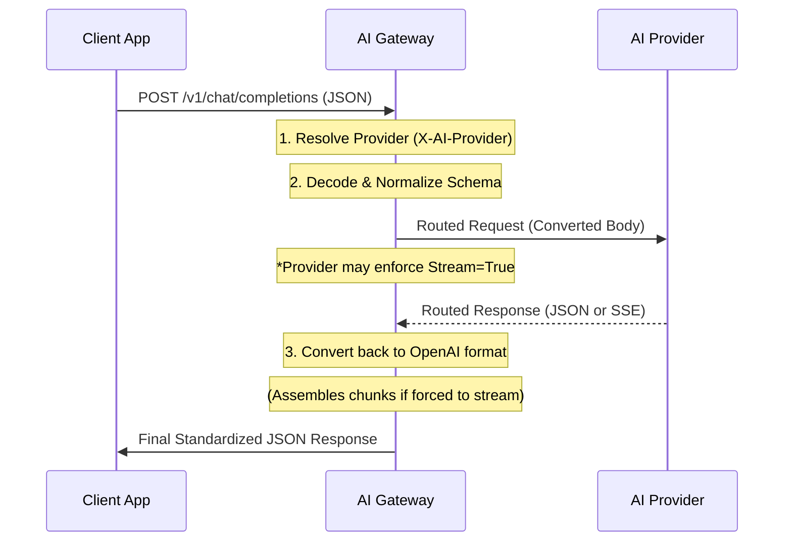

# Synchronous JSON Handling

This document explains how the AI Gateway manages synchronous Request-Response interactions (Standard JSON mode).

## Core Mechanism: Request-Response Lifecycle

When a client makes a synchronous request (`stream: false` or omitted), the Gateway follows a strictly ordered pipeline to ensure transparency and provider abstraction.

### Synchronous Flow

The logic is orchestrated in `proxy/handler.go` via the `handleSync` method, which delegates provider-specific logic to the `Chat` method of each implementation.



### Sync-to-Stream Fallback (Internal)

Many modern providers (specifically GitHub Copilot and certain Anthropic-behind-proxy implementations) reject non-streaming requests for specific models. To ensure 100% compatibility for synchronous clients, the Gateway implements a **Transparent Fallback**:

1.  The Gateway intercepts the `Chat` call and internally forces `stream: true`.
2.  It opens an internal pipe to capture the resulting SSE stream.
3.  An accumulator thread re-assembles the `content` deltas and `tool_calls` into a standard `ChatResponse` object.
4.  If the upstream returns a direct JSON error instead of a stream, the Gateway falls back to a "Raw Body" parse to ensure error details are preserved.

---

## The Translation Layer

The most critical part of the synchronous flow is the **Transformation Path**.

For simple providers (OpenAI, GitHub, Ollama), the transformation is a simple passthrough. For complex providers (Anthropic), the Gateway performs a "Deep Map":

| Stage            | Action                                                                              |
| :--------------- | :---------------------------------------------------------------------------------- |
| **Request In**   | Normalize OpenAI `Messages`, `Tools`, and `Temperature`.                            |
| **Request Out**  | Re-encode as Anthropic `messages` or Ollama-specific JSON.                          |
| **Response In**  | Capture raw Provider JSON (e.g., Anthropic's block format).                         |
| **Response Out** | Re-map results back into a standard `ChatResponse` with `choices` and `tool_calls`. |

---

## Universal Error Handling

The Gateway provides a unified JSON error format regardless of the upstream provider's error structure.

### Error Schema

```json
{
  "error": "Short descriptive message about the failure"
}
```

### Response Codes

- **429 Too Many Requests**: Triggered when the [Local Rate Limit](./RATE_LIMITING.md) is hit.
- **502 Bad Gateway**: Triggered when the upstream provider fails.

Every error includes a unique **Request ID** in the logs (and the `stack` field) for easy correlation.

---

## Integration with Tools

In synchronous mode, Tool Calling is simpler than streaming:

1. The Gateway sends the tool definitions.
2. The Provider returns a single JSON object containing all requested `tool_calls`.
3. The Gateway translates these (if necessary) and returns them to the client.

Because the Gateway is **Stateless**, the client application is responsible for receiving these tool calls, executing them, and sending the results back in a _new_ synchronous request.

---

## Edge Case Normalization

When performing cross-provider mapping (e.g., Anthropic to OpenAI/Copilot), the Gateway implements several normalization strategies to ensure stability:

- **Recursive Schema Sanitization (Gemini/Copilot)**: Providers like Gemini and GitHub Copilot are extremely strict about JSON Schema compliance. The Gateway recursively traverses every schema node to strip unsupported keys like `$schema`, `$id`, `default`, and **`additionalProperties`**.
- **Intelligent Type Injection (De-Pollution)**: To prevent schema validation errors, the Gateway only adds `"type": "object"` or `"type": "array"` to nodes that contain structural indicators. It specifically avoids "polluting" container keys like `properties` with extraneous types.
- **Tool Choice Mapping**:
  - Anthropic's forced tool use (`"type": "any"`) is automatically translated to the OpenAI/Copilot equivalent (`"required"`).
  - Specific named tool selection (`"type": "tool"`) is mapped to the OpenAI function selection format.
  - This ensures that clients like the **Claude Code CLI** work seamlessly even when forcing specific tool selection.
- **Rich Mapping Logs**: For every request, the Gateway logs the resolved mapping (e.g., `mapping=claude-3-opus -> gpt-4o`), making it easy to audit routing decisions across multi-model deployments.
- **Buffer Management**: Sync calls share the same 64KB buffered scanner as streaming calls, allowing them to process extremely large generated payloads without truncation.

These transformations are designed to be transparent to the client while maximizing compatibility with strict upstream backends.

---

## Performance Considerations

- **Streaming Overhead**: Synchronous mode has slightly higher "perceived" latency than streaming because the client must wait for the entire response to be generated.
- **Statelessness**: No state is stored in memory or Redis during the sync call, making the Gateway horizontally scalable.
