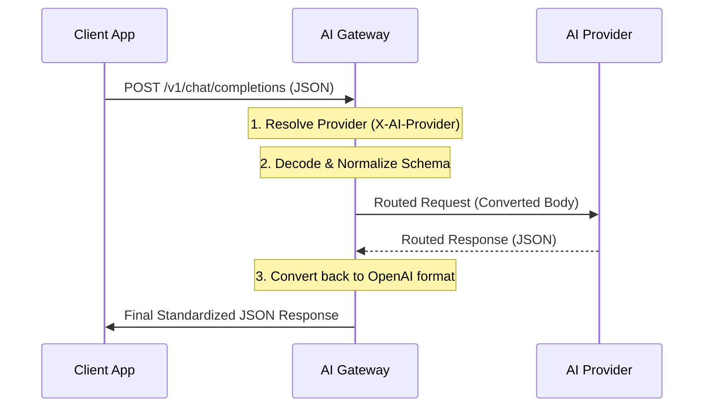

# Synchronous JSON Handling

This document explains how the AI Gateway manages synchronous Request-Response interactions (Standard JSON mode).

## Core Mechanism: Request-Response Lifecycle

When a client makes a synchronous request (`stream: false` or omitted), the Gateway follows a strictly ordered pipeline to ensure transparency and provider abstraction.

### Synchronous Flow

The logic is orchestrated in `proxy/handler.go` via the `handleSync` method, which delegates provider-specific logic to the `Chat` method of each implementation.



---

## The Translation Layer

The most critical part of the synchronous flow is the **Transformation Path**.

For simple providers (OpenAI, GitHub, Ollama), the transformation is a simple passthrough. For complex providers (Anthropic), the Gateway performs a "Deep Map":

| Stage            | Action                                                                              |
| :--------------- | :---------------------------------------------------------------------------------- |
| **Request In**   | Normalize OpenAI `Messages`, `Tools`, and `Temperature`.                            |
| **Request Out**  | Re-encode as Anthropic `messages` or Ollama-specific JSON.                          |
| **Response In**  | Capture raw Provider JSON (e.g., Anthropic's block format).                         |
| **Response Out** | Re-map results back into a standard `ChatResponse` with `choices` and `tool_calls`. |

---

## Universal Error Handling

The Gateway provides a unified JSON error format regardless of the upstream provider's error structure.

### Error Schema

```json
{
  "error": "Short descriptive message about the failure"
}
```

### Response Codes

- **429 Too Many Requests**: Triggered when the [Local Rate Limit](./RATE_LIMITING.md) is hit.
- **502 Bad Gateway**: Triggered when the upstream provider fails.

Every error includes a unique **Request ID** in the logs (and the `stack` field) for easy correlation.

---

## Integration with Tools

In synchronous mode, Tool Calling is simpler than streaming:

1. The Gateway sends the tool definitions.
2. The Provider returns a single JSON object containing all requested `tool_calls`.
3. The Gateway translates these (if necessary) and returns them to the client.

Because the Gateway is **Stateless**, the client application is responsible for receiving these tool calls, executing them, and sending the results back in a _new_ synchronous request.

---

## Performance Considerations

- **Streaming Overhead**: Synchronous mode has slightly higher "perceived" latency than streaming because the client must wait for the entire response to be generated.
- **Statelessness**: No state is stored in memory or Redis during the sync call, making the Gateway horizontally scalable.
