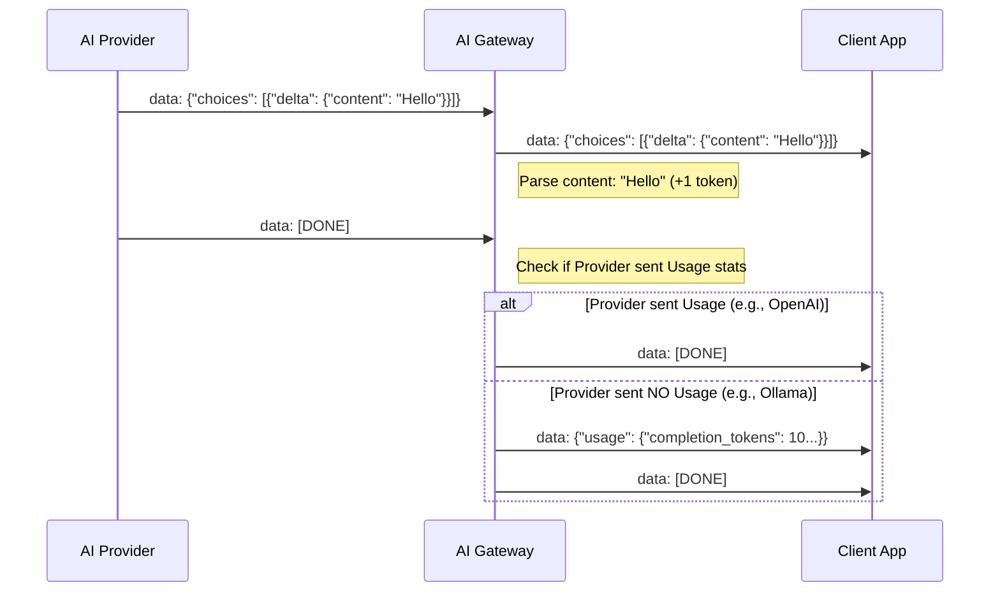

# Streaming & Token Tracking

This document explains how the AI Gateway handles real-time streaming (SSE) and tracks token usage across different AI providers.

## Core Mechanism: SSE Proxying

The gateway uses a "pipe and parse" strategy for streaming. When a client requests a streamed response (`stream: true`), the gateway:

1. Opens a persistent connection to the provider.
2. Forwards incoming data chunks to the client immediately (using `http.Flusher` for low latency).
3. In the background, parses every chunk to track generated content.

### SSE Handler Flow

The logic is encapsulated in `providers/stream.go` through the `streamSSEAndCountTokens` function.

---

## Token Estimation Strategy

Because different providers use different tokenizers (Tiktoken, SentencePiece, etc.), the Gateway uses a **standardized character-based estimation** when native usage data is missing.

### Estimation Rule

`1 Token ≈ 4 Characters (English)`

This provides a consistent metric across all models, preventing "Free" usage of local or smaller models that don't report stats.

### Tool Call Tracking

The gateway also tracks `tool_calls` in streams. It extracts the `arguments` delta and adds them to the `completion_tokens` count, ensuring that complex function calling remains measurable.

---

## Usage Injection

For providers that do not support OpenAI's `stream_options: {"include_usage": true}`, the Gateway performs **Synthetic Injection**:

1. After receiving the final `[DONE]` signal from the provider, the Gateway holds the connection open for a millisecond.
2. It constructs a final `openai-compatible` chunk containing the accumulated `usage` object.
3. It emits this synthetic chunk followed by a final `[DONE]`.

This ensures that libraries like the OpenAI Python SDK can correctly populate the `.usage` field even for local Ollama models.

---

## Performance Considerations

- **Buffered Scanning**: Uses `bufio.Scanner` with a 64KB buffer to handle ultra-long JSON payloads (common in code generation).
- **Zero-Latency**: The `Unmarshal` logic occurs _after_ the raw bytes have been forwarded to the client, ensuring the Gateway adds zero perceptible latency to the stream.
