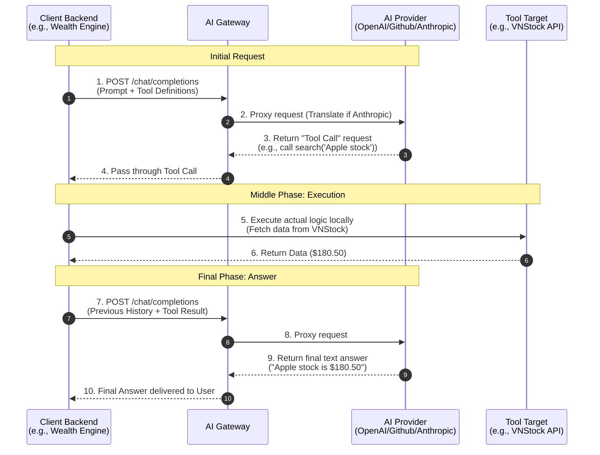

# Sequence Flow

```mermaid
sequenceDiagram
    autonumber
    participant App as Client Backend<br/>(e.g., Wealth Engine)
    participant GW as AI Gateway
    participant AI as AI Provider<br/>(OpenAI/Github/Anthropic)
    participant Tool as Tool Target<br/>(e.g., VNStock API)

    Note over App, AI: Initial Request
    App->>GW: 1. POST /chat/completions<br/>(Prompt + Tool Definitions)
    GW->>AI: 2. Proxy request (Translate if Anthropic)
    AI-->>GW: 3. Return "Tool Call" request<br/>(e.g., call search('Apple stock'))
    GW-->>App: 4. Pass through Tool Call

    Note over App, Tool: Middle Phase: Execution
    App->>Tool: 5. Execute actual logic locally<br/>(Fetch data from VNStock)
    Tool-->>App: 6. Return Data ($180.50)

    Note over App, AI: Final Phase: Answer
    App->>GW: 7. POST /chat/completions<br/>(Previous History + Tool Result)
    GW->>AI: 8. Proxy request
    AI-->>GW: 9. Return final text answer<br/>("Apple stock is $180.50")
    GW-->>App: 10. Final Answer delivered to User
```
