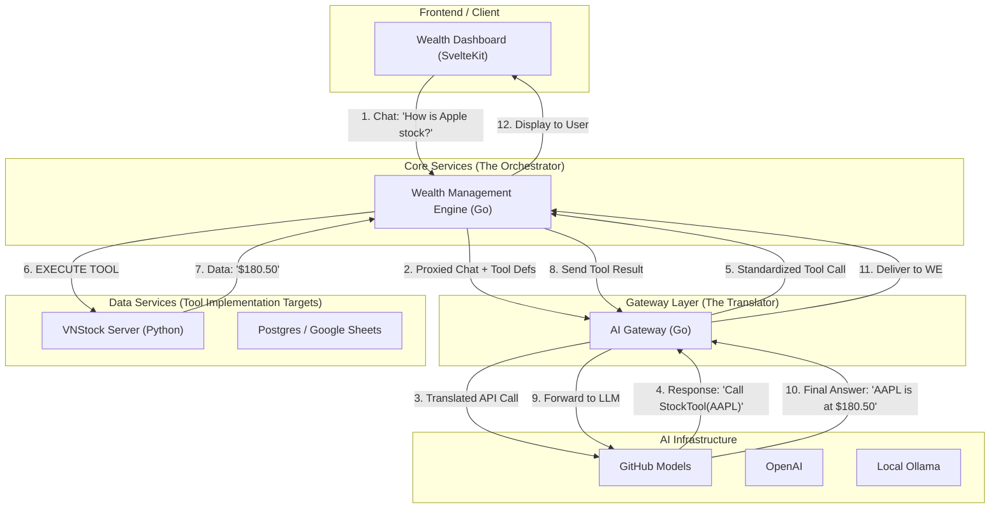

# System Architecture

```mermaid
graph TD
    subgraph "Frontend / Client"
        UI["Wealth Dashboard (SvelteKit)"]
    end

    subgraph "Core Services (The Orchestrator)"
        WE["Wealth Management Engine (Go)"]
    end

    subgraph "Gateway Layer (The Translator)"
        AG["AI Gateway (Go)"]
    end

    subgraph "Data Services (Tool Implementation Targets)"
        VN["VNStock Server (Python)"]
        DB["Postgres / Google Sheets"]
    end

    subgraph "AI Infrastructure"
        GH["GitHub Models"]
        OI["OpenAI"]
        OL["Local Ollama"]
    end

    %% Communication Flow
    UI -- "1. Chat: 'How is Apple stock?'" --> WE
    WE -- "2. Proxied Chat + Tool Defs" --> AG
    AG -- "3. Translated API Call" --> GH
    GH -- "4. Response: 'Call StockTool(AAPL)'" --> AG
    AG -- "5. Standardized Tool Call" --> WE

    %% Tool Execution Phase
    WE -- "6. EXECUTE TOOL" --> VN
    VN -- "7. Data: '$180.50'" --> WE

    WE -- "8. Send Tool Result" --> AG
    AG -- "9. Forward to LLM" --> GH
    GH -- "10. Final Answer: 'AAPL is at $180.50'" --> AG
    AG -- "11. Deliver to WE" --> WE
    WE -- "12. Display to User" --> UI
```
