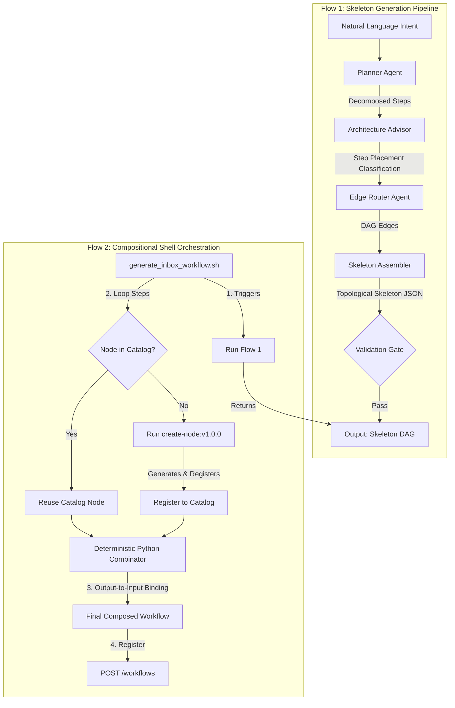

# Workflow Generator Guide - Compositional & Modular Architecture

GraphWeave utilizes a state-of-the-art **Compositional & Modular Architecture** to generate, register, and assemble workflows. Instead of creating giant, monolithic workflow DAGs with embedded, hardcoded node configurations, GraphWeave decomposes the lifecycle into two discrete orchestration phases:

1. **The Skeleton Generation Pipeline** (`workflow-generator:v1.0.0`): A lightweight, multi-agent meta-workflow that produces a topological skeleton DAG containing steps, step classifications, and routing contracts without materializing concrete configs.
2. **The Shell-Orchestrated Assembly Flow** (`generate_inbox_workflow.sh`): A local shell wrapper that parses step intents, checks the catalog for reusable nodes, runs per-step generator instances (`create-node:v1.0.0`), and deterministically wires output-to-input variables based on resolved contracts.

---

## 🗺️ Architectural Topology

The two orchestration flows cooperate to deliver clean, scalable, and highly reusable workflows:



---

## ⚡ Flow 1: The Skeleton Generation Pipeline (`workflow-generator:v1.0.0`)

This pipeline runs inside GraphWeave as a system workflow. It takes a raw natural language intent and outputs a structural skeleton containing the DAG topology and metadata.

### Step-by-Step Pipeline

1. **Planner Agent (`planner:v1.0.0`)**:
   Decomposes the natural language intent into a clean sequence of discrete data transformation steps (e.g., normalizations, extractions, validations, writes). Disallows open-ended terms (`analyze`, `think`, `reflect`, `explore`) and enforces clear inputs and outputs.
2. **Architecture Advisor (`architecture_advisor:v1.0.0`)**:
   Classifies each decomposed step's execution environment. It determines whether the step should be placed as an **`agent_node`** (needs LLM semantic reasoning) or a **`cli_node`** (needs mechanical CLI command execution or file system writes).
3. **Edge Router Agent (`edge_router:v1.0.0`)**:
   Generates a cycle-free Directed Acyclic Graph (DAG) connecting the steps. It maps the linear or conditional execution pathways and outputs the `edges`, `entry_point`, and `exit_point` using strictly namespaced `from` and `to` endpoints.
4. **Skeleton Assembler (`skeleton_assembler:v1.0.0`)**:
   Combines the planner steps, routing edges, and advisor classifications. It enforces topological sanity checks (rejections on cycles, orphans, invalid names) and formats the output schema.
5. **Validation Gate (`validation_gate:v1.0.0`)**:
   Ensures the skeleton meets all publishing criteria. If valid, the execution completes, exposing the skeleton.

### Output Schema

The skeleton outputs a structural DAG manifest:

```json
{
  "is_valid": true,
  "errors": [],
  "skeleton": {
    "name": "inbox-ingest-generated",
    "version": "1.0.0",
    "steps": [
      {
        "id": "normalize_input",
        "purpose": "Clean and standardize input fields",
        "type": "agent_node"
      },
      {
        "id": "process_media",
        "purpose": "OCR extract image references",
        "type": "cli_node"
      }
    ],
    "edges": [
      { "from": "entry", "to": "normalize_input" },
      { "from": "normalize_input", "to": "process_media" }
    ],
    "entry_point": "entry",
    "exit_point": "exit"
  }
}
```

---

## 🐚 Flow 2: The Compositional Shell Orchestration Flow (`generate_inbox_workflow.sh`)

This client-side shell orchestration script acts strictly as a **thin, decoupled runner** to drive the dynamic generation and registration of the workflow.

### Step-by-Step Flow

1. **Generate Skeleton & Slice Intents**:
   Invokes `workflow-generator:v1.0.0` over the GraphWeave API with the raw intent markdown. The system's `planner` and `skeleton_assembler` nodes natively slice, parse, and propagate the logic `context` and explicit CLI `command` templates directly inside the returned DAG skeleton steps array.
2. **Read Step Contexts & Commands**:
   Reads `context` and `command` for each step directly from the compiled skeleton step objects using programmatic `jq` lookups.
3. **Check Catalog for Reusability & Enforce Tag Safety**:
   Queries the catalog API (`GET /nodes/pkm_<step_id>:v1.0.0`).
   - If the node is already present in the catalog, it is reused.
   - If not, it calls `create-node:v1.0.0` over the API, passing the parsed context and command.
   - Converts the capability tags to lowercase kebab-case (e.g. `pkm-normalize-input`) to ensure strict tag formatting validation compliance.
4. **Deterministic Composition**:
   Submits the `skeleton` and `node_map` to the GraphWeave backend. The server-side compositional pipeline handles the deterministic wiring, state path mapping, and output-to-input binding programmatically.
5. **Register Workflow**:
   Saves the finished compiled compositional workflow under `POST /workflows`.

---

## 🏆 Key Advantages of Compositional Architecture

- **No LLM Hallucinations in Routing**: Standard JSON schemas and state paths are constructed programmatically via Python rather than requesting the LLM to generate huge, delicate state path strings at once.
- **Node Reusability (Catalog-First)**: Steps like `process_media` or `normalize_input` are registered once as system-wide nodes. Future generated workflows reuse these catalog definitions instead of duplicating them.
- **Secure Shell Sandboxing**: Commands in `cli_nodes` are securely formatted using curly-brace argument placeholders (e.g. `'{variable_shell}'`), ensuring strict single-quote escaping when evaluated by the GraphWeave CLI runner.
- **Isolated Testing**: Individual nodes can be unit-tested or updated in the catalog without breaking existing parent workflows.
