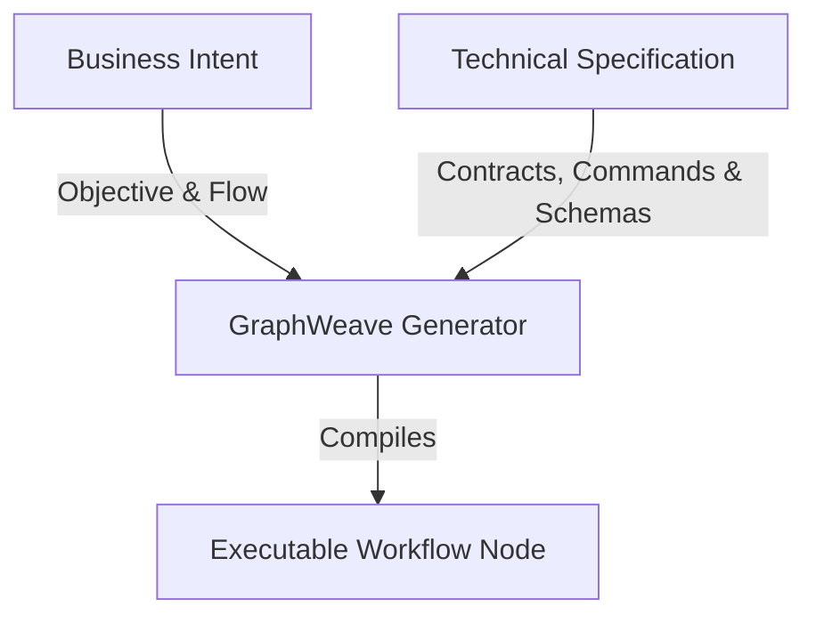

# Intent Writing Guide for GraphWeave Workflows

This guide defines the methodology for structuring input intent documents when generating workflows in GraphWeave. Effective workflow generation requires separating high-level business goals from strict technical constraints.

---

## 1. Architectural Separation

To keep workflow generation clean, scalable, and deterministic, intents must be structured into two distinct files:



### A. The Business Intent

Defines the **what** and **why** of the process. It is written from the user's perspective to describe the business pipeline steps.

- **Location:** Stored alongside the trigger script or input pipeline.
- **Content:** Core objective, business process flow, and high-level domain rules.

### B. The Technical Specification (Writing Guide)

Defines the **how** and the **safety boundaries**. It contains the strict rules, formats, and API shapes that the LLM nodes must obey.

- **Location:** Reference document stored in the tooling setup.
- **Content:** Step-by-step IO contracts, conditional branch flags, command templates, formatting guides, and negative handling.

---

## 2. Guidelines for Technical Specifications

When writing the Technical Specification (Writing Guide) for a pipeline step:

### 1. Define Explicit Inputs and Outputs

Always define a strict IO contract for each step:

- **Inputs:** Explicitly name the fields consumed from predecessors (e.g. `file_path`, `file_content`).
- **Outputs:** Declared output variable names must match the payload keys returned in JSON.

### 2. Handle Negative and Empty Cases (Critical)

Never let LLMs make assumptions when variables are missing. Explicitly define what to do:

- _Example:_ "If there are zero sources in the note, set the source reference dynamically to the note's filename instead of generating a separate source card."

### 3. Forcing Mandates for Summaries / Lists

LLMs are naturally conservative and will avoid extracting or generating complex schemas if they judge the input as a "mere description" or "summary." You must write forcing clauses to prevent empty arrays:

- _Example:_ "If the input content consists of summaries or lists, the model is strictly forbidden from returning an empty outputs array. It must treat these categorizations as valid concepts and logically expand them."

### 4. Layout Standard Templates

Provide literal markdown/text layouts to demonstrate expected structures, callout warnings, and frontmatter configurations. Highlight that headers, tags, and spacing rules are absolute.

---

## 3. Workflow Generation Integration

The Local Shell Wrapper (`generate_inbox_workflow.sh`) is designed to combine the **Technical Specification** and the **Business Intent** at runtime:

```bash
# Slices from INTENT_WRITING_GUIDE + business intent to build complete prompt context
INTENT_GUIDE=$(cat docs/graph-weave/intent-writing-guide.md)
intent="${INTENT_GUIDE}\n\n$(cat business_intent.md)"
```

By maintaining this separation, the underlying GraphWeave generator remains generic and reusable, while workflows are compiled with perfect domain-specific compliance.
