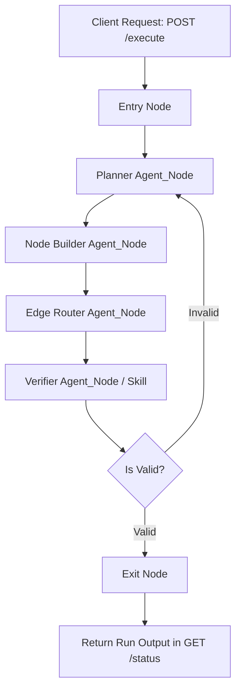

# Use Case: Workflow Generator DAG

## 1. Objective

- **What**: Build a predefined GraphWeave workflow (`workflow-generator:v1.0.0`) that converts a natural language intent into a validated, executable GraphWeave workflow JSON.
- **Why**: Empowers DevOps/SREs to create automation flows without manually writing complex JSON schemas. By using GraphWeave to build GraphWeave, we prove the power of the DAG engine natively without needing new core APIs.
- **Who**: DevOps SREs and platform engineers.

## Traceability

- GW-FEAT-GEN-001: The system must accept natural language problem definitions and output a structurally valid GraphWeave JSON workflow.
- GW-FEAT-GEN-002: The generated DAG must pass the pre-commit schema validation gate.
- GW-FEAT-GEN-003: The final workflow state must contain the workflow definition, which can then be submitted to the `POST /workflows` endpoint.

## 2. Scope

- **In scope**: A predefined JSON workflow definition, system prompts for graph-generation nodes (Planner, Builder, Router), and E2E testing of this workflow using real AI models.
- **Out of scope**: Creating a new `/generate-workflow` API endpoint (the existing `/execute` endpoint will run the workflow).

## 2.1 User Story (What, When, Why)

_As a DevOps SRE,_
**When** I need to diagnose an EKS cluster alert or rotate an AWS credential,
**I want** to execute the `workflow-generator:v1.0.0` workflow with a natural language input,
**So that** I receive a validated, ready-to-execute workflow DAG as the run output, accelerating my infrastructure management tasks.

## 3. Specification

- The workflow accepts input: `{"intent": "description text"}` via the standard `POST /execute` API.
- It uses a **Split-and-Aggregate** design via sequential `agent_node` stages:
  1. **Planner Agent**: Decomposes the intent into a list of required functional nodes.
  2. **Node Builder Agent**: Generates the strict JSON array of `nodes` using the `WORKFLOW_JSON_SPEC.md` format.
  3. **Router Agent**: Analyzes the nodes and constructs the logical transitions as `edges`.
- **Self-Correction Logic**: Implemented as standard workflow graph conditional edges linking a validation agent back to the generation agents if the assembled DAG schema is invalid.
- The outcome is a valid GraphWeave DAG appended to the `workflow_state` under a `generated_workflow` key.

## 4. Technical Plan

1. Author the `workflow-generator:v1.0.0` JSON file representing this DAG.
2. Embed the `WORKFLOW_JSON_SPEC.md` guidelines into the "Node Builder Agent" system prompt.
3. Configure the `branch` condition nodes to evaluate the generated schema validity (mocked validation skill or LLM-based verification for now) and loop back if required.
4. Deploy and execute this workflow during live E2E tests using the existing API routes.

## 5. Tasks

- [ ] Draft `workflow-generator.json` defining the planner, builder, router, and verifier nodes.
- [ ] Craft exact system prompts for the agents to adhere strictly to the schema.
- [ ] Write `test_e2e_workflow_generator.py` to `POST /workflows` (register generator) and `POST /execute` (run generator) with a DevOps intent.

## 6. Verification

- Given a natural language request, when submitted as input to the `workflow-generator` run, then it should eventually output a structurally valid workflow JSON in its state.
- Given a complex intent, when run via `AIGateway`, then the agents successfully route through the pipeline.
- Given the output workflow, when saved and executed independently, then it behaves correctly as a GraphWeave DAG.

## 7. Execution Flow and Sequence Charts

### Execution Flow

