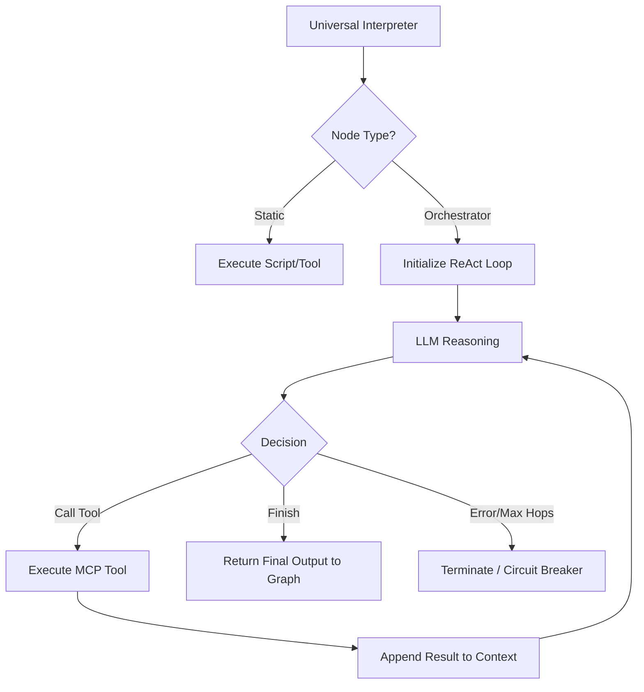

# Feature: The Orchestrator Node

## 1. Objective

- **What**: Build the Orchestrator Node, GraphWeave's central cognitive hub for dynamic, non-deterministic workflows.
- **Why**: Static DAGs are excellent for predictable pipelines, but tasks like open-ended research, debugging, and complex customer support require dynamic tool selection at runtime. The Orchestrator is a reasoning LLM that decides the next step based on prior findings.
- **Who**: Platform engineers and developers building autonomous agents.

## Traceability

- GW-FEAT-ORCH-001: The system must support an `orchestrator` node type in the workflow schema.
- GW-FEAT-ORCH-002: The node must be capable of dynamically loading sub-skills and sub-agents.
- GW-FEAT-ORCH-003: The orchestrator must respect bounding constraints (max hops, circuit breakers) to prevent runaway execution.

## 2. Scope

- **In scope**: A new node type `orchestrator` in the universal interpreter, LLM tool-calling loop, memory/context summarization, and integration with the MCP skill loader.
- **Out of scope**: Developing new external skills (only the binding mechanism is in scope).

## 2.1 User Story (What, When, Why)

_As an SRE building an incident response agent,_
**When** the exact sequence of debugging steps depends on the output of previous logs (i.e. unpredictable path),
**I want** to use an Orchestrator Node in my workflow,
**So that** the LLM can dynamically decide whether to query AWS, check Grafana, inspect GitHub, or terminate the task when sufficient information is gathered.

## 3. Specification

- The workflow JSON schema is extended to support a node where `type: "orchestrator"`.
- This node functions identically to static nodes in routing but executes a deeply autonomous ReAct (Reason + Act) loop internally.
- **Multi-Tool Autonomous Action:** The Orchestrator receives an array of allowed `skills`. Unlike a single static tool call, the node iterates within itself to research, querying multiple external sources sequentially as necessary to build context before concluding.
- **Streaming Emulsion:** The Node yields execution control back to the LangGraph executor _after each internal tool call_ and thought iteration to stream `orchestrator.thought` and `orchestrator.tool_called` events to the UI.
- **Structured State Output:** The Orchestrator does not dump unstructured text into the graph. It returns an organized output object appended to `workflow_state`:
  ```json
  {
    "orchestrator_trace": [ ... thoughts and actions performed ... ],
    "final_result": { "key": "val" } // Bound by the optional user-defined `output_schema`
  }
  ```

### 3.1 Normal Node vs. Orchestrator Node

To understand the Orchestrator's role within GraphWeave:

- **Execution Boundary:** A **Normal Node** executes a block of code or an LLM prompt exactly once, reliant entirely on the graph topology to loop or transition. The **Orchestrator Node** traps execution inside itself, running a ReAct loop checking multiple tools iteratively before it finally decides it is finished and yields to the graph.
- **Data Intake:** A **Normal Node** only receives the explicit data handed to it via the global `workflow_state`. It cannot dynamically seek more information if it is missing something. The **Orchestrator Node** receives the state, but is given `skills` to actively query external databases/APIs if it determines context is missing.
- **Graph Positioning (The Sandwich Pattern):** Because the Orchestrator behaves exactly like a Normal Node to the overarching DAG, it can be embedded in the middle of a pipeline. This creates a "Sandwich" of deterministic guardrails around non-deterministic intelligence.
  - _Example:_ **[Node 1: Static Webhook]** -> **[Node 2: Orchestrator Investigator]** -> **[Node 3: Static Approval Script]**. The autonomy is safely bounded.

## 4. Technical Plan

1. Extend `WORKFLOW_JSON_SPEC.md` to formally document the `orchestrator` node parameters (`system_prompt`, `allowed_skills`, `max_iterations`).
2. Add a sub-graph inside the universal interpreter dedicated to the Orchestrator's internal ReAct loop.
3. Intercept `orchestrator` nodes during LangGraph traversal, provisioning the specified MCP tools.
4. Implement a short-term memory window to prevent context overflow if the orchestrator iterates many times.
5. Reuse existing circuit-breaker/stagnation checks to catch infinite loops.

## 5. Tasks

- [ ] Update `models.py` workflow definitions to support `orchestrator` node fields.
- [ ] Build the `OrchestratorReAct` module encapsulating the dynamic logic.
- [ ] Register the new module in the `RealLangGraphExecutor` mapping.
- [ ] Add streaming event rules (e.g. `orchestrator.thought`, `orchestrator.tool_called`) for transparency.
- [ ] Write integration tests simulating an open-ended investigation.

## 6. Verification

- Given a workflow with an orchestrator node, when executed, then the system must dynamically choose tools based on the input context.
- Given an orchestrator stuck in a loop, when iteration exceeds `max_iterations`, then it must forcefully exit and yield a failure state.
- Given a successful dynamic resolution, when looking at the execution trace, then the status stream must correctly show the interspersed tool calls and thoughts.

## 7. Execution Flow and Sequence Charts

### Execution Flow



### Sequence Chart

```mermaid
sequenceDiagram
    participant UI as Universal Interpreter
    participant Orch as Orchestrator ReAct
    participant LLM as AI Gateway
    participant MCP as Skill Servers (AWS/Grafana)

    UI->>Orch: Start Node (Context, Allowed Skills)
    loop Until Finished or Max Iterations
        Orch->>LLM: Send Context + Available Tools
        LLM-->>Orch: Tool Call Request (e.g., query_grafana)
        alt Action == Finish
            break
        end
        Orch->>MCP: Execute Tool (query_grafana)
        MCP-->>Orch: Tool Result Data
        Orch->>Orch: Update Internal Memory
    end
    Orch-->>UI: Final Conclusive Response
```
