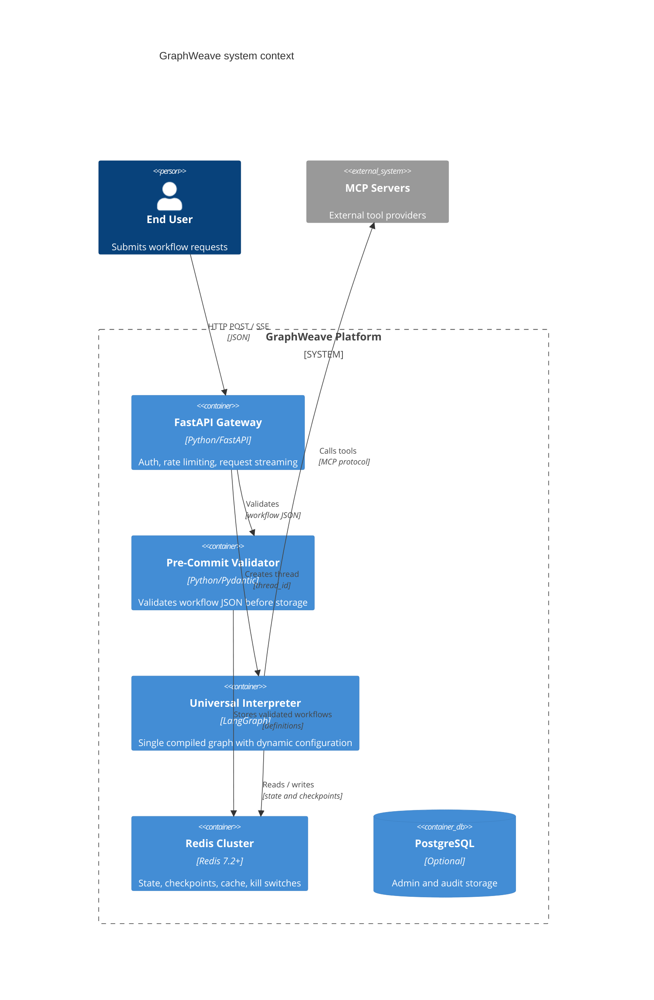

## 1. Objective

- What: Describe the system context and external dependencies for GraphWeave.
- Why: Make the platform boundaries explicit so implementation stays deterministic and testable.
- Who: Architecture, platform, and integration teams.

## 2. Scope

- In scope: gateway, validator, universal interpreter, Redis, PostgreSQL audit storage, and MCP servers.
- Out of scope: end-user product features and provider-specific internal implementations.

## 3. Specification

- The gateway must validate and authorize requests before execution.
- The pre-commit validator must store only valid workflow definitions.
- The interpreter must execute a single compiled graph with dynamic configuration.
- MCP servers remain the external tool boundary for all subagent/tool calls.

## 4. Technical Plan

- Keep the platform split into a request layer, validation layer, runtime layer, and external tool layer.
- Store runtime checkpoints and thread state in Redis.
- Use PostgreSQL for registry/audit needs only.

## 5. Tasks

- [ ] Define request flow and validation boundaries.
- [ ] Keep Redis and PostgreSQL responsibilities separate.
- [ ] Document how MCP tool calls cross the runtime boundary.

## 6. Verification

- Given a workflow request, when it enters the system, then it must be validated before execution.
- Given a tool call, when it is made, then it must cross the MCP boundary rather than bypassing the interpreter.
- Given a checkpointed run, when it resumes, then Redis state must restore the thread correctly.

