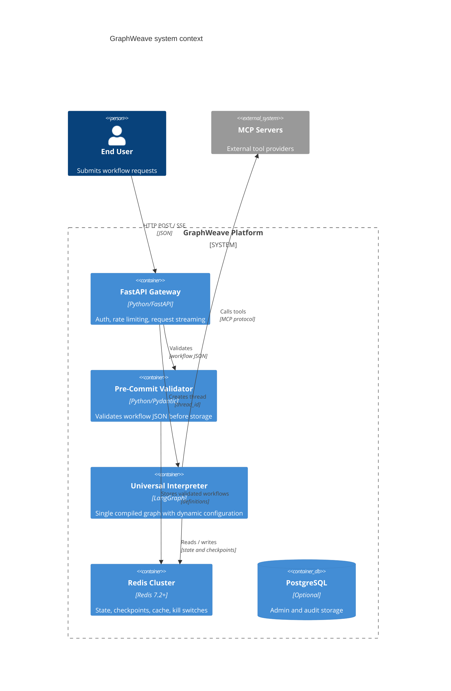

## 1. Objective

- What: Describe the system context and external dependencies for GraphWeave.
- Why: Make the platform boundaries explicit so implementation stays deterministic and testable.
- Who: Architecture, platform, and integration teams.

## Traceability

- FR-ARCH-010: The platform boundary must include FastAPI, Redis, PostgreSQL audit storage, LangGraph, and MCP servers.
- FR-ARCH-011: The external tool boundary must remain MCP-based.
- FR-ARCH-012: Request validation must happen before runtime execution.
- FR-ARCH-013: Tenant, workflow, and thread isolation must apply to workflow execution, Redis state, skill caches, and kill switches.

## 2. Scope

- In scope: gateway, validator, universal interpreter, Redis, PostgreSQL audit storage, and MCP servers.
- Out of scope: end-user product features and provider-specific internal implementations.

## 3. Specification

- The gateway must validate and authorize requests before execution.
- The pre-commit validator must store only valid workflow definitions.
- The interpreter must execute a single compiled graph with dynamic configuration.
- MCP servers remain the external tool boundary for all subagent/tool calls.
- The diagrams in this file are authoritative for boundary definition and should match the runtime architecture.
- PostgreSQL is for registry/audit support, not the primary runtime state store.
- Tenant isolation applies across workflow execution, Redis, skill caches, and kill switches.

## 4. Technical Plan

- Keep the platform split into a request layer, validation layer, runtime layer, and external tool layer.
- Store runtime checkpoints and thread state in Redis.
- Use PostgreSQL for registry/audit needs only.
- Keep the MCP boundary explicit so agent nodes cannot bypass tool mediation.
- Preserve the fixed stack and avoid introducing alternate runtime frameworks in the spec.
- Scope every execution artifact by tenant, workflow, and thread where applicable.

## 5. Tasks

- [ ] Define request flow and validation boundaries.
- [ ] Keep Redis and PostgreSQL responsibilities separate.
- [ ] Document how MCP tool calls cross the runtime boundary.
- [ ] Add traceable IDs to each boundary rule.
- [ ] Record the authoritative component list.

## 6. Verification

- Given a workflow request, when it enters the system, then it must be validated before execution.
- Given a tool call, when it is made, then it must cross the MCP boundary rather than bypassing the interpreter.
- Given a checkpointed run, when it resumes, then Redis state must restore the thread correctly.
- Given an architecture review, when the diagram is inspected, then the boundary list must match the fixed stack.
- Given a runtime change proposal, when it introduces a new core stack component, then it must be rejected unless the spec is updated.

