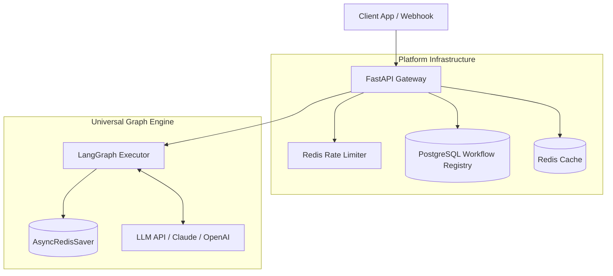

## 1. Objective

- What: Show the end-to-end platform shape for GraphWeave.
- Why: Clarify the runtime boundaries between request handling, workflow registry, execution, and observability.
- Who: Platform engineers and integrators.

## 2. Scope

- In scope: gateway, rate limiting, workflow registry, Redis cache/state, LangGraph execution, and optional observability.
- Out of scope: provider-specific business logic and tenant application code.

## 3. Specification

- API requests must flow through the gateway before runtime execution.
- The interpreter must read/write shared state through Redis-backed storage.
- Workflow definitions must be registry-backed and separate from execution state.
- External model calls must remain isolated behind the graph engine.

## 4. Technical Plan

- Keep the API gateway thin and stateless.
- Use Redis for runtime state, cache, and checkpoints.
- Use a compiled LangGraph executor as the single workflow runtime.
- Add monitoring/tracing around the shared platform boundary.

## 5. Tasks

- [ ] Wire the API gateway to registry, cache, and executor paths.
- [ ] Keep workflow registry and runtime state separated.
- [ ] Add metrics/tracing to the platform boundary.

## 6. Verification

- Given a client request, when it enters the platform, then it must pass through gateway and registry/cache checks.
- Given a graph run, when it executes, then state must persist through Redis-backed storage.
- Given observability is enabled, when workflows run, then metrics/traces must be emitted.



````C4Container
    title Container diagram for GraphWeave

    Container(api, "API Gateway", "FastAPI", "Handles authentication, rate limiting, SSE")
    Container(validator, "Pre-Commit Validator", "Pydantic", "Validates workflow JSON before storage")
    Container(interpreter, "Universal Interpreter", "LangGraph", "Single compiled graph for all workflows")
    Container(redis, "Redis Cluster", "Redis 7.2", "Runtime state, checkpoints, kill switches")
    ContainerDb(postgres, "PostgreSQL", "TimescaleDB", "Audit logs, tenant config (optional)")

    Container(monitor, "Prometheus", "Monitoring", "Collects metrics from all services")
    Container(tracing, "Jaeger", "Tracing", "Distributed tracing")

    Rel(api, validator, "Validates", "gRPC")
    Rel(api, interpreter, "Creates thread", "LangGraph API")
    Rel(interpreter, redis, "Reads/writes", "RESP")
    Rel(interpreter, validator, "Validates on-demand", "gRPC")
    Rel(validator, redis, "Writes validated", "RESP")```

```graph TB
    Client[Client App / Webhook]
    subgraph Platform Infrastructure
        API[FastAPI Gateway]
        Rate[Redis Rate Limiter]
        Registry[(PostgreSQL Workflow Registry)]
        Cache[(Redis Cache)]
    end
    subgraph Universal Graph Engine
        LG[LangGraph Executor]
        State[(AsyncRedisSaver)]
        LLM[LLM API / Claude / OpenAI]
    end
    Client --> API
    API --> Rate
    API --> Registry
    API --> Cache
    API --> LG
    LG --> State
    LG <--> LLM```
````
