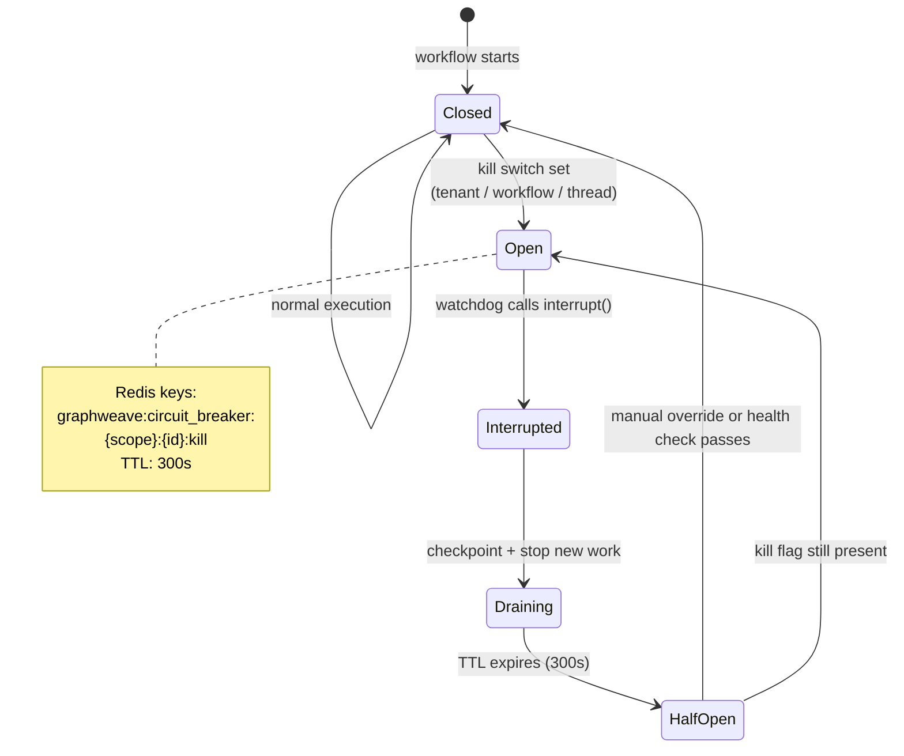

## 1. Objective

- What: Define the kill-switch lifecycle for GraphWeave execution.
- Why: Allow safe emergency stops without corrupting workflow state.
- Who: Operators and runtime engineers.

## Traceability

- FR-RUNTIME-010: Kill switches must support tenant, workflow, and thread scopes.
- FR-RUNTIME-011: The circuit breaker must support half-open recovery.
- FR-RUNTIME-012: Emergency stops must interrupt execution safely.

## 2. Scope

- In scope: tenant/workflow/thread kill switches, interrupt behavior, and half-open recovery.
- Out of scope: business logic recovery strategies and provider-specific failure handling.

## 3. Specification

- Kill switches must be addressable at tenant, workflow, and thread levels.
- Interrupt must happen at the watchdog boundary.
- After TTL expiry, a half-open state must permit health-check recovery.
- The default TTL is 300s, but workflows may override it with clear rationale.
- Half-open behavior must be configurable enough to support partial recovery checks.
- If breaker state is ambiguous, execution must fail closed.

## 4. Technical Plan

- Store kill flags in Redis with a bounded TTL.
- Use the watchdog to observe kill flags before each iteration.
- Allow manual override or health-check recovery to close the circuit again.
- Keep the kill-switch semantics stable even if the internal Redis key naming changes.
- Ensure interrupt behavior is safe for checkpoints and resumability.

## 5. Tasks

- [ ] Implement scoped kill-switch keys.
- [ ] Stop execution through the watchdog boundary.
- [ ] Recover safely after TTL expiry and health checks.
- [ ] Add recovery-policy tests for half-open behavior.

## 6. Verification

- Given a tenant kill flag, when the watchdog runs, then execution must stop.
- Given a workflow kill flag, when the workflow is active, then that workflow must halt without affecting others.
- Given TTL expiry, when the half-open state is reached, then health checks must decide whether to close again.
- Given a transient failure, when the half-open state is reached, then the workflow must either recover or fail closed according to config.
- Given an ambiguous breaker state, when the runtime cannot prove safety, then it must fail closed.

Operational notes:

- A kill switch can be scoped at tenant, workflow, or thread level.
- Interrupt happens at the watchdog boundary so the graph can stop cleanly instead of corrupting state.
- The half-open state is useful for re-checking health after TTL expiry instead of permanently leaving a workflow disabled.
