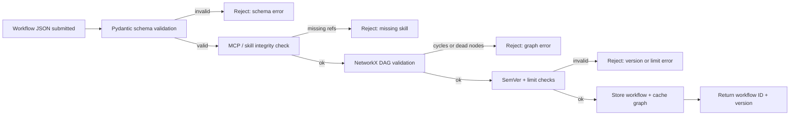

## 1. Objective

- What: Define the pre-commit validation pipeline for workflow JSON.
- Why: Prevent invalid, unsafe, or un-routable workflows from entering runtime storage.
- Who: Platform engineers and workflow authors.

## Traceability

- FR-RUNTIME-020: Workflow JSON must be validated before storage.
- FR-RUNTIME-021: Missing skills or invalid graph structure must fail fast.
- FR-RUNTIME-022: Accepted workflows must be cached and versioned.

## 2. Scope

- In scope: schema validation, skill integrity, graph validation, SemVer checks, and limit checks.
- Out of scope: execution-time business logic and provider implementation details.

## 3. Specification

- A workflow must pass schema validation before any storage action.
- All referenced skills must exist in the registry.
- The graph must be valid and free from dead branches or illegal cycles.
- Version and limit rules must fail fast when constraints are violated.
- The workflow validation contract must remain ahead of runtime execution.
- The spec must distinguish intentional runtime loops from invalid graph cycles.
- NFR: validation must be fast enough to remain part of the interactive authoring flow.

## 4. Technical Plan

- Validate in layers: schema -> registry -> graph -> version -> limits.
- Store only accepted workflows and cache the compiled graph.
- Reject bad inputs before runtime side effects occur.
- Keep the validation pipeline deterministic and explain failures clearly to authors.
- Avoid pushing runtime-specific business logic into the validation step.

## 5. Tasks

- [ ] Add schema and registry validation gates.
- [ ] Enforce graph and version checks.
- [ ] Ensure accepted workflows are cached and returned with a version.
- [ ] Record validation failure reasons with traceable IDs.

## 6. Verification

- Given invalid JSON, when the pipeline runs, then it must reject before storage.
- Given a missing skill reference, when validation runs, then it must fail with a clear error.
- Given a valid workflow, when validation passes, then it must be stored and cached.
- Given a workflow with a dead branch, when validation runs, then it must fail before any runtime state is created.

Validation notes:

- Schema errors fail fast before any storage occurs.
- MCP or skill references must exist before a workflow is accepted.
- Cycles and dead nodes are rejected when they indicate bypasses, while the orchestrator’s intentional runtime loop remains a separate concern.
- SemVer and limit checks prevent incompatible versions and unsafe resource settings from entering the runtime.
