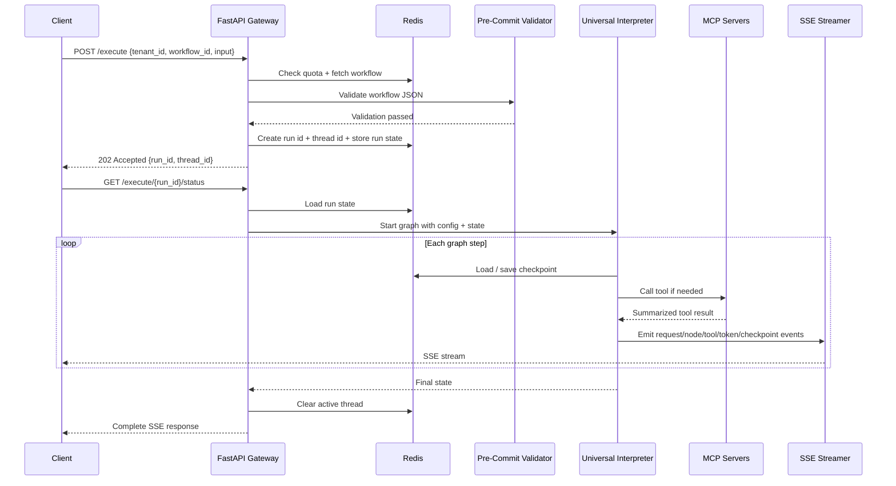

## 1. Objective

- What: Describe the two-request lifecycle for GraphWeave execution.
- Why: Separate workflow submission from live status streaming so clients can start work, receive an id, and then subscribe to progress.
- Who: Backend engineers, integrators, and SRE.

## Traceability

- FR-RUNTIME-001 [MOCK,MVP]: Workflow submission must be validated before execution.
- FR-RUNTIME-002 [MOCK,MVP]: Workflow submission must return a run id for later status access.
- FR-RUNTIME-003 [MOCK,MVP,FULL]: A separate SSE status request must stream structured events for the submitted run.
- FR-RUNTIME-004 [MVP,FULL]: Checkpoints and active thread state must survive interruptions and completion.

## 2. Scope

- In scope: submission request, workflow fetch, validation, run creation, separate status streaming, execution, and checkpointing.
- Out of scope: internal implementation of individual tool providers.

## 3. Specification

### 3.1 Request/Response Contracts

**Submission Request (POST /execute):**

- The submission request must be validated before graph execution.
- The submission payload must carry tenant_id, workflow_id, and execution input.
- The submission payload does not require a client-supplied thread_id.

**Submission Response (201 Created or 202 Accepted):**

- The submission request must return a run id immediately after creation.
- The submission response must include: run_id, thread_id, status (initial state), workflow_id, tenant_id.
- The gateway must generate a thread_id for each run and attach it to execution state.
- thread_id is gateway-generated and returned with the run id.

**Workflow Pre-Creation Requirement [MVP]:**

- Workflow must be created via POST /workflows before execution is allowed.
- If workflow_id does not exist in the tenant's workflow store, POST /execute must return 404 Not Found.
- This enforces declarative workflow deployment: "deploy first, run second."

### 3.2 Execution Status Lifecycle

**Status Enum and Transitions [MVP]:**

- `queued` - Workflow submission accepted and awaiting processing
- `validating` - Input validation in progress
- `pending` - Validation complete, execution queued but not started
- `running` - Currently executing in graph traversal
- `completed` - Execution finished successfully
- `failed` - Execution failed with error
- `cancelled` - User cancelled execution

**Status Update Rules:**

- POST /execute returns status="queued" or "validating" immediately (depends on validation latency)
- Background job transitions: queued → validating → pending → running
- Graph completion transitions: running → completed or running → failed
- Client cancellation transitions: any state → cancelled

### 3.3 HTTP Status Codes for Edge Cases [MVP]

**GET /execute/{run_id}/status Behavior:**

- If run_id exists: return 200 OK with current status and events
- If run_id does not exist (invalid UUID, never submitted): return 404 Not Found
- This enforces that only valid submitted runs have status endpoints

**Error Response Format:**

- 404 Not Found: `{"error": "NotFound", "message": "Run not found"}`
- 400 Bad Request: `{"error": "ValidationError", "details": [...]}`
- 403 Forbidden: `{"error": "Forbidden", "message": "Access denied"}`

### 3.4 Status Streaming Protocol [MVP,FULL]

**JSON Polling (MVP Implementation):**

- GET /execute/{run_id}/status returns JSON object with current status and events list
- Client must poll periodically to receive updates (recommended: 1-5 second intervals)
- This approach is simpler for MVP; upgrade to SSE streaming in FULL phase

**Server-Sent Events (SSE) Streaming (FULL Enhancement):**

- Future upgrade will add SSE streaming alongside JSON polling
- FULL phase will support GET /execute/{run_id}/status with Accept: text/event-stream header
- SSE provides server-push model for real-time event delivery

### 3.5 Event Naming Convention [MVP]

A separate status request must provide structured events back to the client for that run id.

**Event Type Categories:**

- `request.*` - Workflow-level lifecycle events
- `node.*` - Individual node execution events
- `tool.*` - Tool/skill invocation events
- `checkpoint.*` - State persistence events
- `input.*` - Input processing events
- `state.*` - State change events
- `complete` - Final completion marker

**Complete Event Type Enum [MVP]:**

- `request.started` - Workflow execution started
- `request.validation_started` - Input validation started
- `request.validation_completed` - Input validation finished
- `request.completed` - All nodes finished successfully
- `request.failed` - Request-level failure (auth, quota, etc)
- `node.started` - Node execution started
- `node.completed` - Node execution finished successfully
- `node.failed` - Node execution failed with error
- `node.skipped` - Node skipped due to condition evaluation
- `tool.called` - Tool/skill invoked
- `tool.result` - Tool returned result
- `tool.error` - Tool invocation failed
- `input.received` - Input received and ready for processing
- `state.changed` - Execution state changed
- `checkpoint.saving` - Checkpoint save started
- `checkpoint.saved` - Checkpoint persisted to storage
- `checkpoint.error` - Checkpoint save failed
- `complete` - Final event sent to client

**Event JSON Format:**

```json
{
  "type": "node.started",
  "run_id": "550e8400-e29b-41d4-a716-446655440000",
  "timestamp": "2026-04-09T16:00:00Z",
  "node_id": "research_1",
  "data": {
    "input": {...},
    "status": "starting"
  }
}
```

**Event Format Requirements:**

- All events MUST include: type, run_id, timestamp (ISO8601 UTC), data
- Timestamp format: `YYYY-MM-DDTHH:MM:SSZ` (RFC3339, UTC, no offset)
- Events are immutable once emitted (append-only log)
- Events are ordered by timestamp within a run

### 3.6 Checkpoint and Thread Lifecycle

- Checkpoints must be written during execution so interrupted runs can resume.
- Active-thread state must be cleared on completion.
- The status stream must expose the current lifecycle state and the latest checkpoint snapshot when available.

### 3.7 API Endpoints (No Versioning [MVP])

The concrete gateway contract uses simple endpoint paths without version prefix:

- `POST /execute` for submission
- `GET /execute/{run_id}/status` for status polling (MVP) or SSE streaming (FULL)

**Rationale for No Versioning:**

- MVP focus: stable happy-path API that doesn't require version prefixes
- Backwards compatibility maintained through additive schema changes
- If breaking changes needed in future, will migrate at that point

### 3.8 Performance and Reliability (NFR)

- Submission and status polling must keep the workflow responsive under expected load.
- Status updates should reflect state changes within 1-5 seconds (polling interval)
- Event log must be durable (persisted in Redis) to survive restarts
- Checkpoint persistence must not block submission response

## 4. Technical Plan

### 4.1 API Gateway and Orchestration

- Keep the API gateway responsible for orchestration, run creation, and status tracking.
- Use simple endpoint paths without version prefixes: `POST /execute` (no `/api/v1/execute`).
- Use HTTP response status codes to signal errors and lifecycle states (404 for non-existent runs, 201 for created, 202 for accepted).

### 4.2 State and Checkpoint Management

- Route state and checkpoints through Redis with tenant-aware prefixes: `run:{tenant_id}:{run_id}` and `workflow:{tenant_id}:{workflow_id}:{version}`.
- Use a single Redis instance with namespace prefixes (not separate instances per tenant).
- Store run state (submission metadata, thread_id, status) so status requests can attach to the correct execution.
- Store thread_id in run state so checkpoints and cancellation remain consistent.
- Keep active-thread cleanup deterministic so completed runs do not remain visible as live work.

### 4.3 Status Streaming Protocol (MVP: JSON Polling)

- Implement GET /execute/{run_id}/status as JSON polling endpoint (client periodically polls, recommended 1-5 second intervals).
- Each poll returns current status enum and immutable event log.
- Return 200 OK with events for valid runs; return 404 Not Found for invalid/non-existent run_ids.
- Defer Server-Sent Events (SSE) streaming to FULL phase for real-time push capability.

### 4.4 Event Emission and Storage

- Emit structured events for request, node, tool, checkpoint, and completion milestones.
- Store events in Redis as an append-only log associated with each run.
- Ensure events are immutable once emitted and ordered by timestamp within a run.
- Define event naming rules by lifecycle stage (section 3.5: request._, node._, tool.\*, etc.) rather than by implementation detail.

### 4.5 Execution and Guardrails

- Keep the runtime lifecycle compatible with the fixed LangGraph/FastAPI/Redis/MCP stack.
- Define event naming rules by lifecycle stage rather than by implementation detail.
- Enforce workflow pre-creation requirement: workflow must exist before execution is allowed (return 404 if workflow_id missing).
- Validate submission payloads before accepting them, returning 400 Bad Request for validation errors.

## 4.6 Why Two IDs Exist

- `run_id` is the stable public record of the submission, visible to clients and immutable across retries/replays.
- `thread_id` is the live execution handle used by runtime state, generated per execution attempt.
- If a run is retried or replayed later, the same `run_id` keeps the user-facing history while a new `thread_id` represents the new live attempt.
- This separation makes reruns, recovery, and audit trails easier to understand without changing the client-facing job identity.
- When a rerun creates a new `thread_id`, the old thread is considered closed for runtime state purposes but remains linked to the same `run_id` history.

## 5. Tasks

- [ ] Validate submission payloads and fetch workflow definitions.
- [ ] Create a run id before graph execution starts.
- [ ] Stream structured SSE events from a separate status request.
- [ ] Persist checkpoints and clear thread state on completion.
- [ ] Document submission and status endpoint conventions.

## 6. Verification

- Given a valid submission request, when it is accepted, then the client should receive a run id.
- Given a submitted run id, when the status endpoint is opened, then the client should receive SSE events.
- Given a checkpointed run, when execution is interrupted, then it should be resumable.
- Given the run completes, when the final event fires, then the active thread entry must be cleared.
- Given a client integration, when it relies on `POST /execute` and `GET /execute/{run_id}/status`, then the submission and stream contracts must match the spec.
- Given a long workflow, when it runs under expected load, then submission and streaming must remain within the documented responsiveness target.



Key runtime details:

- The graph streams granular SSE events such as `request.started`, `node.started`, `tool.started`, `tool.result`, `token.delta`, `node.completed`, `checkpoint.saved`, and `complete` on the status endpoint.
- Checkpoints are written during execution so a thread can resume after interruption.
- The active thread key is cleared at the end of the run, which keeps concurrency and kill-switch handling predictable.
