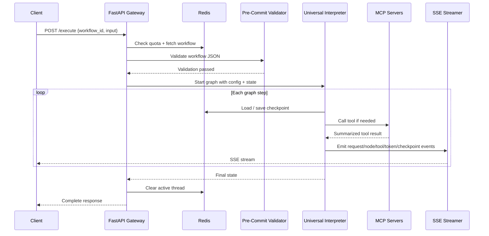

## 1. Objective

- What: Describe the request-to-stream lifecycle for GraphWeave execution.
- Why: Make the runtime event sequence and state transitions explicit.
- Who: Backend engineers, integrators, and SRE.

## Traceability

- FR-RUNTIME-001: Client requests must be validated before execution.
- FR-RUNTIME-002: The gateway must stream structured events back to the client.
- FR-RUNTIME-003: Checkpoints and active thread state must survive interruptions and completion.

## 2. Scope

- In scope: request intake, workflow fetch, validation, graph execution, streaming, and checkpointing.
- Out of scope: internal implementation of individual tool providers.

## 3. Specification

- Every request must be validated before graph execution.
- The runtime must stream structured SSE events back to the client.
- Checkpoints must be written during execution so interrupted runs can resume.
- Active-thread state must be cleared on completion.
- The concrete gateway endpoint must be `POST /execute` and remain stable for clients.
- Event names must follow a clear convention that maps to workflow lifecycle stages: `request.*`, `node.*`, `tool.*`, `checkpoint.*`, `complete`.
- NFR: streaming and checkpointing must keep the workflow responsive under expected load.

## 4. Technical Plan

- Keep the API gateway responsible for orchestration and streaming.
- Route state and checkpoints through Redis.
- Emit SSE events for request, node, tool, token, checkpoint, and completion milestones.
- Define event naming rules by lifecycle stage rather than by implementation detail.
- Keep the runtime lifecycle compatible with the fixed LangGraph/FastAPI/Redis/MCP stack.

## 5. Tasks

- [ ] Validate request payloads and fetch workflow definitions.
- [ ] Start graph execution with state/config and streaming enabled.
- [ ] Emit structured SSE events and persist checkpoints.
- [ ] Clear thread state on completion.
- [ ] Document endpoint and event naming conventions.

## 6. Verification

- Given a valid request, when it is executed, then the client should receive SSE events.
- Given a checkpointed run, when execution is interrupted, then it should be resumable.
- Given the run completes, when the final event fires, then the active thread entry must be cleared.
- Given a client integration, when it relies on `POST /execute`, then the stream contract must match the spec.
- Given a long workflow, when it runs under expected load, then streaming and checkpointing must remain within the documented responsiveness target.

Key runtime details:

- The graph streams granular SSE events such as `request.started`, `node.started`, `tool.started`, `tool.result`, `token.delta`, `node.completed`, `checkpoint.saved`, and `complete`.
- Checkpoints are written during execution so a thread can resume after interruption.
- The active thread key is cleared at the end of the run, which keeps concurrency and kill-switch handling predictable.
