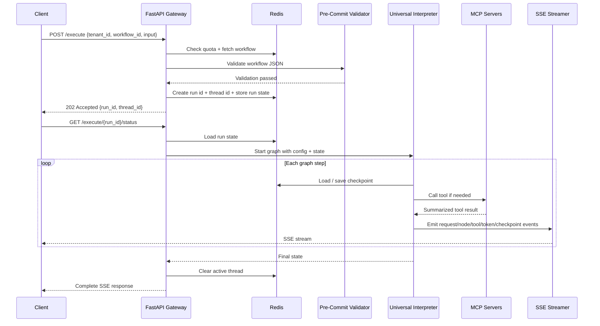

## 1. Objective

- What: Describe the two-request lifecycle for GraphWeave execution.
- Why: Separate workflow submission from live status streaming so clients can start work, receive an id, and then subscribe to progress.
- Who: Backend engineers, integrators, and SRE.

## Traceability

- FR-RUNTIME-001: Workflow submission must be validated before execution.
- FR-RUNTIME-002: Workflow submission must return a run id for later status access.
- FR-RUNTIME-003: A separate SSE status request must stream structured events for the submitted run.
- FR-RUNTIME-004: Checkpoints and active thread state must survive interruptions and completion.

## 2. Scope

- In scope: submission request, workflow fetch, validation, run creation, separate status streaming, execution, and checkpointing.
- Out of scope: internal implementation of individual tool providers.

## 3. Specification

- The submission request must be validated before graph execution.
- The submission request must return a run id immediately after creation.
- The gateway must generate a thread_id for each run and attach it to execution state.
- thread_id is gateway-generated and returned with the run id.
- A separate SSE status request must stream structured events back to the client for that run id.
- Checkpoints must be written during execution so interrupted runs can resume.
- Active-thread state must be cleared on completion.
- The concrete gateway contract must split into `POST /execute` for submission and `GET /execute/{run_id}/status` for SSE status streaming.
- Event names must follow a clear convention that maps to workflow lifecycle stages: `request.*`, `node.*`, `tool.*`, `checkpoint.*`, `complete`.
- The submission payload must carry tenant_id, workflow_id, and execution input.
- The submission payload does not require a client-supplied thread_id.
- The status stream must expose the current lifecycle state and the latest checkpoint snapshot when available.
- NFR: submission and streaming must keep the workflow responsive under expected load.

## 4. Technical Plan

- Keep the API gateway responsible for orchestration and status streaming.
- Route state and checkpoints through Redis.
- Emit SSE events for request, node, tool, token, checkpoint, and completion milestones on the status endpoint.
- Store run state so the status request can attach to the correct execution.
- Store thread_id in run state so checkpoints and cancellation remain consistent.
- Define event naming rules by lifecycle stage rather than by implementation detail.
- Keep the runtime lifecycle compatible with the fixed LangGraph/FastAPI/Redis/MCP stack.
- Keep active-thread cleanup deterministic so completed runs do not remain visible as live work.

## 4.1 Why Two IDs Exist

- `run_id` is the stable public record of the submission.
- `thread_id` is the live execution handle used by runtime state.
- If a run is retried or replayed later, the same `run_id` can keep the user-facing history while a new `thread_id` can represent the new live attempt.
- This separation makes reruns, recovery, and audit trails easier to understand without changing the client-facing job identity.

## 5. Tasks

- [ ] Validate submission payloads and fetch workflow definitions.
- [ ] Create a run id before graph execution starts.
- [ ] Stream structured SSE events from a separate status request.
- [ ] Persist checkpoints and clear thread state on completion.
- [ ] Document submission and status endpoint conventions.

## 6. Verification

- Given a valid submission request, when it is accepted, then the client should receive a run id.
- Given a submitted run id, when the status endpoint is opened, then the client should receive SSE events.
- Given a checkpointed run, when execution is interrupted, then it should be resumable.
- Given the run completes, when the final event fires, then the active thread entry must be cleared.
- Given a client integration, when it relies on `POST /execute` and `GET /execute/{run_id}/status`, then the submission and stream contracts must match the spec.
- Given a long workflow, when it runs under expected load, then submission and streaming must remain within the documented responsiveness target.

Key runtime details:

- The graph streams granular SSE events such as `request.started`, `node.started`, `tool.started`, `tool.result`, `token.delta`, `node.completed`, `checkpoint.saved`, and `complete` on the status endpoint.
- Checkpoints are written during execution so a thread can resume after interruption.
- The active thread key is cleared at the end of the run, which keeps concurrency and kill-switch handling predictable.
