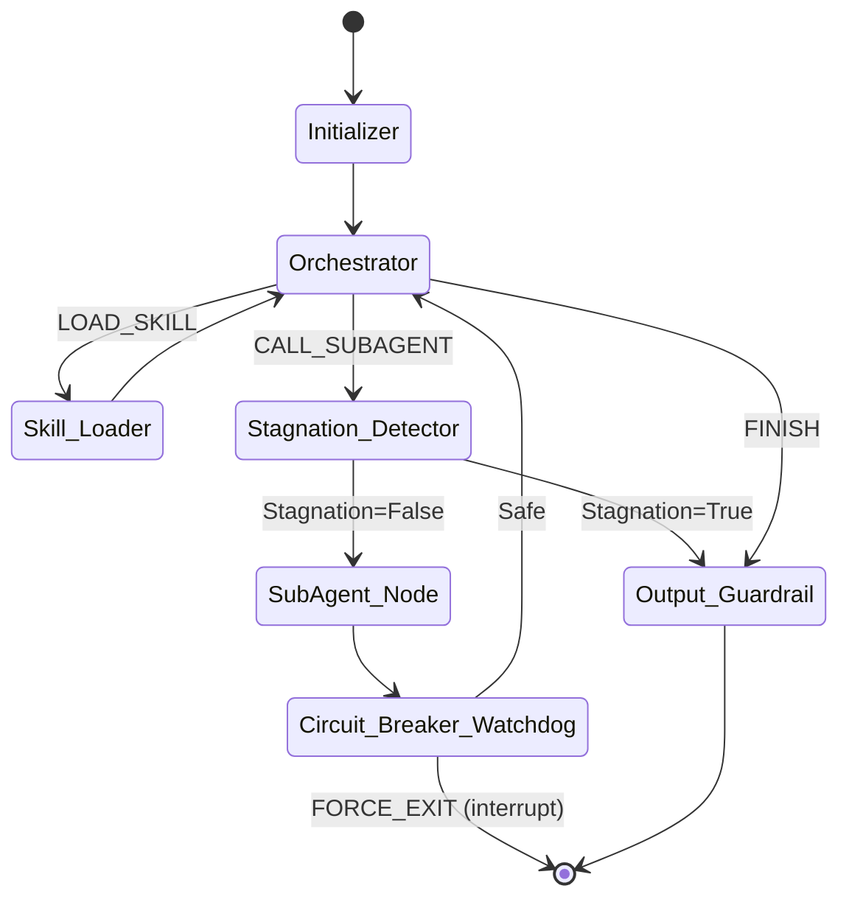
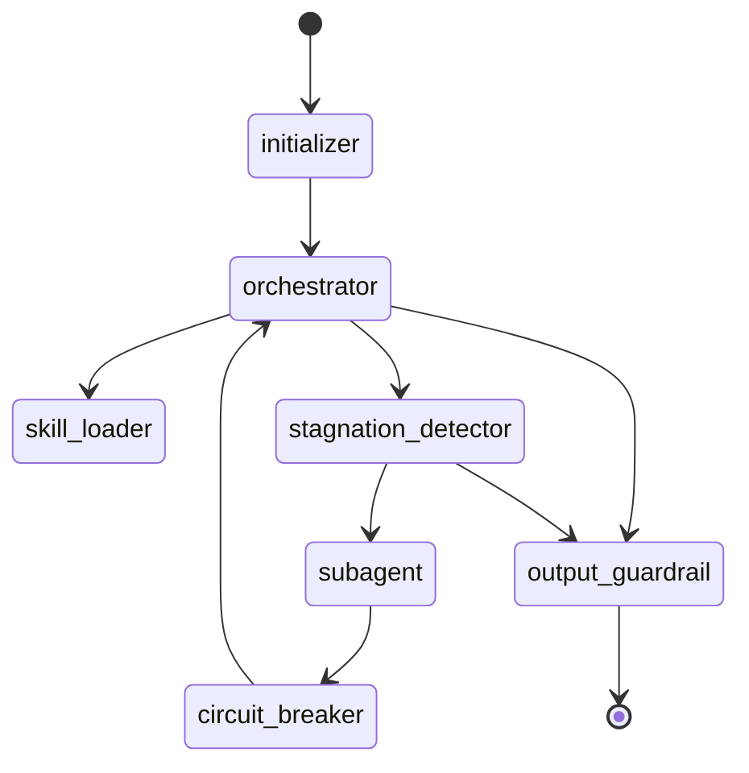
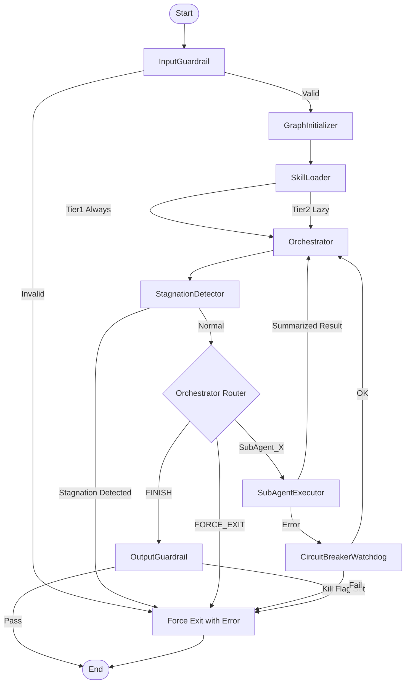
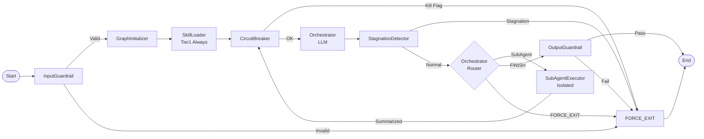

## 1. Objective

- What: Define the runtime shape of the universal interpreter graph.
- Why: Make execution, routing, and stop conditions explicit for deterministic workflow runs.
- Who: Runtime engineers, workflow authors, and platform operators.

## Traceability

- FR-RUNTIME-040: A single compiled graph must handle multiple workflows.
- FR-RUNTIME-041: Tier 1 skill summaries must always be loaded before routing.
- FR-RUNTIME-042: Subagent and exit paths must remain isolated and explicit.

## 2. Scope

- In scope: initializer, orchestrator, skill loading, stagnation detection, subagent execution, circuit breaker, and output guardrail.
- Out of scope: provider internals, business-domain logic, and UI presentation.

## 3. Specification

- The same compiled graph must handle multiple workflows through dynamic configuration.
- Tier 1 summaries must be always available; Tier 2 schemas must be loaded lazily.
- Subagents must stay isolated and return summarized results.
- Circuit breakers and stagnation detection must be able to force safe exit.
- Output guardrails must run before workflow completion.
- The runtime spec should be treated as authoritative for node order and safe-exit behavior.
- NFR: the interpreter must remain responsive enough for streaming workflows.

## 4. Technical Plan

- Model the runtime as a single reusable graph with dynamic branching.
- Route to skill loading only when the orchestrator requests additional context.
- Use the watchdog boundary to interrupt execution safely.
- Return to the orchestrator after subagent completion unless an exit condition is met.
- Keep node naming and control flow aligned with the documented runtime contract.
- Allow internal module changes so long as the graph behavior remains the same.

## 5. Tasks

- [ ] Document the canonical node sequence for execution.
- [ ] Preserve the lazy-load and stagnation branches.
- [ ] Keep safe-exit paths explicit.
- [ ] Map each node to a traceable requirement ID.

## 6. Verification

- Given a workflow start, when the initializer runs, then the orchestrator must receive a valid state.
- Given a skill request, when the orchestrator selects it, then the loader must fetch Tier 2 context only for that skill.
- Given stagnation or a kill flag, when detected, then the graph must exit safely rather than loop.
- Given a supported workflow, when the interpreter runs, then it must honor the documented node sequence and runtime contract.

What this captures:

- The same compiled graph handles many workflows; dynamic configuration decides which branch executes.
- Tier 1 summaries are always available, while Tier 2 schemas are loaded lazily only when a branch needs them.
- Subagents stay isolated and return summarized results before the orchestrator decides the next hop.
- The circuit breaker sits between subagent execution and the next orchestrator iteration so a thread can be stopped safely.
