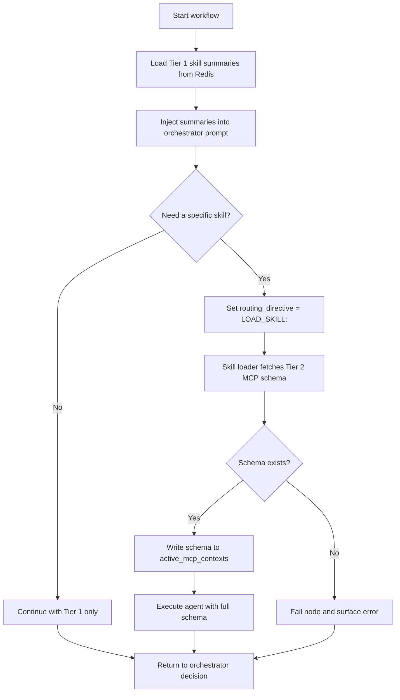

## 1. Objective

- What: Show how GraphWeave loads skills in two tiers.
- Why: Keep orchestrator context small while still allowing full capability expansion on demand.
- Who: Runtime engineers and AI workflow authors.

## Traceability

- FR-SKILL-001: Tier 1 summaries must always be present.
- FR-SKILL-002: Tier 2 schemas must be loaded dynamically at runtime.
- FR-SKILL-003: Missing Tier 2 schemas must fail the node.

## 2. Scope

- In scope: tier-1 summaries, tier-2 schemas, lazy loading, and failure handling.
- Out of scope: subagent tool execution internals and provider-specific parsing.

## 3. Specification

- Tier 1 summaries must always be available to the orchestrator.
- Tier 1 summaries must use a minimal JSON schema with skill id, purpose, inputs, outputs, and safety notes.
- Tier 2 schemas must be loaded only when the orchestrator selects a specific skill.
- Missing Tier 2 schemas must fail the node.
- The skills model is a hard requirement, not an optimization.
- Inputs to skills may come from folder-based docs or MCP tools, but runtime loading is mandatory.
- NFR: loading should minimize prompt bloat and preserve routing responsiveness.

## 4. Technical Plan

- Load summaries first and inject them into the orchestrator prompt.
- Fetch full MCP schemas only for selected skills.
- Track loaded schemas in active context state for agent execution.
- Keep the loading flow explicit enough to explain why a skill was or was not expanded.
- Maintain a clear convention for naming skill-loading events in streams.

## 5. Tasks

- [ ] Load tier-1 summaries into Redis-backed state.
- [ ] Fetch tier-2 schemas lazily when requested.
- [ ] Fail the node when a schema is missing.
- [ ] Add naming guidelines for skill-load events and failure events.

## 6. Verification

- Given a workflow start, when it begins, then Tier 1 summaries must be available before routing.
- Given the orchestrator selects a skill, when the loader runs, then only that skill's Tier 2 schema should load.
- Given a missing schema, when the loader fails to find it, then the node should fail.
- Given a skill activation, when the runtime expands context, then it must be clear why the expansion occurred.

