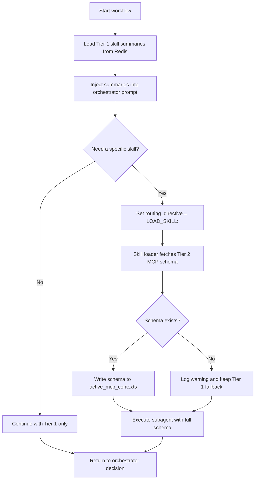

## 1. Objective

- What: Show how GraphWeave loads skills in two tiers.
- Why: Keep orchestrator context small while still allowing full capability expansion on demand.
- Who: Runtime engineers and AI workflow authors.

## 2. Scope

- In scope: tier-1 summaries, tier-2 schemas, lazy loading, and fallback behavior.
- Out of scope: subagent tool execution internals and provider-specific parsing.

## 3. Specification

- Tier 1 summaries must always be available to the orchestrator.
- Tier 2 schemas must be loaded only when the orchestrator selects a specific skill.
- Missing schemas must fall back gracefully without breaking the main workflow.

## 4. Technical Plan

- Load summaries first and inject them into the orchestrator prompt.
- Fetch full MCP schemas only for selected skills.
- Track loaded schemas in active context state for subagent execution.

## 5. Tasks

- [ ] Load tier-1 summaries into Redis-backed state.
- [ ] Fetch tier-2 schemas lazily when requested.
- [ ] Preserve fallback behavior when a schema is missing.

## 6. Verification

- Given a workflow start, when it begins, then Tier 1 summaries must be available before routing.
- Given the orchestrator selects a skill, when the loader runs, then only that skill's Tier 2 schema should load.
- Given a missing schema, when the loader fails to find it, then the workflow should continue with fallback handling.

