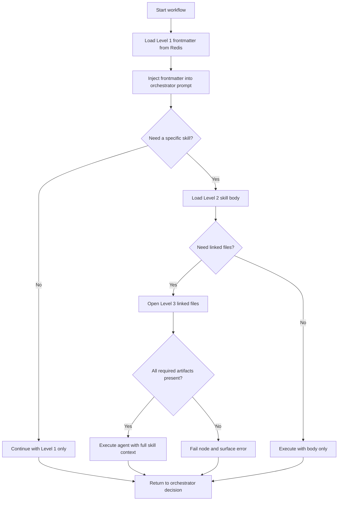

## 1. Objective

- What: Show how GraphWeave loads skills in two tiers.
- Why: Keep orchestrator context small while still allowing full capability expansion on demand.
- Who: Runtime engineers and AI workflow authors.

## Traceability

- FR-SKILL-001: Level 1 frontmatter must always be present.
- FR-SKILL-002: Level 2 skill bodies must be loaded dynamically at runtime.
- FR-SKILL-003: Missing Level 2 bodies or required Level 3 linked files must fail the node.

## 2. Scope

- In scope: tier-1 summaries, tier-2 schemas, lazy loading, and failure handling.
- Out of scope: subagent tool execution internals and provider-specific parsing.

## 3. Specification

- Level 1 frontmatter must always be available to the orchestrator.
- Level 1 metadata must stay minimal and focus on name, description, and trigger cues.
- Level 2 skill bodies must be loaded only when the orchestrator selects a specific skill.
- Level 3 linked files must load only when the skill execution needs them.
- Missing Level 2 bodies or required Level 3 linked files must fail the node.
- The skills model is a hard requirement, not an optimization.
- Inputs to skills may come from folder-based docs or MCP tools, but runtime loading is mandatory.
- NFR: loading should minimize prompt bloat and preserve routing responsiveness.

## 4. Technical Plan

- Load Level 1 frontmatter first and inject it into the orchestrator prompt.
- Fetch Level 2 bodies only for selected skills.
- Open Level 3 linked files only when the execution path needs them.
- Track loaded skill artifacts in active context state for agent execution.
- Keep the loading flow explicit enough to explain why a skill was or was not expanded.
- Maintain a clear convention for naming skill-loading events in streams.

## 5. Tasks

- [ ] Load level-1 frontmatter into Redis-backed state.
- [ ] Fetch level-2 bodies lazily when requested.
- [ ] Open level-3 linked files only on demand.
- [ ] Fail the node when a required artifact is missing.
- [ ] Add naming guidelines for skill-load events and failure events.

## 6. Verification

- Given a workflow start, when it begins, then Level 1 frontmatter must be available before routing.
- Given the orchestrator selects a skill, when the loader runs, then only that skill's Level 2 body should load.
- Given a skill needs supporting files, when execution requests them, then only the needed Level 3 linked files should open.
- Given a missing required artifact, when the loader fails to find it, then the node should fail.
- Given a skill activation, when the runtime expands context, then it must be clear why the expansion occurred.

