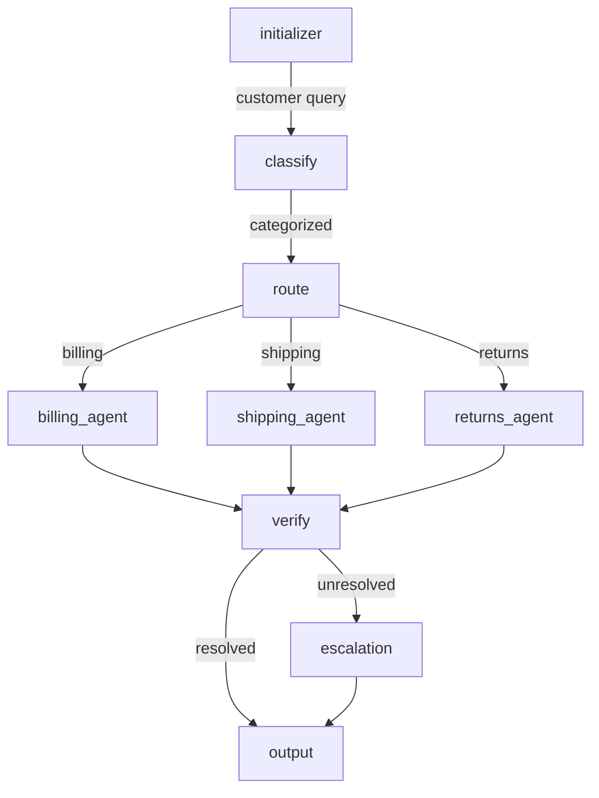

# Migration Guide: From Subagent-Routing to LangGraph-Native Workflows

## Problem Statement

The previous workflow model mixed **skill availability with routing logic**. This created tight coupling between:

- Available skills
- Workflow structure (DAG)
- Agent routing decisions

**Result**: Workflows were fragile and skills constrained the graph structure.

---

## The Fix: Separate Structure from Content

### Old Model (Subagent-Routing)

```json
{
  "skills": ["billing_system", "shipping_api"],
  "subagents": [
    {
      "name": "billing_agent",
      "skill_id": "billing_system",
      "allowed_tools": ["stripe_get_invoice"]
    }
  ],
  "routing_rules": {
    "entry_node": "initializer",
    "fallback_on_stagnation": "output_guardrail"
  }
}
```

**Problems**:

1. Workflow structure implicit (determined by subagents + skills).
2. No explicit edges or conditions.
3. Routing depends on available skills (fragile).
4. Difficult to visualize or reason about graph flow.

### New Model (Explicit State Machine + Skill Loading)

```json
{
  "nodes": [
    { "id": "classify", "type": "skill_call", "skill_id": "classify_support_request" },
    { "id": "route_decision", "type": "branch", "condition": "$.classification.category" },
    { "id": "billing_agent", "type": "skill_call", "skill_id": "billing_system" }
  ],
  "edges": [
    { "from": "classify", "to": "route_decision" },
    { "from": "route_decision", "to": "billing_agent", "condition": "$.classification.category == 'billing'" }
  ]
}
```

**Benefits**:

1. ✓ Workflow structure **explicit** (nodes and edges).
2. ✓ Routing determined by **edge conditions**, not available skills.
3. ✓ Skills are **context**, not routing logic.
4. ✓ Graph is **visualizable** and **reasoned about**.
5. ✓ Execution is **deterministic** regardless of skill availability.

---

## Key Architectural Shifts

### 1. Node Types are Explicit

| Type             | Purpose                        | Example                    |
| ---------------- | ------------------------------ | -------------------------- |
| `entry`          | Start workflow, accept input   | Customer query input       |
| `skill_call`     | Execute a skill (load context) | "billing_system" skill     |
| `branch`         | Evaluate condition, no work    | Decision point (if/then)   |
| `human_decision` | Pause for human input          | Approval gate              |
| `exit`           | End workflow, output result    | Format and return response |

**Old Model** had only `subagents` (implicit execution).

### 2. Edges Have Conditions

```json
{
  "from": "route_decision",
  "to": "billing_agent",
  "condition": "$.classification.category == 'billing'"
}
```

Conditions are **JSONPath expressions** evaluated against workflow state.

**Old Model** had `routing_rules` that were implicit or provider-specific.

### 3. Skills Load at Node Execution

When node `billing_agent` executes:

1. Runtime reads `"skill_id": "billing_system"`.
2. Looks up skill in registry → finds `SKILL.md`.
3. Loads frontmatter (discovery) + body (procedure).
4. Injects skill markdown into execution context.
5. Agent executes with skill guidance.
6. Output stored via `output_key: "billing_response"`.

**Old Model** had skills as top-level list; execution details unspecified.

### 4. Guardrails are Per-Node

```json
{
  "id": "billing_agent",
  "type": "skill_call",
  "guardrails": {
    "input": {
      "max_tokens": 2000,
      "blocked_patterns": ["ignore instructions"]
    },
    "output": {
      "pii_detection": true,
      "blocked_topics": ["internal_pricing"]
    }
  }
}
```

Guardrails are attached to **where the risk lives** (the node).

**Old Model** had global guardrails; node-level guardrails were unclear.

---

## Migration Path

### Step 1: Identify Nodes

List all discrete work units:

- Query classification
- Billing lookup
- Shipping tracking
- Returns processing
- Escalation

### Step 2: Identify Edges and Conditions

Document transitions:

- After classification → route based on category.
- After agent execution → verify resolution.
- If unresolved → escalate.

### Step 3: Assign Skills to Nodes

Map each work unit to a skill:

- `classify_query` → skill: `classify_support_request`
- `billing_agent` → skill: `billing_system`

### Step 4: Specify Input/Output Mappings

For each `skill_call` node:

- What inputs come from where? (JSONPath)
- What output key stores the result?

### Step 5: Define Guardrails

For sensitive nodes (PII, payment), add input/output guardrails.

### Step 6: Validate and Visualize

Use the JSON schema to validate. Render the graph:



---

## Real Example: Customer Support Workflow

### Old Approach (Implicit)

```json
{
  "workflow_id": "customer-support",
  "skills": ["billing_system", "shipping_api", "returns_processor"],
  "subagents": [
    { "name": "billing_agent", "skill_id": "billing_system" },
    { "name": "shipping_agent", "skill_id": "shipping_api" }
  ]
}
```

**Questions**:

- How does the workflow decide to route to billing_agent?
- What conditions trigger escalation?
- How does execution actually flow?

### New Approach (Explicit)

```json
{
  "name": "customer-support",
  "version": "2.0.0",
  "nodes": [
    {
      "id": "classify_query",
      "type": "skill_call",
      "skill_id": "classify_support_request"
    },
    {
      "id": "route_decision",
      "type": "branch",
      "config": { "condition_expression": "$.classification.category" }
    },
    {
      "id": "billing_agent",
      "type": "skill_call",
      "skill_id": "billing_system"
    }
  ],
  "edges": [
    { "from": "classify_query", "to": "route_decision" },
    { "from": "route_decision", "to": "billing_agent", "condition": "$.classification.category == 'billing'" }
  ]
}
```

**Clarity**:

- ✓ Explicit path from input → classification → routing → agent.
- ✓ Condition for billing route is clear.
- ✓ Skill loading happens at node execution time.
- ✓ Flow is visualizable and testable.

---

## Backwards Compatibility

### What Changes

- Top-level `skills` array → removed (skills referenced in nodes).
- `subagents` array → removed (replaced by explicit nodes).
- `routing_rules` → removed (replaced by edge conditions).

### What Stays the Same

- Guardrails (input/output) concept remains; now per-node.
- Skill registry concept remains; now loaded at node time.
- Limits (max_hops, timeout_seconds) remain at workflow level.

### Migration Checklist

- [ ] Convert each `subagent` to a `skill_call` node.
- [ ] Convert implicit routing to explicit edges with conditions.
- [ ] Add node types (entry, exit, branch) to define graph shape.
- [ ] Move skill references from top-level to node `config.skill_id`.
- [ ] Test condition evaluation with real state snapshots.

---

## FAQ

**Q: Do I need to change my skills?**
A: No. Skills remain SKILL.md files with frontmatter + body. Only the workflow JSON changes.

**Q: How are skills discovered?**
A: Skills are resolved by `skill_id` at runtime. The registry maps `skill_id` → `SKILL.md` location.

**Q: What if a skill fails to load?**
A: The workflow should handle gracefully. A missing skill can be treated as a node failure, triggering fallback edges (if defined).

**Q: Can I have conditional skill loading?**
A: Not directly. If you need conditional skill selection, use a `branch` node to evaluate the condition, then route to different `skill_call` nodes.

**Q: Are workflows deterministic now?**
A: Yes. Given the same input and state snapshots, the graph path is deterministic (conditions are evaluated the same way).

---

## References

- `WORKFLOW_JSON_SPEC.md` — Full schema documentation.
- `workflow.json` — Example customer support workflow.
- `LLM_SKILLS_ARCHITECTURE.md` — How skills are packaged and loaded.
