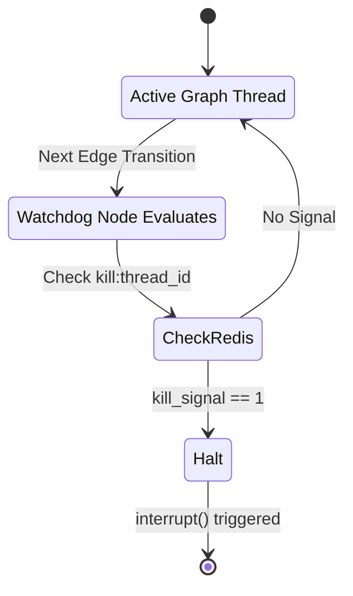
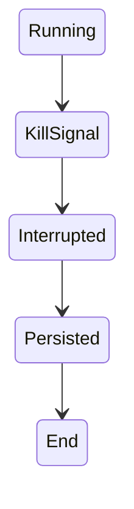
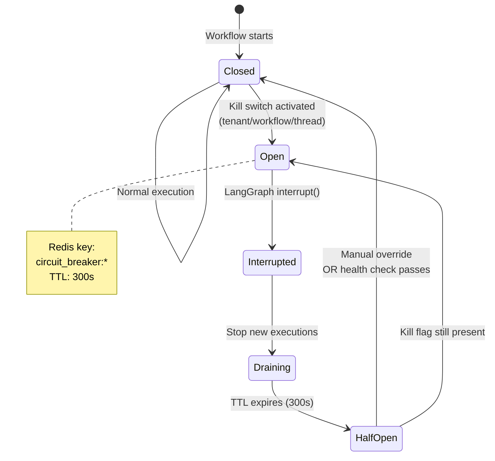

```mermaid
stateDiagram-v2
    state "Active Graph Thread" as Active
    state "Watchdog Node Evaluates" as Eval
    [*] --> Active
    Active --> Eval: Next Edge Transition
    Eval --> CheckRedis: Check kill:thread_id
    CheckRedis --> Halt: kill_signal == 1
    Halt --> [*]: interrupt() triggered
    CheckRedis --> Active: No Signal

```

```mermaid
stateDiagram-v2
    Running --> KillSignal
    KillSignal --> Interrupted
    Interrupted --> Persisted
    Persisted --> End

```

```mermaid
stateDiagram-v2
    [*] --> Closed: Workflow starts
    
    Closed --> Closed: Normal execution
    Closed --> Open: Kill switch activated<br/>(tenant/workflow/thread)
    
    Open --> Interrupted: LangGraph interrupt()
    Interrupted --> Draining: Stop new executions
    Draining --> HalfOpen: TTL expires (300s)
    
    HalfOpen --> Closed: Manual override<br/>OR health check passes
    HalfOpen --> Open: Kill flag still present
    
    note right of Open
        Redis key:
        circuit_breaker:*
        TTL: 300s
    end note
```
