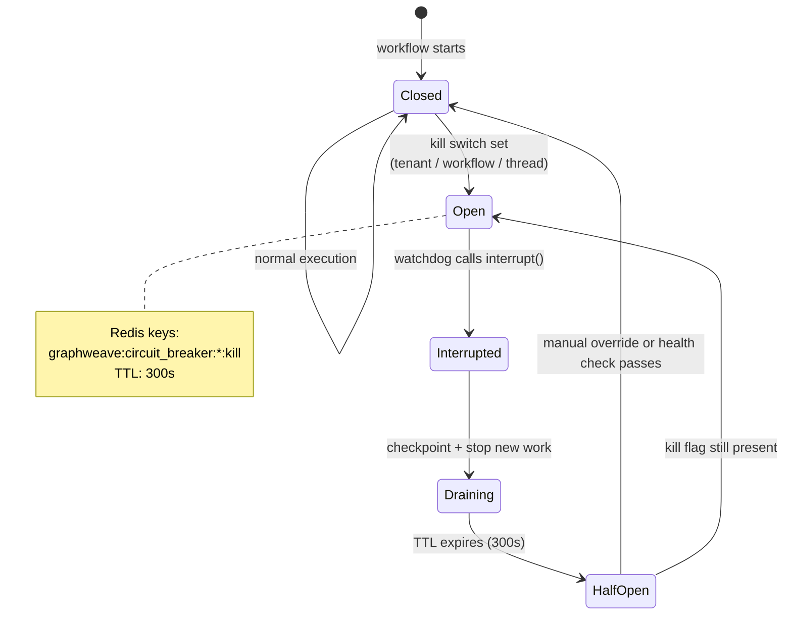

Operational notes:

- A kill switch can be scoped at tenant, workflow, or thread level.
- Interrupt happens at the watchdog boundary so the graph can stop cleanly instead of corrupting state.
- The half-open state is useful for re-checking health after TTL expiry instead of permanently leaving a workflow disabled.
