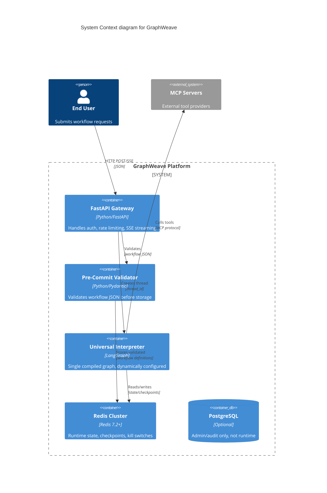

```mermaid
C4Context
    title System Context diagram for GraphWeave

    Person(user, "End User", "Submits workflow requests")
    
    System_Boundary(graphweave, "GraphWeave Platform") {
        Container(api, "FastAPI Gateway", "Python/FastAPI", "Handles auth, rate limiting, SSE streaming")
        Container(validator, "Pre-Commit Validator", "Python/Pydantic", "Validates workflow JSON before storage")
        Container(interpreter, "Universal Interpreter", "LangGraph", "Single compiled graph, dynamically configured")
        Container(redis, "Redis Cluster", "Redis 7.2+", "Runtime state, checkpoints, kill switches")
        ContainerDb(postgres, "PostgreSQL", "Optional", "Admin/audit only, not runtime")
    }
    
    System_Ext(mcp_servers, "MCP Servers", "External tool providers")
    
    Rel(user, api, "HTTP POST/SSE", "JSON")
    Rel(api, validator, "Validates", "workflow JSON")
    Rel(api, interpreter, "Creates thread", "thread_id")
    Rel(interpreter, redis, "Reads/writes", "state/checkpoints")
    Rel(interpreter, mcp_servers, "Calls tools", "MCP protocol")
    Rel(validator, redis, "Stores validated", "workflow definitions")
```
