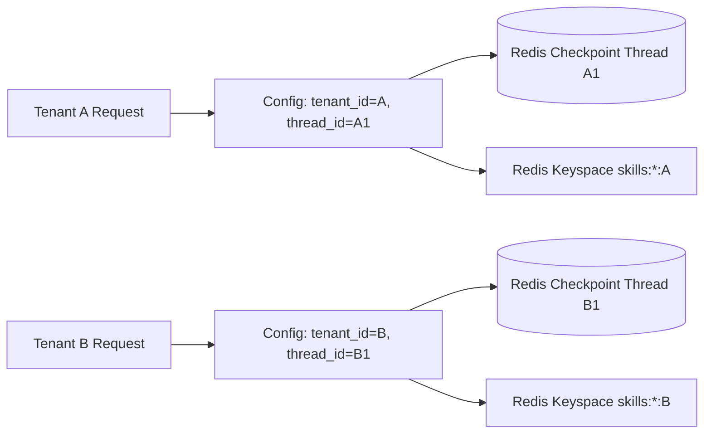
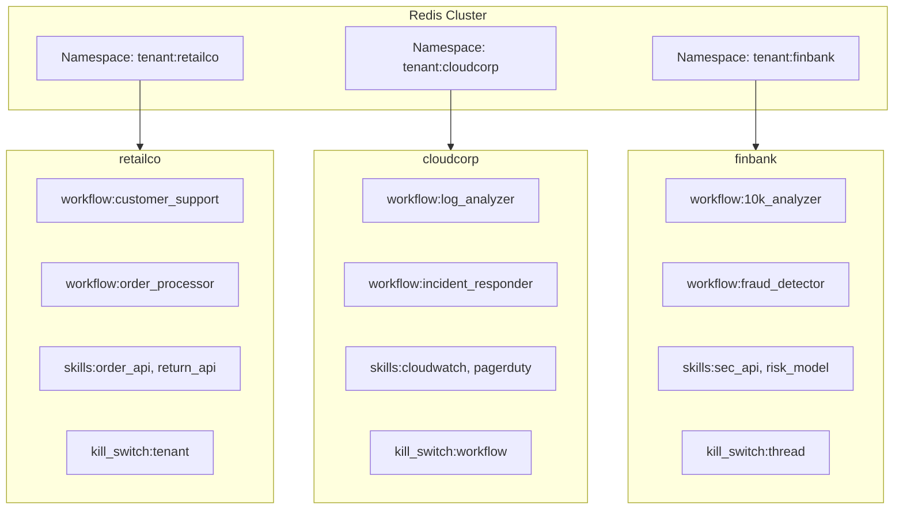

```mermaid
graph LR
    TenantA[Tenant A Request] --> ConfigA[Config: tenant_id=A, thread_id=A1]
    TenantB[Tenant B Request] --> ConfigB[Config: tenant_id=B, thread_id=B1]
    ConfigA --> StateA[(Redis Checkpoint Thread A1)]
    ConfigB --> StateB[(Redis Checkpoint Thread B1)]
    ConfigA --> KeyspaceA[Redis Keyspace skills:*:A]
    ConfigB --> KeyspaceB[Redis Keyspace skills:*:B]

```

```mermaid
graph TB
    subgraph "Redis Cluster"
        NS1[Namespace: tenant:retailco]
        NS2[Namespace: tenant:cloudcorp]
        NS3[Namespace: tenant:finbank]
    end
    
    subgraph "retailco"
        W1[workflow:customer_support]
        W2[workflow:order_processor]
        S1[skills:order_api, return_api]
        K1[kill_switch:tenant]
    end
    
    subgraph "cloudcorp"
        W3[workflow:log_analyzer]
        W4[workflow:incident_responder]
        S2[skills:cloudwatch, pagerduty]
        K2[kill_switch:workflow]
    end
    
    subgraph "finbank"
        W5[workflow:10k_analyzer]
        W6[workflow:fraud_detector]
        S3[skills:sec_api, risk_model]
        K3[kill_switch:thread]
    end
    
    NS1 --> retailco
    NS2 --> cloudcorp
    NS3 --> finbank
```
