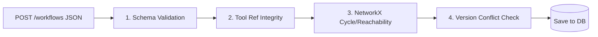
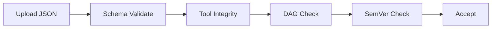
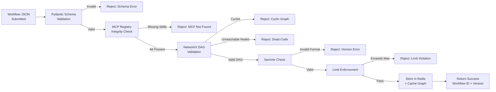

```mermaid
flowchart LR
    Upload[POST /workflows JSON] --> Pydantic[1. Schema Validation]
    Pydantic --> Integrity[2. Tool Ref Integrity]
    Integrity --> DAG[3. NetworkX Cycle/Reachability]
    DAG --> SemVer[4. Version Conflict Check]
    SemVer --> DB[(Save to DB)]
```

```mermaid
flowchart LR
    A[Upload JSON] --> B[Schema Validate]
    B --> C[Tool Integrity]
    C --> D[DAG Check]
    D --> E[SemVer Check]
    E --> F[Accept]
```

```mermaid
flowchart LR
    A[Workflow JSON<br/>Submitted] --> B[Pydantic Schema<br/>Validation]
    
    B -->|Invalid| REJECT1[Reject: Schema Error]
    B -->|Valid| C[MCP Registry<br/>Integrity Check]
    
    C -->|Missing Skills| REJECT2[Reject: MCP Not Found]
    C -->|All Present| D[NetworkX DAG<br/>Validation]
    
    D -->|Cycles| REJECT3[Reject: Cyclic Graph]
    D -->|Unreachable Nodes| REJECT4[Reject: Dead Code]
    D -->|Valid DAG| E[SemVer Check]
    
    E -->|Invalid Format| REJECT5[Reject: Version Error]
    E -->|Valid| F[Limit Enforcement]
    
    F -->|Exceeds Max| REJECT6[Reject: Limit Violation]
    F -->|Pass| G[Store in Redis<br/>+ Cache Graph]
    
    G --> H[Return Success<br/>Workflow ID + Version]
```
