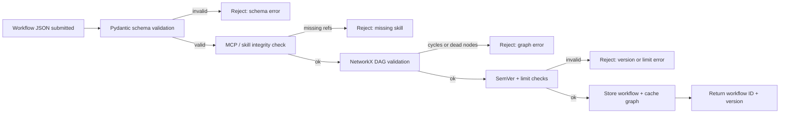

Validation notes:

- Schema errors fail fast before any storage occurs.
- MCP or skill references must exist before a workflow is accepted.
- Cycles and dead nodes are rejected when they indicate bypasses, while the orchestrator’s intentional runtime loop remains a separate concern.
- SemVer and limit checks prevent incompatible versions and unsafe resource settings from entering the runtime.
