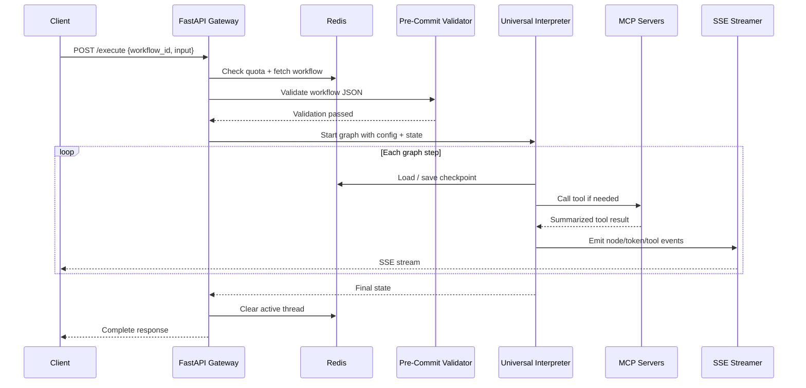

Key runtime details:

- The graph streams granular events such as `node_start`, `tool_start`, `tool_result`, `token`, `node_end`, and `complete`.
- Checkpoints are written during execution so a thread can resume after interruption.
- The active thread key is cleared at the end of the run, which keeps concurrency and kill-switch handling predictable.
