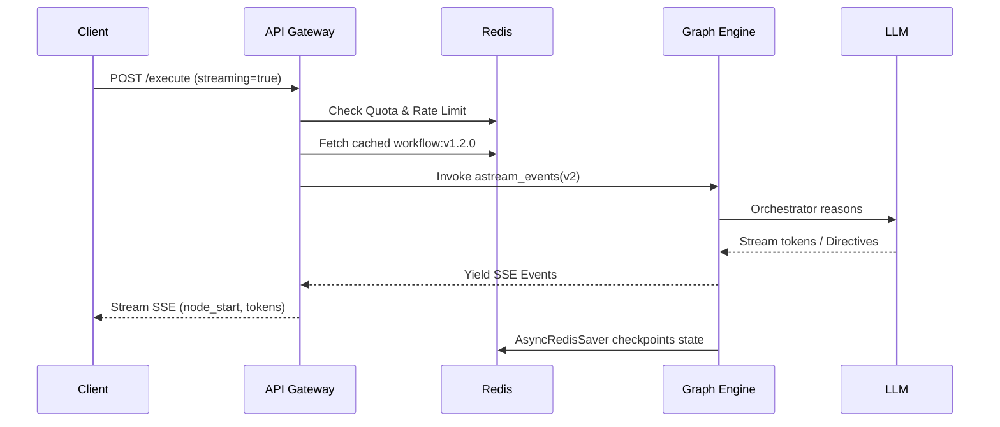
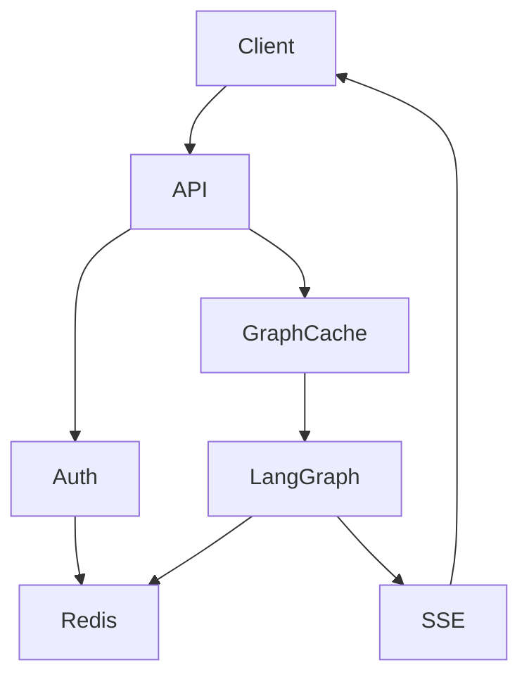
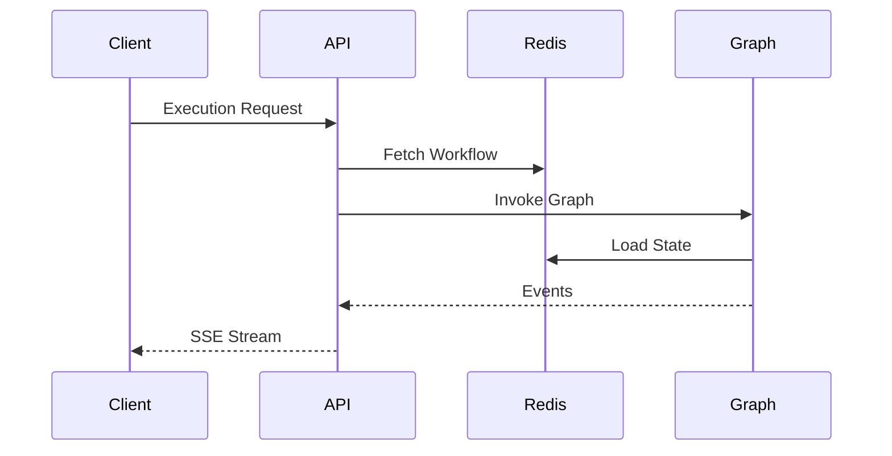
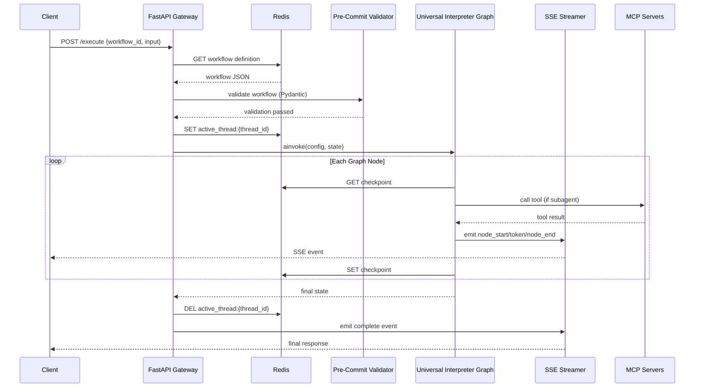

```mermaid
sequenceDiagram
    participant C as Client
    participant A as API Gateway
    participant R as Redis
    participant G as Graph Engine
    participant L as LLM
    C->>A: POST /execute (streaming=true)
    A->>R: Check Quota & Rate Limit
    A->>R: Fetch cached workflow:v1.2.0
    A->>G: Invoke astream_events(v2)
    G->>L: Orchestrator reasons
    L-->>G: Stream tokens / Directives
    G-->>A: Yield SSE Events
    A-->>C: Stream SSE (node_start, tokens)
    G->>R: AsyncRedisSaver checkpoints state
```

```mermaid
graph TB
    Client --> API
    API --> Auth
    Auth --> Redis
    API --> GraphCache
    GraphCache --> LangGraph
    LangGraph --> Redis
    LangGraph --> SSE
    SSE --> Client
```

```mermaid
sequenceDiagram
    participant C as Client
    participant A as API
    participant R as Redis
    participant G as Graph

    C->>A: Execution Request
    A->>R: Fetch Workflow
    A->>G: Invoke Graph
    G->>R: Load State
    G-->>A: Events
    A-->>C: SSE Stream
```

```mermaid
sequenceDiagram
    participant C as Client
    participant API as FastAPI Gateway
    participant R as Redis
    participant V as Pre-Commit Validator
    participant G as Universal Interpreter Graph
    participant S as SSE Streamer
    participant M as MCP Servers

    C->>API: POST /execute {workflow_id, input}
    API->>R: GET workflow definition
    R-->>API: workflow JSON
    API->>V: validate workflow (Pydantic)
    V-->>API: validation passed
    API->>R: SET active_thread:{thread_id}
    API->>G: ainvoke(config, state)
    
    loop Each Graph Node
        G->>R: GET checkpoint
        G->>M: call tool (if subagent)
        M-->>G: tool result
        G->>S: emit node_start/token/node_end
        S-->>C: SSE event
        G->>R: SET checkpoint
    end
    
    G-->>API: final state
    API->>R: DEL active_thread:{thread_id}
    API->>S: emit complete event
    S-->>C: final response
```
