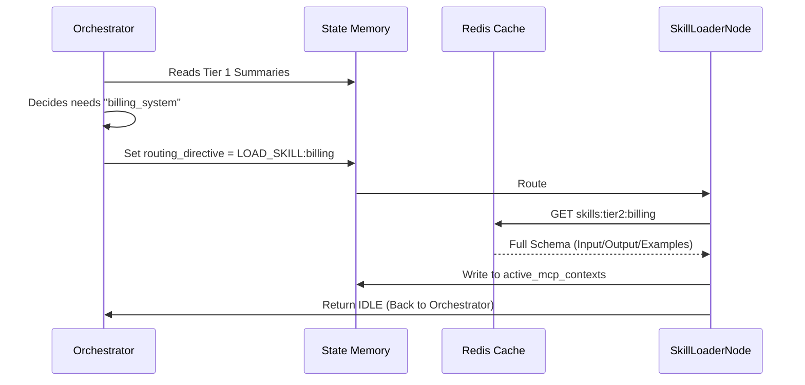
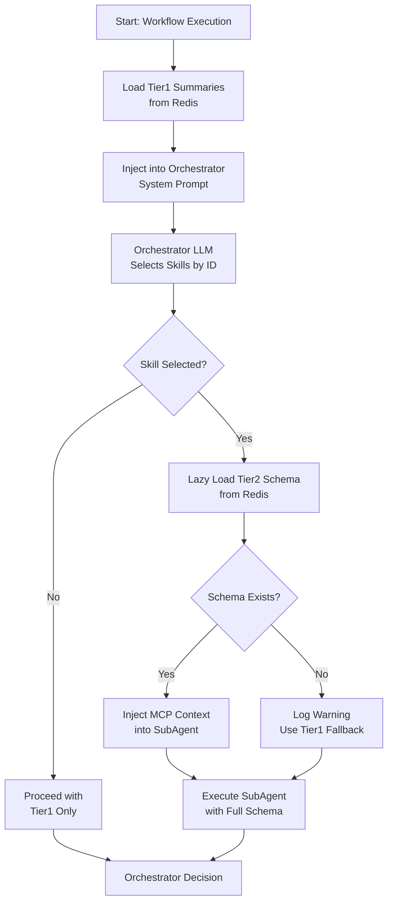

```mermaid
sequenceDiagram
    participant O as Orchestrator
    participant S as State Memory
    participant Redis as Redis Cache
    O->>S: Reads Tier 1 Summaries
    O->>O: Decides needs "billing_system"
    O->>S: Set routing_directive = LOAD_SKILL:billing
    S->>SkillLoaderNode: Route
    SkillLoaderNode->>Redis: GET skills:tier2:billing
    Redis-->>SkillLoaderNode: Full Schema (Input/Output/Examples)
    SkillLoaderNode->>S: Write to active_mcp_contexts
    SkillLoaderNode->>O: Return IDLE (Back to Orchestrator)
```

```mermaid
flowchart TD
    A[Start: Workflow Execution] --> B[Load Tier1 Summaries<br/>from Redis]
    B --> C[Inject into Orchestrator<br/>System Prompt]
    C --> D[Orchestrator LLM<br/>Selects Skills by ID]
    
    D --> E{Skill Selected?}
    E -->|No| F[Proceed with<br/>Tier1 Only]
    E -->|Yes| G[Lazy Load Tier2 Schema<br/>from Redis]
    
    G --> H{Schema Exists?}
    H -->|Yes| I[Inject MCP Context<br/>into SubAgent]
    H -->|No| J[Log Warning<br/>Use Tier1 Fallback]
    
    I --> K[Execute SubAgent<br/>with Full Schema]
    J --> K
    F --> L[Orchestrator Decision]
    K --> L
```
