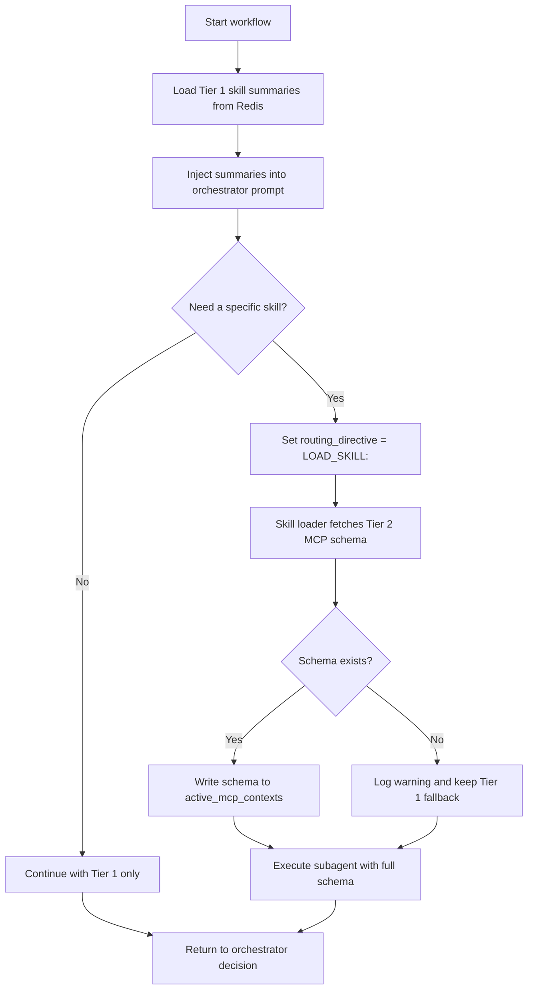

```mermaid
flowchart TD
    A[Start workflow] --> B[Load Tier 1 skill summaries from Redis]
    B --> C[Inject summaries into orchestrator prompt]
    C --> D{Need a specific skill?}
    D -->|No| E[Continue with Tier 1 only]
    D -->|Yes| F[Set routing_directive = LOAD_SKILL:<id>]
    F --> G[Skill loader fetches Tier 2 MCP schema]
    G --> H{Schema exists?}
    H -->|Yes| I[Write schema to active_mcp_contexts]
    H -->|No| J[Log warning and keep Tier 1 fallback]
    I --> K[Execute subagent with full schema]
    J --> K
    E --> L[Return to orchestrator decision]
    K --> L
```
