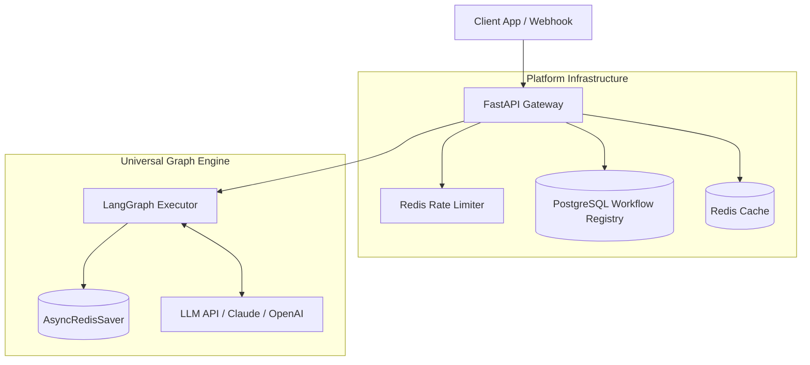

```C4Container
    title Container diagram for GraphWeave

    Container(api, "API Gateway", "FastAPI", "Handles authentication, rate limiting, SSE")
    Container(validator, "Pre-Commit Validator", "Pydantic", "Validates workflow JSON before storage")
    Container(interpreter, "Universal Interpreter", "LangGraph", "Single compiled graph for all workflows")
    Container(redis, "Redis Cluster", "Redis 7.2", "Runtime state, checkpoints, kill switches")
    ContainerDb(postgres, "PostgreSQL", "TimescaleDB", "Audit logs, tenant config (optional)")
    
    Container(monitor, "Prometheus", "Monitoring", "Collects metrics from all services")
    Container(tracing, "Jaeger", "Tracing", "Distributed tracing")
    
    Rel(api, validator, "Validates", "gRPC")
    Rel(api, interpreter, "Creates thread", "LangGraph API")
    Rel(interpreter, redis, "Reads/writes", "RESP")
    Rel(interpreter, validator, "Validates on-demand", "gRPC")
    Rel(validator, redis, "Writes validated", "RESP")```

```graph TB
    Client[Client App / Webhook]
    subgraph Platform Infrastructure
        API[FastAPI Gateway]
        Rate[Redis Rate Limiter]
        Registry[(PostgreSQL Workflow Registry)]
        Cache[(Redis Cache)]
    end
    subgraph Universal Graph Engine
        LG[LangGraph Executor]
        State[(AsyncRedisSaver)]
        LLM[LLM API / Claude / OpenAI]
    end
    Client --> API
    API --> Rate
    API --> Registry
    API --> Cache
    API --> LG
    LG --> State
    LG <--> LLM```
