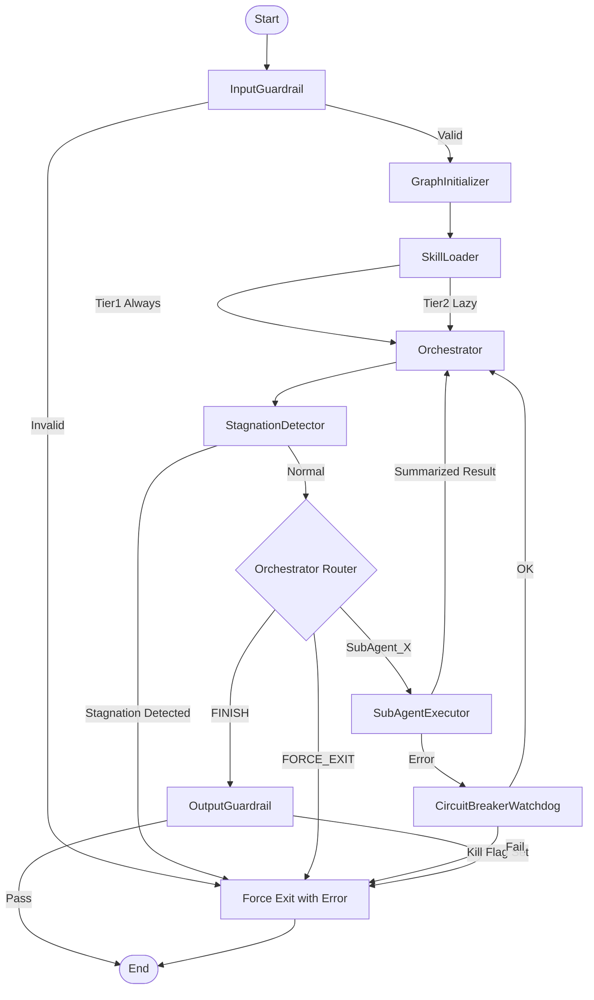
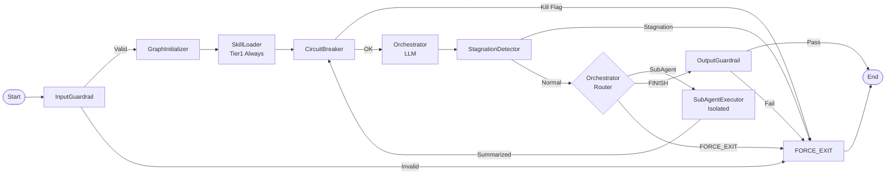

```mermaid
stateDiagram-v2
    [*] --> Initializer
    Initializer --> Orchestrator
    Orchestrator --> Skill_Loader: LOAD_SKILL
    Skill_Loader --> Orchestrator
    Orchestrator --> Stagnation_Detector: CALL_SUBAGENT
    Stagnation_Detector --> Output_Guardrail: Stagnation=True
    Stagnation_Detector --> SubAgent_Node: Stagnation=False
    SubAgent_Node --> Circuit_Breaker_Watchdog
    Circuit_Breaker_Watchdog --> Orchestrator: Safe
    Circuit_Breaker_Watchdog --> [*]: FORCE_EXIT (interrupt)
    Orchestrator --> Output_Guardrail: FINISH
    Output_Guardrail --> [*]
    ```

```mermaid
stateDiagram-v2
    [*] --> initializer
    initializer --> orchestrator

    orchestrator --> skill_loader
    orchestrator --> stagnation_detector
    orchestrator --> output_guardrail

    stagnation_detector --> subagent
    stagnation_detector --> output_guardrail

    subagent --> circuit_breaker
    circuit_breaker --> orchestrator

    output_guardrail --> [*]
```




