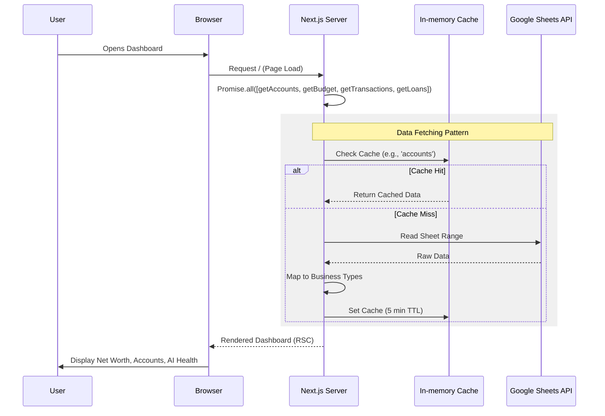
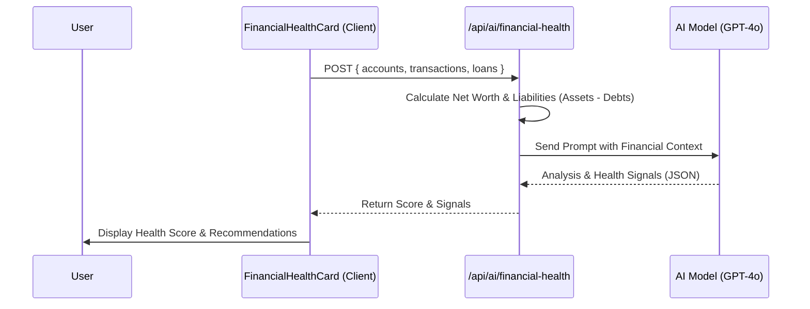
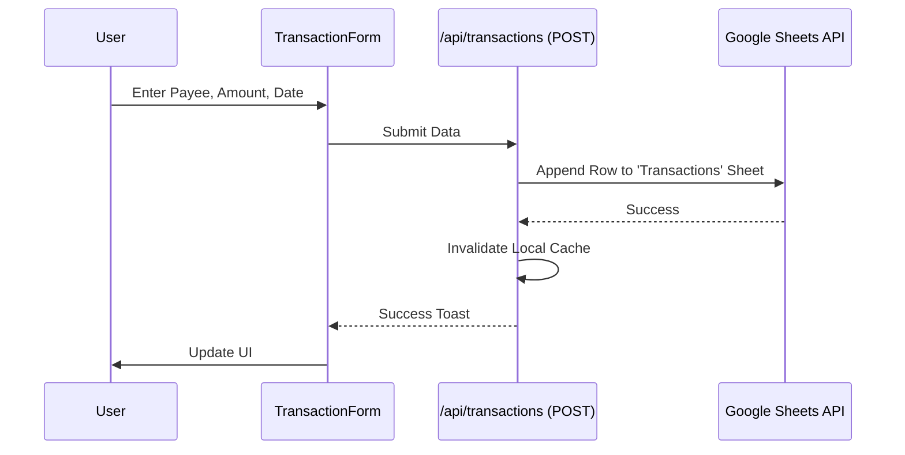
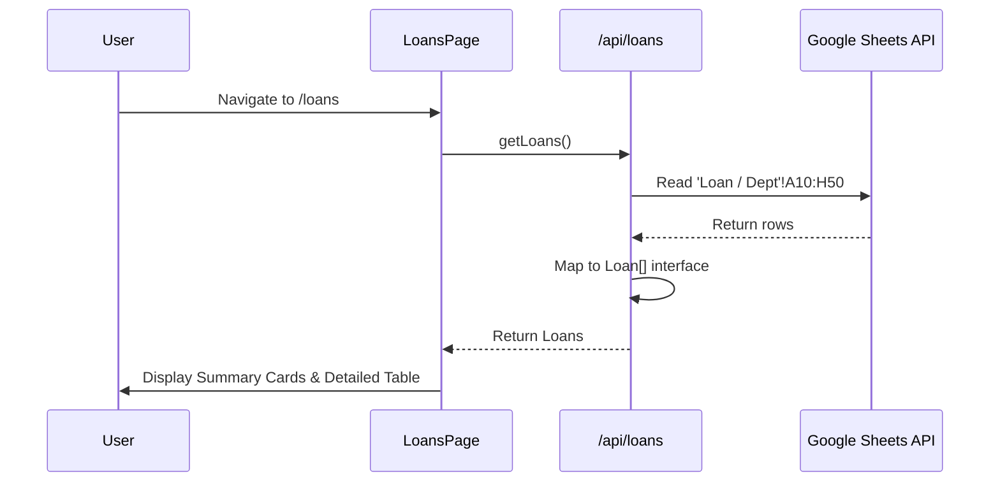

# User Flows

This document outlines the primary user interactions and data movements within the Wealth Management System.

## 1. Dashboard Loading & Data Sync

The dashboard is the central hub. It fetches all financial data in parallel to provide a holistic view.

## 2. AI Financial Health Assessment

The health card uses AI to analyze current state vs. recent performance.

## 3. Adding a Transaction

Adding a transaction triggers a direct write to Google Sheets and a cache invalidation.

## 4. Loan & Debt Tracking

Tracking external liabilities and repayment progress.

