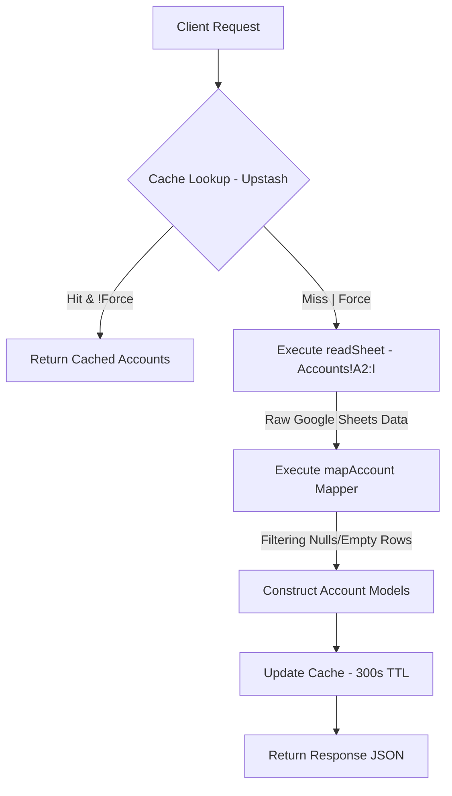

# API Specification: Portfolio Accounts (GET /api/accounts)

## 1. Executive Summary

The **Accounts API** is the foundational system of record for the Wealth Management application. It synchronizes and delivers a consolidated view of the user's across-asset financial nodes (Cash, Savings, Securities, IFC) by orchestrating data from the underlying **Google Sheets** persistence layer. The API ensures high-performance retrieval via Upstash caching and implements institutional-grade data mapping for financial consistency.

---

## 2. API Details

- **Endpoint**: `GET /api/accounts`
- **Authentication**: Institutional Session Required.

### 2.1 Input (Query Parameters)

| Parameter | Type    | Required | Description                                      |
| :-------- | :------ | :------- | :----------------------------------------------- |
| `force`   | Boolean | No       | `true` to force-refresh data from Google Sheets. |

### 2.2 Output (JSON Response Format)

```json
[
  {
    "id": "acc_123",
    "name": "VCB Savings",
    "balance": 500000000,
    "currency": "VND",
    "category": "Bank"
  },
  {
    "id": "acc_456",
    "name": "Binance Spot",
    "balance": 2500.5,
    "currency": "USD",
    "category": "Crypto"
  }
]
```

---

## 3. Logic & Process Flow

### 3.1 Data Synchronization Pipeline



### 3.2 Feature Delegation

This API follows the **Feature-Sliced Design (FSD)** architecture:

- **Routing**: Handled at the application layer (`app/api/accounts`).
- **Core Logic**: Exported from the shared `libs` feature (`features/accounts/api`).
- **Persistence**: Managed via the centralized `sheets` service in `libs/services`.

---

## 4. Technical Requirements

### 4.1 Data Mapping & Integrity

- **Source**: `Accounts` sheet in the linked Google spreadsheet.
- **Mapping Logic**: Transforms raw column indexes (A-I) into typed structures:
  - `name`: (string) Identifier.
  - `balance`: (number) Liquid/Total value.
  - `category`: (string) Classification (e.g., Bank, Crypto, Securities).
  - `currency`: (string) ISO code (VND/USD).
- **Filtering**: Automatically excludes empty rows or header residues during parsing.

### 4.2 Caching Persistence

- **TTL**: 300 seconds (5 minutes) by default to balance data freshness with external API quota limits.
- **Key**: `accounts:all`.
- **Latency Target**: `< 100ms` for cached sessions.

### 4.3 Resilience & Errors

- **Sheet Connection**: Graceful handling of Google API quota exceeding or authentication expiration.
- **`handleApiError`**: Standardized error response structure including relevant user messages and HTTP status codes.

---

## 5. Edge Cases & Resilience

### 5.1 Data Anomalies

- **Special Row Filtering**: The API automatically skips helper/instruction rows (e.g., "you can track...", "accounts column") based on `JUNK_ACCOUNT_NAMES` patterns.
- **Malformed Balances**: Cells containing non-numeric strings or currency symbols are safely parsed as `0` via the `num()` utility.
- **Serial Date Conversions**: The API automatically detects and converts Excel/Sheets serial numbers (e.g., `45321`) into readable date strings for the `dueDate` field.

### 5.2 Empty States

- **Zero Assets**: If a user clears all account rows, the system will return an empty array `[]` which the frontend renders as a "standing by" placeholder or "No result" state.

---

## 6. Non-Functional Requirements (NFR)

### 5.1 Presentation Safety (Masking)

- The API output satisfies the structure required by the `MaskedBalance` UI component, allowing full portfolio totals to be hidden during sensitive demonstrations.

### 5.2 Scalability

- **Parallel Fetching ready**: Designed to coexist with other parallel sheet requests (`transactions`, `budget`) by utilizing separate cache keys.
- **Column Flexibility**: Mapper logic is decoupled from absolute sheet order (via named mappers) to allow future sheet expansion without breaking the API.

### 5.3 UX Responsiveness

- **Stale-While-Revalidate**: Frontend hooks utilize SWR to show previously cached accounts immediately while the API executes a background refresh.
