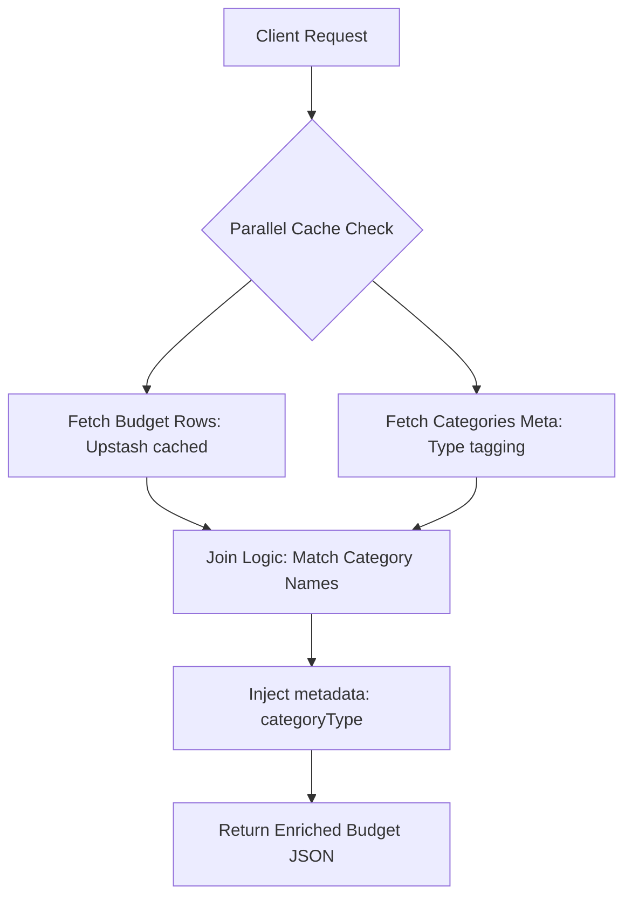

# API Specification: Budget Allocation (GET /api/budget)

## 1. Executive Summary

The **Budget API** provides a structured view of the user's monthly financial allocations and spending targets. It synchronizes data from the `Budget` sheet, applies categorical enrichment (Income vs. Expense tagging), and delivers a comprehensive model for the **Budget Dashboard** and **Category Spend Heatmaps**.

---

## 2. API Details

- **Endpoint**: `GET /api/budget`
- **Authentication**: Institutional Session Required.

### 2.1 Input (Query Parameters)

_No parameters currently supported; returns the full active budget period._

### 2.2 Output (JSON Response Format)

```json
[
  {
    "category": "Rent",
    "monthlyLimit": 15000000,
    "yearlyLimit": 180000000,
    "monthlySpent": 15000000,
    "yearlySpent": 45000000,
    "monthlyRemaining": 0,
    "yearlyRemaining": 135000000,
    "categoryType": "Expense"
  },
  {
    "category": "Salary",
    "monthlyLimit": 50000000,
    "yearlyLimit": 600000000,
    "monthlySpent": 52000000,
    "yearlySpent": 156000000,
    "monthlyRemaining": 0,
    "yearlyRemaining": 444000000,
    "categoryType": "Income"
  }
]
```

---

## 3. Logic & Process Flow

### 3.1 Synchronization & Enrichment



---

## 4. Technical Requirements

### 4.1 Data Modeling

- **Source**: `Budget` sheet in Google Spreadsheet (Rows A:G).
- **Aggregation**: The API retrieves row-level data parsed via `mapBudgetItem` which handles junk row filtering and number normalization.

### 4.2 Performance & Caching

- **Persistence**: Cached in Upstash using `CACHE_KEYS.BUDGET`.
- **Latency Target**: `< 100ms` for cached results.

---

## 5. Edge Cases & Resilience

### 5.1 Data Anomalies

- **Zero Values**: Categories with `0` limits or spending are still returned but may be filtered by UI heatmaps based on activity.
- **Malformed Strings**: Numeric cells containing non-numeric characters (e.g., "$", "₫", or text) are safely parsed as `0` via the `num()` utility.
- **Section Headers**: The API automatically filters out pure uppercase section headers (e.g., "EXPENSE CATEGORIES") to prevent them from appearing as selectable budget items.

### 5.2 Synchronization

- **Out-of-Sync Totals**: Since "Actual" spending is calculated within the spreadsheet (SUMIFS), there may be a slight delay between a transaction `POST` and the budget `GET` reflecting the update if the spreadsheet's internal recalculation engine is latent.

---

## 6. Non-Functional Requirements (NFR)

### 6.1 Presentation Safety (Masking)

- All numeric values are compatible with the `MaskedBalance` component, ensuring budget targets are not leaked during screen sharing.
