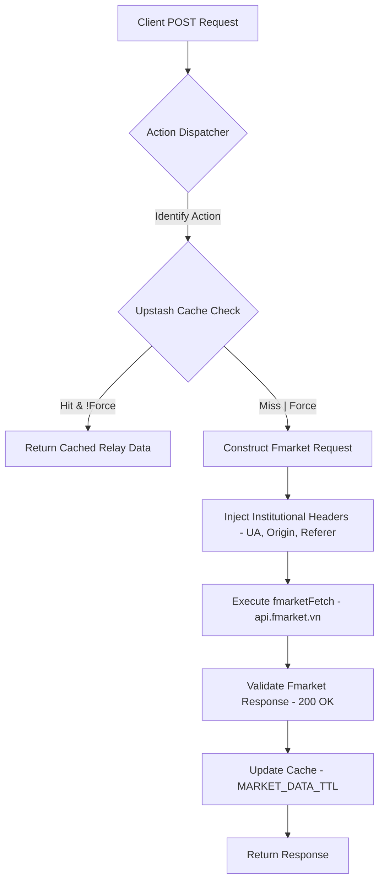

# API Specification: Fmarket Proxy Gateway (POST /api/fmarket)

## 1. Executive Summary

The **Fmarket Proxy API** is a secure, high-performance gateway connecting the Wealth Management dashboard to the **Fmarket.vn** ecosystem—Vietnam's leading open-fund platform. It acts as an institutional-grade relay that bypasses browser-level CORS/CSRF restrictions, handles specialized authentication headers, and implements aggressive caching to provide a low-latency benchmarking experience for mutual funds and local banking rates.

---

## 2. API Details

- **Endpoint**: `POST /api/fmarket`
- **Authentication**: Institutional Session Required.

### 2.1 Input (JSON Payload)

| Field    | Type   | Required | Description                                                                     |
| :------- | :----- | :------- | :------------------------------------------------------------------------------ |
| `action` | Enum   | Yes      | Functional dispatch key (e.g., `getProductsFilterNav`, `getBankInterestRates`). |
| `params` | Object | No       | Key-value pairs matching the target Fmarket endpoint's requirements.            |

**Example (Fetching Banks)**:

```json
{
  "action": "getBankInterestRates",
  "params": {}
}
```

### 2.2 Output (JSON Response Format)

```json
{
  "data": {
    "bankList": [
      {
        "bankName": "Vietcombank",
        "bankShortName": "VCB",
        "interestRate": 4.7,
        "period": 12
      }
    ]
  },
  "status": 200,
  "message": "Success"
}
```

---

## 3. Logic & Process Flow

### 3.1 Relay & Caching Pipeline



### 3.2 Implemented Actions

| Action                 | Purpose                                                   | Mapping                                   |
| :--------------------- | :-------------------------------------------------------- | :---------------------------------------- |
| `getProductsFilterNav` | Fetches filtered fund lists (Stock/Bond/Balanced/MMF).    | `POST /res/products/filter`               |
| `getIssuers`           | Retrieves a list of Vietnamese fund management companies. | `POST /res/issuers`                       |
| `getBankInterestRates` | Compares multi-bank deposit interest rates.               | `GET /res/bank-interest-rate`             |
| `getProductDetails`    | Detailed metadata for a single Fund Certificate (IFC).    | `GET /home/product/{code}`                |
| `getNavHistory`        | Historical Net Asset Value (NAV) time-series data.        | `POST /res/product/get-nav-history`       |
| `getUsdRateHistory`    | Historical USD/VND interbank rates.                       | `POST /res/get-usd-rate-history`          |
| `getGoldProducts`      | Real-time physical Gold (SJC) price feed aggregator.      | `POST /res/products/filter (types: GOLD)` |

---

## 4. Technical Requirements

### 4.1 Header Spoofing (Institutional Compliance)

The API MUST handle the following headers to ensure session integrity with Fmarket.vn:

- `User-Agent`: High-fidelity browser string (macOS/Firefox class).
- `Origin`: `https://fmarket.vn` (Mandatory for CSRF bypass).
- `Referer`: `https://fmarket.vn/` (Mandatory for referer-policy bypass).
- `F-Language`: `vi` (Vietnamese locale preference).

### 4.2 Caching & Throttling

- **Cache TTL**: All market data from Fmarket is cached using the `MARKET_DATA` constant (typically 300-600s).
- **Centralized Registry**: Uses `getOrSetCache` to prevent "Thundering Herd" API calls to the upstream provider.

### 4.3 Error Handling

- **FmarketAPI Failure**: Returns a 500 status with an explicit `error: "Failed to fetch Fmarket data"` message including the underlying reason for easier debugging.

---

## 5. Edge Cases & Resilience

### 5.1 Protocol Mismatches

- **User-Agent Detection**: If Fmarket updates its bot-detection algorithms, the static proxy headers may require rotation.
- **Empty Response Scenarios**: For less liquid funds or bank products with expired rates, the API will return an empty list `[]` while maintaining a 200 HTTP status.

### 5.2 Latency Recovery

- **Request Timeouts**: The proxy uses a synchronous fetch pattern with an implicit 10s timeout to prevent thread blocks on the Next.js server.

---

## 6. Non-Functional Requirements (NFR)

### 5.1 Performance (SLA)

- **Response Time**:
  - Locally Cached: `< 100ms`.
  - Upstream Proxy: `< 1,200ms` (standard for Fmarket.vn responsiveness).
- **Latency Recovery**: If upstream is down, returns a clean 502/504 error to avoid browser-level "Waiting for server" hangs.

### 5.2 Security

- **Parameter Validation**: Strict validation on `action` to prevent invocation of unauthorized backend methods.
- **Credential Safety**: The proxy ensures no client-side credentials or cookies are leaked to the third-party upstream.
