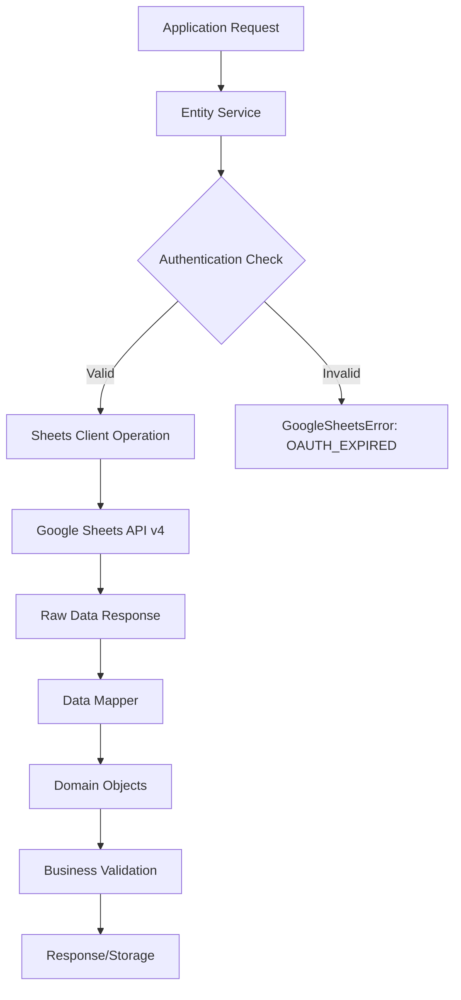

# API Specification: Google Sheets Integration

## 1. Executive Summary

The **Google Sheets Integration API** provides a comprehensive abstraction layer for interacting with Google Sheets as the primary data persistence store. This service layer handles authentication, data reading/writing, parsing, validation, and error handling for all financial data operations in the Wealth Management platform.

---

## 2. Service Architecture

### 2.1 Core Components

- **Authentication Service** (`libs/wealth-management/src/services/sheets/auth.ts`)
- **Client Operations** (`libs/wealth-management/src/services/sheets/client.ts`)
- **Data Mappers** (`libs/wealth-management/src/services/sheets/mappers.ts`)
- **Entity Services** (`libs/wealth-management/src/services/`)

### 2.2 Data Flow Architecture



---

## 3. Authentication API

### 3.1 Service: `getSheetsClient()`

**Purpose**: Establishes authenticated connection to Google Sheets API

**Location**: `libs/wealth-management/src/services/sheets/auth.ts`

**Environment Variables Required**:

- `GOOGLE_CLIENT_ID`: OAuth2 client identifier
- `GOOGLE_CLIENT_SECRET`: OAuth2 client secret
- `GOOGLE_REFRESH_TOKEN`: Persistent refresh token
- `GOOGLE_SHEETS_ID`: Target spreadsheet ID

**Return Type**: `sheets` (Google Sheets API client instance)

**Error Handling**:

- `GoogleSheetsError: MISSING_CREDENTIALS` - Required env vars missing
- `GoogleSheetsError: OAUTH_EXPIRED` - Refresh token expired
- `GoogleSheetsError: API_ERROR` - General authentication failure

**Usage Example**:

```typescript
import { getSheetsClient } from '@wealth-management/services/sheets/auth';

const sheets = await getSheetsClient();
// Use sheets for API operations
```

---

## 4. Data Operations API

### 4.1 Read Operations

#### `readSheet(range: string): Promise<string[][]>`

**Purpose**: Retrieves raw data from specified sheet range

**Parameters**:

- `range`: A1 notation range (e.g., `'Accounts!A2:I'`, `'Transactions!A1:M'`)

**Return Type**: `string[][]` - 2D array of string values

**Features**:

- `valueRenderOption: 'UNFORMATTED_VALUE'` - Preserves raw data types
- Automatic string coercion for uniform parsing
- Error handling with user-friendly messages

**Usage Example**:

```typescript
import { readSheet } from '@wealth-management/services/sheets/client';

const accountsData = await readSheet('Accounts!A2:I');
// Returns: [['VietcomBank', '50000000', 'bank', ...], ...]
```

### 4.2 Write Operations

#### `appendRow(range: string, values: any[]): Promise<boolean>`

**Purpose**: Adds new row to end of specified range

**Parameters**:

- `range`: Target sheet and starting column (e.g., `'Transactions!A2'`)
- `values`: Array of cell values to append

**Features**:

- `valueInputOption: 'USER_ENTERED'` - Allows formulas and formatting
- Automatic error recovery and logging

#### `writeToFirstEmptyRow(sheetName: string, columnARange: string, values: any[]): Promise<boolean>`

**Purpose**: Intelligently inserts row avoiding formula conflicts

**Parameters**:

- `sheetName`: Target sheet tab name
- `columnARange`: Full column-A range for scanning (e.g., `'Transactions!A2:A'`)
- `values`: Row data to insert

**Algorithm**:

1. Scan column A to find last data row
2. Calculate insertion point after last data
3. Write to calculated range

**Use Case**: Safe insertion in sheets with running balance formulas

#### `updateRow(range: string, values: any[]): Promise<boolean>`

**Purpose**: Updates existing row data

**Parameters**:

- `range`: Exact cell range to update (e.g., `'Accounts!A5:D5'`)
- `values`: New cell values

---

## 5. Data Mapping API

### 5.1 Entity Mappers

All mappers follow the pattern: `(row: string[], index?: number) => Entity | null`

#### `mapAccount(row: string[]): Account | null`

**Sheet Structure**: `Accounts!A:H`

- A: Name | B: Due Date | C: Goal Amount | D: Goal Progress (%) | E: Cleared Balance | F: Balance | G: Type | H: Note

**Business Rules**:

- Filters junk rows (headers, help text)
- Parses serial dates to readable format
- Applies Vietnamese number formatting
- Infers currency from account type

#### `mapTransaction(row: string[], index: number): Transaction | null`

**Sheet Structure**: `Transactions!A:M`

- A: Account | B: Date | C: Ref# | D: Payee | E: Tags | F: Memo | G: Category | H: Cleared | I: Payment | J: Deposit | K-M: Balances

**Business Rules**:

- Parses comma-separated tags array
- Handles multiple cleared status indicators (Y, ✓, yes)
- Validates payment vs deposit exclusivity
- Generates unique IDs from row index

#### `mapBudgetItem(row: string[]): BudgetItem | null`

**Sheet Structure**: `Budget!A:G`

- A: Category | B: Monthly Limit | C: Yearly Limit | D: Monthly Spent | E: Yearly Spent | F: Monthly Remaining | G: Yearly Remaining

**Business Rules**:

- Filters section headers and help text
- Parses Vietnamese number formats
- Calculates remaining amounts automatically

#### `mapGoal(row: string[], index: number): Goal | null`

**Sheet Structure**: Sparse layout in `Goals!E,G,I`

- E: Name | G: Target Amount | I: Current Amount

**Business Rules**:

- Parses VND strings with formatting
- Infers goal types from name patterns
- Calculates progress and status

### 5.2 Utility Functions

#### `num(value: string | undefined): number`

**Purpose**: Safe number parsing with Vietnamese localization

**Features**:

- Handles comma separators
- Converts empty/null to 0
- Removes currency symbols

#### `isJunkRow(name: string): boolean`

**Purpose**: Identifies non-data rows for filtering

**Patterns**: Headers, help text, instructions

---

## 6. Entity Service APIs

### 6.1 Account Service

**Location**: `libs/wealth-management/src/services/accounts.ts`

**Key Methods**:

- `getAccounts()`: Retrieves and maps all account data
- `syncAccounts()`: Forces refresh from Google Sheets

**Caching**: Upstash Redis with 5-minute TTL

### 6.2 Transaction Service

**Location**: `libs/wealth-management/src/services/transactions.ts`

**Key Methods**:

- `getTransactions()`: Retrieves enriched transaction data
- `addTransaction(data)`: Creates new transaction entry
- `syncTransactions()`: Refreshes from Google Sheets

**Features**:

- Category enrichment from metadata sheet
- Parallel fetching with caching

### 6.3 Budget Service

**Location**: `libs/wealth-management/src/services/budget.ts`

**Key Methods**:

- `getBudget()`: Retrieves budget categories and limits
- `syncBudget()`: Updates from Google Sheets

### 6.4 Goals Service

**Location**: `libs/wealth-management/src/services/goals.ts`

**Key Methods**:

- `getGoals()`: Retrieves and maps goal data
- `syncGoals()`: Refreshes goal information

---

## 7. Error Handling & Resilience

### 7.1 Error Types

#### GoogleSheetsError

- `MISSING_CREDENTIALS`: Environment configuration missing
- `OAUTH_EXPIRED`: Refresh token needs renewal
- `API_ERROR`: General Google Sheets API failure

#### AppError (Application Level)

- Includes user-friendly messages
- HTTP status codes for API responses
- Structured error context

### 7.2 Recovery Mechanisms

**Authentication Recovery**:

- Clear instructions for `pnpm run auth:setup`
- Pro-tips for production mode setup
- Token refresh automation guidance

**Data Recovery**:

- Graceful degradation for partial failures
- Cache fallbacks for offline scenarios
- Reconciliation checks for data consistency

**User Experience**:

- Alert components with terminal-style guidance
- Progressive error disclosure
- Contextual help links

---

## 8. Performance & Scaling

### 8.1 Caching Strategy

**Upstash Redis**:

- Account data: 300s TTL
- Transaction data: 300s TTL
- Budget data: 300s TTL
- Goals data: 300s TTL

**Cache Keys**:

- `accounts:all`
- `transactions:all`
- `budget:all`
- `goals:all`

### 8.2 API Limits & Quotas

**Google Sheets API v4**:

- 100 requests per 100 seconds per user
- 1000 requests per 100 seconds (higher quota available)
- Automatic quota monitoring and backoff

### 8.3 Parallel Operations

**Concurrent Fetching**:

- Multiple sheet reads can execute simultaneously
- Separate cache keys prevent conflicts
- Atomic write operations maintain consistency

---

## 9. Security Considerations

### 9.1 Authentication Security

**OAuth2 Best Practices**:

- Refresh token rotation
- Secure environment variable storage
- No hardcoded credentials

**Access Control**:

- Server-side only API calls
- No client-side sheet access
- Encrypted data transmission

### 9.2 Data Privacy

**Sensitive Data Handling**:

- Balance masking components
- Configurable exposure levels
- Audit logging for access

---

## 10. Development & Testing

### 10.1 Setup Requirements

**Environment Setup**:

```bash
# OAuth setup
pnpm run auth:setup

# Verify connection
pnpm run auth:verify
```

**Required Environment Variables**:

```env
GOOGLE_CLIENT_ID=your_client_id
GOOGLE_CLIENT_SECRET=your_client_secret
GOOGLE_REFRESH_TOKEN=your_refresh_token
GOOGLE_SHEETS_ID=your_spreadsheet_id
```

### 10.2 Testing Strategy

**Unit Tests**:

- Mapper functions with various data formats
- Error handling scenarios
- Date and number parsing edge cases

**Integration Tests**:

- Full sheet read/write cycles
- Authentication flow validation
- Cache invalidation testing

### 10.3 Development Tools

**Scripts Available**:

- `auth:setup`: Interactive OAuth setup
- `auth:verify`: Connection validation
- `sheets:sync`: Manual data synchronization

---

## 11. Migration & Compatibility

### 11.1 Sheet Structure Requirements

**Supported Formats**:

- Standard A1 notation ranges
- Vietnamese number formatting
- Multiple date formats
- Unicode text support

**Backwards Compatibility**:

- Flexible column ordering
- Optional fields handling
- Graceful degradation for missing data

### 11.2 Version Compatibility

**Google Sheets API**:

- Currently using v4 (latest stable)
- Automatic migration path for future versions

**Google Auth Library**:

- Uses latest OAuth2 client
- Refresh token compatibility maintained

---

## 12. Monitoring & Observability

### 12.1 Error Tracking

**Application Logs**:

- Sheet operation failures
- Authentication issues
- Data parsing errors

**User-Facing Alerts**:

- Connection status indicators
- Setup guidance components
- Recovery instructions

### 12.2 Performance Metrics

**Latency Tracking**:

- Sheet read response times
- Write operation durations
- Cache hit/miss ratios

**Quota Monitoring**:

- API call frequency
- Rate limit proximity alerts
- Usage analytics

---

This API specification provides the complete technical reference for Google Sheets integration, enabling developers to build features that leverage the robust data persistence layer while maintaining high performance, security, and user experience standards.
