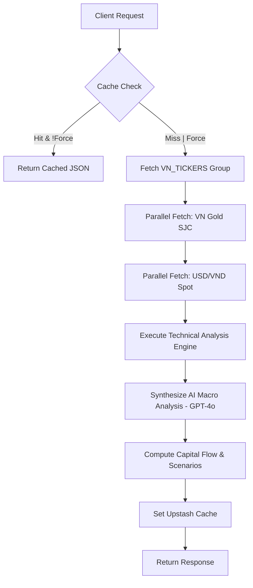

# API Specification: Market Pulse Terminal (GET /api/market-pulse)

## 1. Executive Summary

The **Market Pulse API** is the primary telemetry engine for the Wealth Management dashboard. It provides high-frequency market data, technical indicator synthesis, and AI-driven macro narratives for the Vietnamese (VN) and US markets. The API acts as an orchestrator, combining data from multiple historical sources, real-time gold/FX feeds, and Large Language Models (LLM) to deliver a "unified market state" to the frontend.

## 2. API Details

- **Endpoint**: `GET /api/market-pulse`
- **Authentication**: Institutional Session Required.

### 2.1 Input (Query Parameters)

| Parameter   | Type    | Required | Description                                                               |
| :---------- | :------ | :------- | :------------------------------------------------------------------------ |
| `timeframe` | Enum    | No       | Resolution of data: `1h`, `4h`, `1d` (default), `1w`.                     |
| `force`     | Boolean | No       | `true` to bypass cache and trigger fresh data ingestion and AI synthesis. |

### 2.2 Output (JSON Response Format)

```json
{
  "vn": {
    "assets": [
      {
        "symbol": "^VNINDEX",
        "name": "VN-Index",
        "price": 1250.45,
        "percentChange": 0.85,
        "direction": "up",
        "momentum": "stable"
      }
    ],
    "technicals": {
      "cycle": {
        "phase": "Accumulation",
        "strength": 85,
        "confidence": 0.92
      },
      "signals": {
        "action": "LONG",
        "entry": 1245.0,
        "stopLoss": 1230.0
      }
    },
    "scenarios": [
      {
        "name": "Bullish Consolidation",
        "regime": "Risk-ON",
        "summaryVi": "Thị trường đang tích lũy trong xu hướng tăng..."
      }
    ]
  },
  "lastUpdated": "2024-03-21T10:00:00Z"
}
```

---

## 3. Business Requirements

### 3.1 Macro Intelligence Module

| Feature                      | Description                                                                                                                                                                 | Business Value                                                        |
| :--------------------------- | :-------------------------------------------------------------------------------------------------------------------------------------------------------------------------- | :-------------------------------------------------------------------- |
| **Intelligence Banner (3S)** | A dynamic grid displaying three primary market scenarios (e.g., Risk-ON, Crisis, Stagflation). Includes **Confidence Score**, **Estimate Period**, and executive summaries. | Strategic orientation and risk-regime identification.                 |
| **Fmarket Insight**          | Integration of institutional-grade benchmarks for Vietnam including **Gold (SJC 9999)** and **USD/VND** exchange rates sourced via Fmarket/Billionaire-quant APIs.          | Reliable macro-benchmark tracking for local investors.                |
| **Smart Money Flow**         | Real-time tracking of institutional capital movement (Risk-ON/Defensive/Neutral).                                                                                           | Avoidance of retail sentiment traps; alignment with "Whale" activity. |
| **Dominant Driver**          | Identification of the single most influential factor (e.g., Inflation data, FED pivot) and its impact on asset correlations.                                                | Information filtering; focus on high-impact signals.                  |

### 3.2 Tactical Execution Engine

- **Market Signal Cards**:
  - **Actions**: Hard-coded triggers (`LONG`, `SHORT`, `EXIT`, `REDUCE`, `TAKE PROFIT`).
  - **Precision Parameters**: Specific Entry Ranges, Stop Loss levels, and Risk:Reward (R:R) ratios.
  - **Ticker-Level Deep Dive**: Automated narrative generation explaining the thesis for specific tickers (e.g., VNINDEX, FPT, HPG).
- **Multi-TF Alignment Matrix (Entry Timing)**:
  - Quantitative scoring (1-10) based on **MTF (Multi-Timeframe)** convergence.
  - **Higher TF Support (60%)**: Alignment with the primary trend (1D/1W).
  - **Lower TF Confirmation (40%)**: Scalp-level triggers (15m/30m) to optimize entry.

### 3.3 Advanced Analytical Suite (Ticker Analyze)

- **Visual Velocity (Spectrum)**: Real-time % change bar charts with directional color coding (Emerald/Rose).
- **Snapshot Terminal**: Tabular data feed for intraday, daily, and weekly performance delta.
- **ICT Signature Detection**: Automated detection of Fair Value Gaps (FVG) and Order Blocks (OB).
- **Sentiment Synthesis**: A proprietary psychology index (0-100) combining VIX volatility, crowd RSI, and trend velocity.

### 3.4 Statistical Seasonality Terminal (Seasonal Analyze)

- **Feature**: 1-year historical pattern analysis for monitored tickers across multiple periodicities.
- **Metrics**:
  - **Periodic Rank**: Best performing days/weeks/months of the year.
  - **Performance Ratio**: Average Return vs. Win Rate (%).
  - **Reliability Factors**: Profit Factor (P.F) and Standard Deviation (Volatility).
  - **Proprietary Score**: A combined seasonality strength score used for timing monthly contributions.

### 3.5 Fundamental Valuation Terminal

- **DCF Model Scenarios**: Algorithmic intrinsic value estimation with automated "Upside Potential" calculation.
- **Monte Carlo Simulations**: Probabilistic outcome modeling (P10/P50/P90) over 10,000 iterations.
- **Sector Benchmarking**: Relative valuation vs. industry peers (P/E, Dividend Yield, etc.).

---

## 4. Implementation Details

### 4.1 Data Input Architecture

#### Primary Asset Tickers (VN Market)

The terminal's analytical engine consumes high-frequency data from the following instruments:

- **Indices**: ^VNINDEX (VN-Index), VN30.
- **High-Alpha Tickers**: VCB, VNM, ACB, TCB, MBB, FPT, HPG, SAB, GAS.
- **Institutional Benchmarks (Fmarket/Billionaire-Quant)**:
  - **Premium Gold**: Real-time SJC 9999 prices.
  - **Premium FX**: USD/VND interbank rates.

#### Multi-Source Adapter Strategy

Data ingestion follows a strictly prioritized fallback chain:

1.  **VNStock/Fmarket (Primary)**: Fetches historical and real-time data for Vietnamese indices and stocks.
2.  **Yahoo Finance (Secondary)**: Fallback source for universal market data coverage.
3.  **CafeF (Last Resort)**: Real-time snapshots for VN indices if primary streams are latent.

#### Technical Data Requirements (Sampling)

Based on the selected timeframe, the following historical candle depth is required for technical synthesis:

- **1h**: 7 days of historical 1-hour candles.
- **4h**: 14 days of historical 4-hour candles.
- **1d**: 60 days of daily historical candles.
- **1w**: 90 days of weekly historical candles.

#### Caching Performance Layer

To minimize API overhead and ensure instant UI rendering:

- **Price-level data**: Cached for 5 minutes (`PRICE_CACHE_TTL`).
- **Statistical History**: Cached for 1 hour (`HISTORY_CACHE_TTL`).
- **Processed Profiles**: Advanced asset signatures (e.g., correlations, seasonality) are cached for 14 days.

### 4.2 Data & Control Interface

#### Multi-Timeframe (TF) Granularity

The system MUST support the following intervals for technical analysis and signal generation:

- **Scalping/Precision**: 15m, 30m.
- **Intraday/Swing**: 1H, 4H.
- **Macro Trend**: 1D, 1W.

#### Synchronization & Refresh Logic

- **Stream Control**: Selectable auto-sync intervals (1min, 5min, 15min, 30min, 1H, 4H, 1D, 1W).
- **Manual Override**: A "Force Refresh" capabilities to bypass cache and pull live updates.
- **System Status**: Real-time "Connectivity Pulse" indicating the health of the WebSocket/API connection.

---

## 5. Logic & Process Flow

### 5.1 Data Orchestration Pipeline



### 5.2 Data Sourcing (Fallback Chain)

The API utilizes a refined adapter strategy with the following priority:

1. **VNStockAdapter**: Primary source for HSX/HNX tickers via internal `vnstock-server`.
2. **YahooFinanceAdapter**: Secondary fallback for all global and local tickers.
3. **CafeFAdapter**: Third-tier fallback for real-time Vietnamese index snapshots.
4. **Vang.Today**: Dedicated real-time feed for domestic Gold (SJC 9999).

---

## 8. Technical Requirements

### 8.1 AI Intelligence Layer

- **Model**: `github-gpt-4o`.
- **Prompting**: Uses dynamic templates loaded from Google Sheets (under `market/generate-ai-analysis`).
- **Synthesis**: The AI summarizes $50+$ data points including correlations, Wyckoff phases, and DCF upside into simplified English/Vietnamese narratives.

### 8.2 Caching Strategy

- **L1 (Upstash Redis)**:
  - Full Market State: 300 seconds (5 minutes).
  - Data points are cached individually for 14 days to speed up historical re-analysis.
- **Client Cache**: SWR (Stale-While-Revalidate) integrated for seamless UI transitions.

### 8.3 Error Handling

- **AppError Framework**: Uses specialized `NetworkError` and `AppError` subclasses.
- **Graceful Degradation**: If AI synthesis fails, the API falls back to heuristic-based scenario detection (e.g., "Falling Knife Warning") to ensure the UI remains functional.

---

## 9. Edge Cases & Resilience

### 9.1 External Service Latency/Outage

- **Waterfall Fallback Chain**: If the primary source (`vnstock-server`) is unreachable, the system automatically descends to `YahooFinanceAdapter`.
- **Gold/FX Resilience**: Fmarket or Vang.Today endpoint failures are non-blocking; the API will simply omit these assets from the result set rather than crashing the full dashboard.

### 9.2 Partial Data Recovery

- **Symbol Validation**: Incomplete data for a specific ticker (e.g., missing 1W history) will cause that symbol to be excluded from technical analysis scores to ensure statistical reliability.
- **Cache Warming**: The first request to a fresh timeframe (e.g., `1w`) may experience a cold-start delay of $~5$s while the background AI analysis runs; subsequent requests use the cached result.

---

## 6. Tracked Assets

| Market | Ticker   | Yahoo Symbol       | Description                                     |
| ------ | -------- | ------------------ | ----------------------------------------------- |
| 🇺🇸 US  | VIX      | `^VIX`             | Volatility Index — Chỉ số biến động             |
| 🇺🇸 US  | DXY      | `DX-Y.NYB`         | US Dollar Index — Chỉ số sức mạnh USD           |
| 🇺🇸 US  | US10Y    | `^TNX`             | US 10Y Treasury Yield — Lợi suất TPCP Mỹ 10 năm |
| 🇺🇸 US  | WTI      | `CL=F`             | Crude Oil — Dầu thô WTI                         |
| 🇺🇸 US  | Gold     | `GC=F`             | Gold (XAU/USD) — Vàng                           |
| 🇺🇸 US  | S&P500   | `^GSPC`            | S&P 500 Index — Chỉ số cổ phiếu vốn hóa lớn Mỹ  |
| 🇺🇸 US  | NQ100    | `^NDX`             | Nasdaq-100 — Chỉ số công nghệ Mỹ                |
| 🇺🇸 US  | BTC      | `BTC-USD`          | Bitcoin                                         |
| 🇻🇳 VN  | VN-Index | `^VNINDEX`         | Vietnam Stock Index — Chỉ số chứng khoán VN     |
| 🇻🇳 VN  | HNX      | `^HNXINDEX`        | Hanoi Exchange Index — Sàn Hà Nội               |
| 🇻🇳 VN  | VN30     | `^VN30`            | VN30 Blue-chip Index — 30 cổ phiếu vốn hóa lớn  |
| 🇻🇳 VN  | USD/VND  | `VND=X`            | Exchange Rate — Tỷ giá USD/VND                  |
| 🇻🇳 VN  | VN Gold  | `GC=F` (converted) | Gold in VND (proxy via XAU × USD/VND rate)      |

---

## 7. Non-Functional Requirements (NFR)

### 7.1 Performance (SLA)

- **Time to First Byte (TTFB)**:
  - Cache Hit: `< 150ms`.
  - Cache Miss (Cold Start + AI): `< 8,000ms`.
- **Availability**: High-availability multi-source fallback ensures data delivery even if primary VN servers are latent.

### 7.2 Security

- **Data Masking Compatibility**: The API output is designed to be consumed by the `MaskedBalance` component for presentation safety.
- **Input Validation**: Strict Zod-like validation on `timeframe` and `market` parameters.

### 7.3 Scalability

- **Horizontal Scaling**: Stateless API implementation allowing for easy scaling across Vercel/Cloudflare functions.
- **Rate Limiting**: Integrated via Upstash to prevent brute-force scanning of expensive AI routes.
