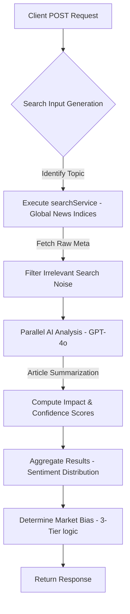

# API Specification: News Analyze Terminal (POST /api/news/analyze)

## 1. Executive Summary

The **News Analyze API** is an AI-powered sentiment intelligence engine that parses global financial news to determine the prevailing market bias. By applying Large Language Models (LLM) to real-time search results, the API provides a quantified view of "market noise," filtering out irrelevant data and surface-level headlines to reveal the underlying thematic sentiment driving price action.

---

## 2. API Details

- **Endpoint**: `POST /api/news/analyze`
- **Authentication**: Institutional Session Required.

### 2.1 Input (JSON Payload)

```json
{
  "topic": "Vietnam Market & Policy",
  "isAll": true
}
```

### 2.2 Output (JSON Response Format)

```json
{
  "articles": [
    {
      "source": "VnExpress",
      "summary": "Vietnam's GDP growth exceeds expectations in Q1...",
      "sentiment": "Positive",
      "impactScore": 92,
      "url": "https://url-to-source.com"
    }
  ],
  "bias": "BULLISH",
  "topic": "Vietnam Market & Policy"
}
```

---

## 3. Business Requirements

### 3.1 Thematic Sentiment Scanners

| Feature                      | Description                                                                                                                       | Business Value                                                        |
| :--------------------------- | :-------------------------------------------------------------------------------------------------------------------------------- | :-------------------------------------------------------------------- |
| **Topic-Based Briefing**     | Targeted analysis for specific macro themes: **Vietnam Market & Policy**, **Interest Rates & Macro**, and **Global Geopolitics**. | Contextual intelligence tailored to the investor's specific exposure. |
| **Sentiment Bias Indicator** | A high-visibility visual indicator (`BULLISH`, `BEARISH`, `NEUTRAL`) based on the aggregated sentiment of analyzed articles.      | Instant orientation of the news cycle's directional pressure.         |
| **Sentiment Histogram**      | A comparative bar chart showing the distribution of Positive, Negative, and Neutral articles within the current scan.             | Visualizing the "degree of consensus" vs. market indecision.          |

### 3.2 AI-Driven Article Deep Dive

- **Automated Summarization**: LLM-generated single-sentence summaries of complex articles to reduce information overload.
- **Quantified Impact Scoring**:
  - **Confidence (0-100%)**: The AI's certainty regarding the identified sentiment.
  - **Market Impact (0-100)**: A relative score indicating the article's potential to move markets or influence policy.
- **Source Verification**: Direct links to original publishers with source-specific sentiment tagging.

---

## 4. Data Input Architecture

### 4.1 News Ingestion Pipeline

1.  **Search Input**: Dynamic query generation (e.g., `${topic} latest market news financial impact ${currentYear}`).
2.  **Execution Engine**: Powered by the internal `search-service` providing high-velocity access to global news indices.
3.  **Raw Data Structure**: Includes Article Title, Snippet (metadata), URL, and Source Domain.

### 4.2 AI Analysis Layer (Logic Flow)

- **Model**: `github-gpt-4o` (or equivalent high-reasoning LLM).
- **Processing**: Structured `generateObject` calls ensure output conforms to a strict JSON schema:
  - `sentiment`: Enum [`Positive`, `Negative`, `Neutral`].
  - `confidence`: Numeric validation.
  - `impactScore`: Numeric validation.
  - `summary`: String (Summary).
- **Bias Calculation**:
  - `BULLISH`: Positive count > Negative AND Positive count > Neutral.
  - `BEARISH`: Negative count > Positive AND Negative count > Neutral.
  - `NEUTRAL`: Default state if no clear majority exists.

---

## 5. Control/UX Infrastructure

### 5.1 Interactive Analysis Controls

- **Manual Refresh**: Trigger-based re-scan of news sources to capture breaking developments.
- **Expandable Insights**: Toggable detail view ("View Detailed Article Insights") to minimize UI clutter on macro-only glances.
- **Propagation**: Analysis results can be pushed to the **Think Tank** for cross-functional debate synthesis.

### 3.1 News Ingestion & Analysis Pipeline



### 3.2 AI Core & Orchestration

- **Model**: `github-gpt-4o`.
- **Logic Flow**:
  - `generateObject` with strict Zod schema for article summaries.
  - Resulting JSON MUST contain `sentiment`, `confidence`, `impactScore`, and `summary`.
- **Bias Calculation**:
  - `BULLISH`: Positive articles > Negative.
  - `BEARISH`: Negative articles > Positive.
  - `NEUTRAL`: Default if balanced.

---

## 4. Technical Requirements

### 4.1 Latency & Resource Management

- **Streaming Support**: Although standard POST, internally utilizes `maxDuration: 300` to prevent Vercel function timeouts during heavy LLM processing.
- **Search Service**: Integrated with `search-service` for multi-source news discovery.

### 4.2 Error Handling & Reliability

- **Retry Logic**: Provides "Retry Analysis" capabilities for failed search queries or AI rate-limiting.
- **Empty State Policy**: If zero articles are found, returns `bias: "NEUTRAL"` and an empty `articles` array without breaking the UI.

---

## 5. Edge Cases & Resilience

### 5.1 Scanning Limitations

- **Search Latency**: High-velocity search discovery might occasionally miss ultra-breaking news if indices are not yet updated; the API includes a 1-year thematic modifier (e.g., `... financial impact 2024`) to ensure recency.
- **Rate Limiting**: Integrated with GPT-4o usage quotas; if the model is overloaded, the API returns a 429 Retry-After, and the UI provides a "System overloaded" state.

### 5.2 Content Specificity

- **Thematic Drift**: If a search returns broad, non-financial news for a specific ticker (e.g., general politics), the LLM is instructed to assign a `Neutral` sentiment to prevent "noise" from biasing the market report.

---

## 9. Non-Functional Requirements (NFR)

### 9.1 Performance & Scalability

- **Latency**: AI analysis of 10+ concurrent articles should complete in <15 seconds.
- **Timeouts**: Extended `maxDuration` (300s) to accommodate deep-thinking AI processing of large news sets.
- **Empty State Logic**: If zero articles are found, the system MUST display a "No result" or "Analysis Unavailable" placeholder to avoid UI breakage.

### 9.2 UI/UX Aesthetics (Glassmorphism)

- **Glassmorphism Design Compliance**: All UI components MUST adhere to the Glassmorphism design system, utilizing semi-transparent background blurs (`backdrop-filter: blur()`), subtle border highlights, and layered depth effects to maintain a premium, modern aesthetic.
- **Directional Color Coding**: Consistency across the terminal (Emerald for Positive/Bullish, Rose for Negative/Bearish, Amber for Neutral).
- **Micro-animations**: Pulse indicators on sentiment badges and loading spinners during real-time scanning.

### 9.3 Security & Resilience

- **Error Propagation**: Graceful handling of search API failures or AI rate limits with "Retry Analysis" capabilities.
- **Masked Data**: News sources and titles are exempt from balance masking but are rendered in a high-contrast legible layout for presentation safety.

### 9.4 Performance (SLA)

- **Time to First Byte (TTFB)**:
  - AI Processing: `< 15,000ms` for analysis of $10+$ articles.
- **SLA**: $99\%$ success rate for search discovery; AI synthesis subject to model provider uptime.

### 9.5 UI/UX Aesthetics (Glassmorphism)

- **Data Rendering**: Results are formatted for consistent display in the **News Analyze Terminal**, utilizing Emerald/Rose/Amber sentiment badges as per the design tokens.
- **Presentation Safety**: Masked data logic ensures that sensitive totals are hidden, but news headlines remain visible for context.
