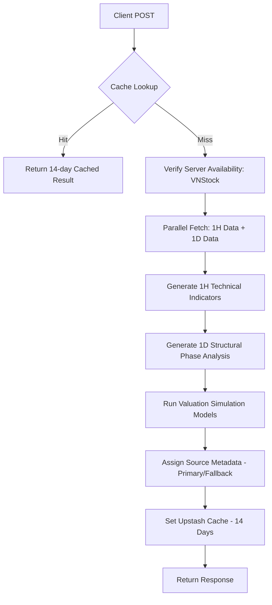

# API Specification: Ticker Analyze Deep Dive (POST /api/ticker/analyze)

## 1. Executive Summary

The **Ticker Analyze API** is the specialized analysis engine for the **Ticker Deep-Dive Terminal**. It generates comprehensive technical, fundamental, and probabilistic analysis for a single ticker (Stock or IFC). Unlike the batch-focused Market Pulse, this API focuses on high-resolution data (1H + 1D) for individualized investment research and valuation simulations.

---

## 2. API Details

- **Endpoint**: `POST /api/ticker/analyze`
- **Authentication**: Institutional Session Required.

### 2.1 Input (JSON Payload)

```json
{
  "symbol": "VCB",
  "name": "Vietcombank",
  "market": "VN"
}
```

### 2.2 Output (JSON Response Format)

```json
{
  "technicals1h": {
    "cycle": { "phase": "Markup", "strength": 78 },
    "signals": { "action": "LONG", "entry": 92500 }
  },
  "technicals1d": {
    "cycle": { "phase": "Accumulation", "strength": 92 }
  },
  "valuation": {
    "dcf": [{ "symbol": "VCB", "fairValue": 105000, "upside": 13.5 }],
    "monteCarlo": [{ "symbol": "VCB", "p50": 102000, "iterations": 10000 }]
  },
  "dataSource": {
    "provider": "vnstock-server",
    "status": "primary"
  }
}
```

---

## 3. Logic & Process Flow

### 3.1 Analysis Generation Pipeline



### 3.2 Data Reliability Logic

The API calculates the final `dataSource` based on the success of the `VNStockAdapter`.

- If `vnstock-server` is reachable and returns data, status is `primary`.
- If `vnstock-server` is unavailable, the system automatically falls back to `yahoo-finance` and provides the `fallbackReason` to the frontend for transparency.

---

## 4. Technical Requirements

### 4.1 Computational Simulation

- **DCF (Discounted Cash Flow)**: Algorithmic intrinsic value estimation using historical financial statements.
- **Monte Carlo Modeling**: Uses the `generateValuation` service to run probabilistic simulations for the next $252$ trading days.
- **Wyckoff Integration**: Each timeframe (1H, 1D) independently maps Wyckoff phases (Accumulation, Markup, etc.) to the asset's specific price action.

### 4.2 Caching Strategy (Persistence)

- **Time-to-Live (TTL)**: 14 Days (`ANALYZE_CACHE_TTL`).
- **Cache Invalidation**: Analysis is strictly cached by `symbol:market` key. Fresh analysis must be manually triggered via `force` if required (though current API uses POST without force by default).
- **Edge Caching**: `Cache-Control` headers are set to `public, max-age=2592000` (30 days) to allow CDN-level acceleration.

### 4.3 Resilience

- Ensures continuous availability even if the specialized price crawler (`vnstock-server`) is down by using international fallback providers.

---

## 5. Edge Cases & Resilience

### 5.1 Analysis Constraints

- **Insufficient Data**: If a symbol has $< 100$ data points for a specific timeframe, technical indicators like EMA200 will be omitted from the results with a `null` value.
- **Unavailable Fundamental Data**: For newly listed companies or those with missing financial statements, the DCF model will skip valuation generation.

### 5.2 Dynamic Fallbacks

- **`dataSource.status`**: The API communicates its internal health via the `dataSource` object. If `status` is `fallback`, the frontend should display a warning that the analysis is using secondary data sources.

---

## 6. Non-Functional Requirements (NFR)

### 5.1 Performance (SLA)

- **Response Time**: Analysis on fresh symbols must complete in `< 10,000ms` (due to heavy computational modeling).
- **Throughput**: Optimized for single-ticker deep research; high-frequency batch usage is throttled via Next.js rate limiting.

### 5.2 UI/UX Connectivity

- **X-Cache Header**: The API provides `X-Cache: HIT` or `MISS` for developer visibility.
- **Status Feed**: Returns the source provider name to be displayed as a "Data Authenticity" badge on the frontend.
