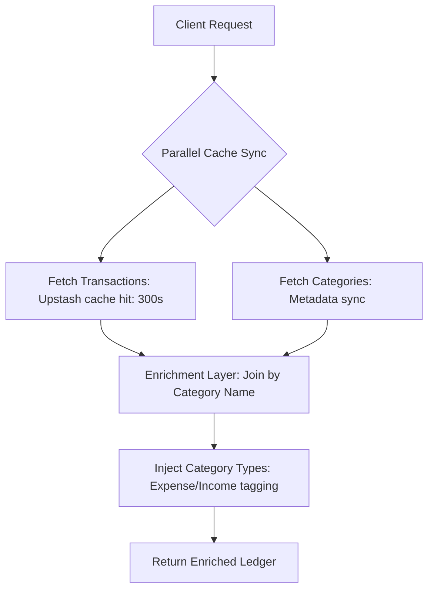

# API Specification: Financial Transactions (GET/POST /api/transactions)

## 1. Executive Summary

The **Transactions API** is the primary engine for ledger-based wealth reporting and historical data logging. It serves a dual purpose: (1) high-speed, enriched retrieval of historical transaction records across all synced accounts, and (2) secure, validated entry of new wealth movements (Income, Expenses, Transfers) into the Google Sheets persistence layer.

---

## 2. API Details

- **Endpoints**: `GET/POST /api/transactions`
- **Authentication**: Institutional Session Required.

### 2.1 GET: Retrieval

**Input (Query Params)**:

- `force` (Boolean): `true` to force cache refresh.

**Output (JSON)**:

```json
[
  {
    "id": "tx_789",
    "date": "2024-03-20",
    "category": "Food",
    "categoryType": "Expense",
    "payment": 150000,
    "memo": "Lunch at Pho Thin"
  }
]
```

### 2.2 POST: Entry

**Input (JSON Payload)**:

```json
{
  "date": "2024-03-21",
  "category": "Salary",
  "deposit": 15000000,
  "memo": "March Salary Credit"
}
```

**Output (JSON)**:

```json
{ "success": true }
```

---

## 3. Logic & Process Flow

### 3.1 Retrieval Pipeline (GET)



### 3.2 Entry Pipeline (POST)

1.  **Request Capture**: Receives body from UI form components.
2.  **Date Standardizer**: Uses `parseDate` utility to ensure Vietnamese/International format compliance.
3.  **Schema Validation**: Enforces strict `TransactionSchema` (Zod-based) to ensure data types (Numeric amounts, non-null categories).
4.  **Sheet Injection**: Calls `addTransaction` to append a new row to the Google Spreadsheet.
5.  **Cache Invalidation**: Triggers internal refresh flags to ensure subsequent GET calls see the new data.

---

## 4. Technical Requirements

### 4.1 Data Enrichment (Joins)

The API performs an in-memory "Join" between the `Transactions` ledger and the `Categories` metadata sheet. This allows the frontend to apply conditional styling based on the **Category Type** (e.g., coloring Expenses in Rose and Income in Emerald) without duplicating logic on the client.

### 4.2 Error Handling

- **`handleApiError`**: Implements standardized responses for validation errors, sheet connection failures, and schema mismatches.
- **Transaction Validation**: Ensures that at least one numerical value (`payment` or `deposit`) is present before committing to the sheet.

### 4.3 Persistence

- Uses `readSheet` and `addTransaction` abstractions to interact with the server-only Google Client, preventing direct sheet access from the client bundle.

---

## 5. Edge Cases & Resilience

### 5.1 Data Anomalies (GET)

- **Lazy Parsing**: Transaction rows missing Account IDs are automatically discarded during the mapping phase.
- **Categorization Fallback**: If a transaction's category is not found in the `Categories` metadata sheet, it defaults to `Uncategorized` while the underlying `payment/deposit` values remain intact.
- **Date Robustness**: The API uses the specialized `parseDate` utility to resolve varied date formats (DD/MM, DD/MM/YYYY, or standard ISO).

### 5.2 Persistence Edge Cases (POST)

- **Atomic Operations**: Post requests are synchronous to ensure sequential row appending in Google Sheets, preventing row overwriting during high-frequency concurrent usage.
- **Payload Validation**: The `TransactionSchema` enforces that either a `payment` or `deposit` must be present, preventing the creation of empty/valueless ledger entries.

---

## 6. Non-Functional Requirements (NFR)

### 5.1 Performance (SLA)

- **Get Performance**: `< 150ms` (cached).
- **Post Performance**: `< 2,500ms` (due to synchronous Google Sheets row insertion).

### 5.2 Security & Accuracy

- **Strict Row Mapping**: Prevents accidental row overwrites by specifying explicit A-Z column ranges during the append process.
- **Zod Schema Reinforcement**: Acts as a second layer of defense against malformed payloads from the client.

### 5.3 Scalability

- **Category Dynamism**: As users add new categories in the spreadsheet UI, the API automatically reflects these in the `enrichment` join on the next sync, ensuring the dashboard remains flexible to individual accounting needs.
