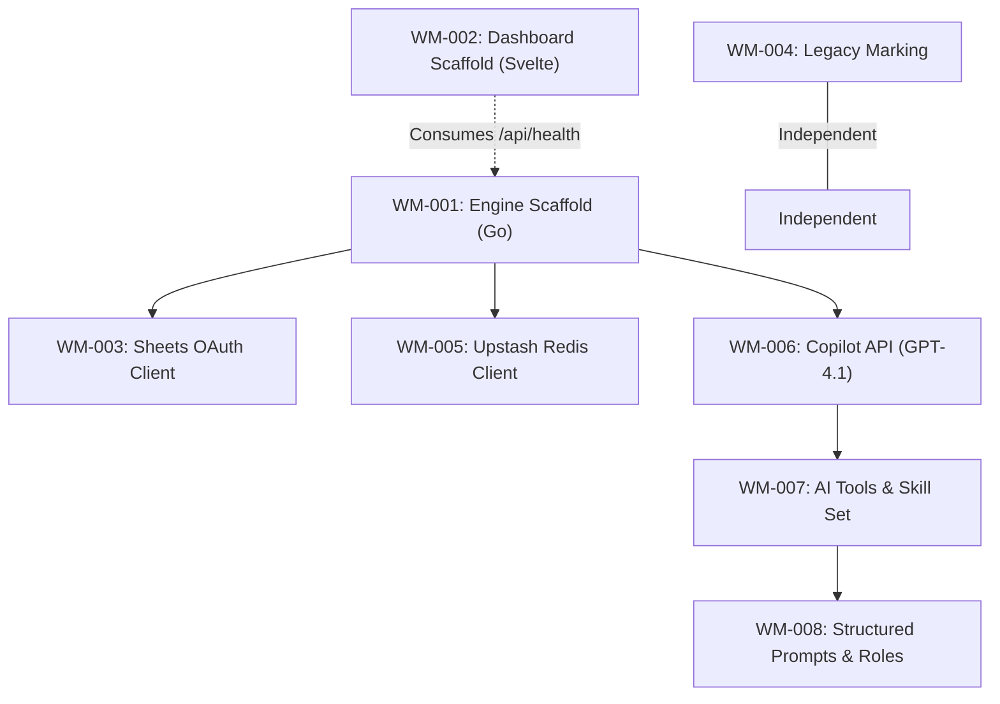

# Sprint 1: System Foundation & Monorepo Plumbing

**Slogan**: _"The Transition from Next.js Legacy to Go-Svelte High-Performance"_  
**Period**: April 1st - April 14th  
**PO/PM**: Antigravity  
**Dev Lead**: Antigravity

---

## 🏗️ Sprint 1: Dependency Visualization



---

## 🟢 Sprint 1: Definition of Done (DoD)

1.  **Architecture**: Successful scaffold of `apps/wealth-management-engine` and `apps/wealth-management-dashboard` in the Nx workspace.
2.  **Connectivity**: The Go backend can successfully ping the legacy `vnstock-server` (Python) and local SWR cache (Redis).
3.  **Authentication**: OAuth2 Google Sheets client successfully implemented in a shared Go library.
4.  **AI Validation**: The Go backend successfully completes the **AI Readiness Suite** (Streaming, JSON, Tools, Skills, and Multi-Role Prompts) via GitHub Copilot GPT-4.1.
5.  **External Connectivity**: All 3 external services (Google Sheets, Upstash Redis, GitHub Copilot) confirmed reachable and stress-tested from the Go core.
6.  **Legacy**: Current `apps/wealth-management`, `apps/portfolio-landpage`, and `apps/cloudinary-photos-app` (Next.js) are marked as `[LEGACY]`. Root `package.json` cleaned of legacy dependencies.
7.  **Quality**: Sub-200ms latency on the first Go "Hello World" API endpoint.
8.  **MCP Readiness**: The **Wealth Management Engine** is successfully detectable as an **MCP Server** via `stdio` or `eventsource`.
9.  **Architecture**: **Hexagonal** (Go Engine) and **FSD/DDD** (Svelte Dashboard) patterns confirmed in first commit; all commands via **Bun/Bunx**.

---

**Task ID**: WM-001
**Title**: [Infrastructure] Scaffold the Go Backend (Gin/Fiber) in the Nx Monorepo
**Status**: DONE
**Reporter**: PM
**Assignee**: Dev Lead
**Priority**: High
**Related Docs**: [\_setup/README.md](file:///Users/ez2/projects/personal/monorepo/docs/wealth-management/_setup/README.md)
**Description**:
Initialize a high-performance Go-based backend service inside `apps/wealth-management-engine`. This service will take over the data orchestration currently handled by the Next.js API routes.

- **Tools**: `nx` for scaffolding, `bun` for script running.
- **Nx Integration**: Install and configure the **`@nx-go/nx-go`** plugin; initialize the workspace with `go.mod` in the app directory.
- **Framework**: Fiber; strictly implement **Hexagonal (Ports & Adapters)** isolation with domain, port, and adapter folders within the app.
- **App-Only Structure**: All Go code lives in `apps/wealth-management-engine/` — no libs extraction needed for Sprint 1. Code organized as: `domain/`, `port/`, `service/`, `adapter/`
  **Acceptance Criteria**:
- ✅ Service starts on `localhost:8080`.
- ✅ Includes a `/api/health` check endpoint.
- ✅ Correct `nx.json` target mapping for `build`, `serve`, and `test`.

**Implementation Notes**:

- **Framework**: Fiber v2.52.12 (high-performance Go web framework)
- **Nx Integration**: `@nx-go/nx-go@4.0.0-beta.0` with v4 beta migration applied:
  - Updated `project.json` to use project-relative paths (`main.go` instead of `{projectRoot}/main.go`)
  - Configured target-level caching: `build` task with `cache: true`, `serve` with `cache: false` for live reload
  - Go files properly excluded from shared globals
- **Code Structure**: All Go code in `apps/wealth-management-engine/`:
  - `domain/` — Domain models (e.g., `HealthStatus`)
  - `port/` — Interfaces/ports (e.g., `HealthService` interface)
  - `service/` — Service implementations (e.g., `HealthService`)
  - `adapter/` — External framework adapters (e.g., Fiber handlers)
  - `main.go` — Entry point
- **Port**: Configured to `8080` with proper startup logging via Fiber
- **Health Check**: `/api/health` returns JSON `{"status": "OK"}`
- **Verification**: Server starts successfully via `bunx nx serve wealth-management-engine`

**Development Commands**:

```bash
# Start backend (nx-go v4 handles Go tooling)
bunx nx serve wealth-management-engine

# Build backend
bunx nx build wealth-management-engine

# Run tests
bunx nx test wealth-management-engine

# Lint Go code
bunx nx lint wealth-management-engine

# Tidy dependencies
bunx nx tidy wealth-management-engine
```

**Task ID**: WM-002
**Title**: [Infrastructure] Scaffold SvelteKit Frontend as Standalone App
**Status**: DONE
**Reporter**: PM
**Assignee**: Dev Lead
**Priority**: High
**Related Docs**: [\_specs/README.md](file:///Users/ez2/projects/personal/monorepo/docs/wealth-management/_specs/README.md)
**Description**:
Initialize the new React-alternative frontend using **SvelteKit** in `apps/wealth-management-dashboard` as a **standalone project** (no Nx lib extraction).

- **Tools**: `bunx sv create` to scaffold SvelteKit directly in `apps/`.
- **Framework**: SvelteKit (meta-framework for Svelte) with Vite 8.0.3 as build tool.
- **Nx Strategy**: Standalone app with a manual `project.json` for Nx task tracking (`build`, `serve`, `check`) — required since we still leverage the Nx monorepo for orchestration. SvelteKit has no official Nx plugin, so no Nx-generated scaffold or lib extraction. Shared UI extraction to `libs/wm-core-ui` is **deferred** to a later sprint once component surface area justifies it.
- **Styling**: Tailwind CSS + Glassmorphism UI tokens.
- **Architecture**: Organize internally by **FSD layers** (`src/features/`, `src/entities/`, `src/shared/`) with **DDD** naming for core models.
- **Dependencies**: No local `package.json` — all deps resolved via root monorepo `package.json`. Bun workspaces handle resolution.
- **Dev Server**: SvelteKit's development server (powered by Vite) on port 5173. API proxy configured to Go backend (`http://localhost:8080`).
  **Acceptance Criteria**:
- ✅ SvelteKit app starts on `localhost:5173` via `bunx nx serve wealth-management-dashboard` or `bunx vite dev`.
- ✅ Consumes the Go `/api/health` endpoint on load (home page displays health status).
- ✅ Successfully integrates the core glassmorphism theme with Tailwind CSS.
- ✅ FSD folder structure (`src/features/`, `src/entities/`, `src/shared/`) present in repository.
- ✅ `project.json` created for Nx task orchestration (build, serve, check, lint, test).
- ✅ `vite.config.mjs` (SvelteKit's Vite config) configured with API proxy to Go backend and Svelte 5 runes syntax support.
- ✅ ESLint and Prettier configs integrated; Svelte 5 state reactivity implemented.
- ✅ ESLint and Prettier configurations aligned with root monorepo standards.

**Implementation Notes**:

- **Framework Stack**: SvelteKit v2.55.0 + Svelte 5.55.1 (runes-based reactivity)
- **Build Tool**: Vite 8.0.3 (beta, experimental support via vite-plugin-svelte)
- **No Local Package Manager Config**: All dependencies managed from root via Bun workspaces
- **Vite Configuration**: `.mjs` extension avoids ESM/CJS bundling issues in monorepo context
- **UI Theme**: Glassmorphism implemented with Tailwind CSS (backdrop-blur, opacity masks)
- **API Integration**: Health check endpoint auto-loads on component mount; displays loading/error/success states via Vite dev server proxy
- **Linting**: ESLint with legacy `.eslintrc.json` format (compatible with monorepo's ESLint 8.46.0) with rules aligned to root `.eslintrc.json`
- **Formatting**: Prettier unified with root config (useTabs: false, tabWidth: 2, trailingComma: "all", printWidth: 120)
- **Config Consolidation**: Removed duplicate SvelteKit-specific settings; now extends root standards

**Development Commands**:

```bash
# Start SvelteKit dashboard (via Nx)
bunx nx serve wealth-management-dashboard

# Or start directly (same as Nx command)
bunx vite dev

# Build for production (SvelteKit adapter for Node)
bunx nx build wealth-management-dashboard
bunx vite build

# Check types
bunx svelte-check --tsconfig ./tsconfig.json

# Run tests (Vitest)
bunx vitest

# Lint code
bunx eslint .

# Format code
bunx prettier --write .
```

**End-to-End Flow Verification** (March 30, 2026):

```bash
# Terminal 1: Start Go backend on :8080
bunx nx serve wealth-management-engine

# Terminal 2: Start SvelteKit dashboard on :5173
bunx nx serve wealth-management-dashboard

# Terminal 3: Verify connectivity
curl http://localhost:5173/api/health  # Via Vite dev proxy to Go backend
# Response: {"status": "OK"} ✅
```

All acceptance criteria met. SvelteKit dashboard successfully proxies API calls to Go backend via Vite's development server.

---

**Task ID**: WM-003
**Title**: [Data-Engine] Implement Google Sheets OAuth Client in Go
**Status**: TODO
**Reporter**: PM
**Assignee**: Dev Lead
**Priority**: High
**Related Docs**: [\_technical/1-Data-Engine/Architecture_and_Schema.md](file:///Users/ez2/projects/personal/monorepo/docs/wealth-management/_technical/1-Data-Engine/Architecture_and_Schema.md)
**Description**:
Port the legacy TypeScript OAuth client logic into Go. This is the **Core DB Client** for the entire platform.

- **Prerequisites**: Must reuse existing `GOOGLE_SHEETS_ID` and OAuth secrets from `.env`.
- **Logic**: Use `golang.org/x/oauth2` and `google.golang.org/api/sheets/v4`.
  **Acceptance Criteria**:
- Go service can read the `Accounts` sheet tab successfully.
- Implements the "Refreshed Bearer Token" logic natively in Go.
- Integration tests for `readSheet` and `appendRow`.

---

**Task ID**: WM-004
**Title**: [DevOps] Mark Next.js as Legacy & Redirect Configuration
**Status**: TODO
**Reporter**: PM
**Assignee**: Dev Lead
**Priority**: Medium
**Related Docs**: [README.md](file:///Users/ez2/projects/personal/monorepo/docs/wealth-management/README.md)
**Description**:
Formally mark the current `apps/wealth-management` (Next.js) as legacy and ensure no new features are built on that codebase.

- **Action**: Update `apps/wealth-management/README.md` with [LEGACY] header.
- **Action**: Disable production CI/CD builds for the legacy app in favor of the new Go-Svelte path.
  **Acceptance Criteria**:
- The main documentation clearly points to the new Go/Svelte directories for active development.
- Folder name updated mentally to `apps/wealth-management-legacy` (or similar tag).

---

**Task ID**: WM-005
**Title**: [Resilience] Redis (Upstash) Go Integration for Caching
**Status**: TODO
**Reporter**: PM
**Assignee**: Dev Lead
**Priority**: High
**Related Docs**: [\_technical/1-Data-Engine/Architecture_and_Schema.md](file:///Users/ez2/projects/personal/monorepo/docs/wealth-management/_technical/1-Data-Engine/Architecture_and_Schema.md)
**Description**:
Connect the Go backend to the existing Upstash Redis instance to maintain the < 300ms latency requirement.

- **Logic**: Use `go-redis` or equivalent.
  **Acceptance Criteria**:
- Go backend can `SET` and `GET` keys from the same Redis instance used by the legacy app.
- Cache invalidation logic ported to Go.

---

**Task ID**: WM-006
**Title**: [AI-System] GitHub Copilot API Integration & Handshake (Go)
**Status**: TODO
**Reporter**: PM
**Assignee**: Dev Lead
**Priority**: High
**Related Docs**: [\_technical/2-AI-Systems/Orchestration_and_Tools.md](file:///Users/ez2/projects/personal/monorepo/docs/wealth-management/_technical/2-AI-Systems/Orchestration_and_Tools.md)
**Description**:
Implement the initial AI connection client in the Go backend using the GitHub Copilot subscription.

- **Logic**: Use the `api.githubcopilot.com` endpoint with the Copilot Bearer token.
- **Model Default**: Configure for "GPT-4.1" (Latest available LLM).
- **Goal**: Confirm the backend can send a system prompt and receive a valid JSON/Text response.
  **Acceptance Criteria**:
- CLI tool or endpoint `/api/test/ai/stream` returns a successful real-time completion.
- Handles the custom "Copilot Token Exchange" flow natively in Go.

---

**Task ID**: WM-007
**Title**: [AI-System] Tool & Skill Integration Test (Go)
**Status**: TODO
**Reporter**: PM
**Assignee**: Dev Lead
**Priority**: High
**Related Docs**: [\_technical/2-AI-Systems/Orchestration_and_Tools.md](file:///Users/ez2/projects/personal/monorepo/docs/wealth-management/_technical/2-AI-Systems/Orchestration_and_Tools.md)
**Description**:
Implement the capability for the Go-orchestrator to detect and execute external "Tools" and "Skills."

- **Logic**: Mock a `GetBalance` tool and a `MarketAnalysis` skill.
- **Goal**: Confirm the AI can generate a valid Tool Call JSON and wait for the "Tool Result" injection.
  **Acceptance Criteria**:
- Endpoint `/api/test/ai/tools` completes a multi-turn conversation (User → AI Tool Call → Go Execution → AI Synthesis).

---

**Task ID**: WM-008
**Title**: [AI-System] Structured Prompting & Role Synthesis
**Status**: TODO
**Reporter**: PM
**Assignee**: Dev Lead
**Priority**: High
**Related Docs**: [\_technical/2-AI-Systems/Orchestration_and_Tools.md](file:///Users/ez2/projects/personal/monorepo/docs/wealth-management/_technical/2-AI-Systems/Orchestration_and_Tools.md)
**Description**:
Implement the prompt management engine in Go for complex task orchestration.

- **Logic**: Support for System/User/Assistant role-tagging.
- **Logic**: JSON Response enforcing (e.g., "Respond only in valid JSON format").
- **Custom Prompts**: Template-based injection for specialized tasks (e.g., Investment Briefing).
  **Acceptance Criteria**:
- Endpoint `/api/test/ai/json` returns a perfectly parsed Go struct from an AI JSON response.
- Successfully demonstrates a three-role interaction (System Persona + User Query + AI History).

---

**Task ID**: WM-009
**Title**: [Infrastructure] MCP Server Core implementation (Go)
**Status**: TODO
**Reporter**: PM
**Assignee**: Dev Lead
**Priority**: High
**Related Docs**: [\_technical/2-AI-Systems/Orchestration_and_Tools.md](file:///Users/ez2/projects/personal/monorepo/docs/wealth-management/_technical/2-AI-Systems/Orchestration_and_Tools.md)
**Description**:
Implement the Model Context Protocol (MCP) server foundation in the **Engine**.

- **Tools**: Use the `mcp-sdk-go` (or standard JSON-RPC if SDK is TBD).
- **Goal**: Expose an initial `EngineHealth` tool via MCP.
  **Acceptance Criteria**:
- CLI `Engine-Engine --mcp` mode initializes a JSON-RPC session.
- AI (e.g., Antigravity) can successfully list and call the `EngineHealth` tool.

---
