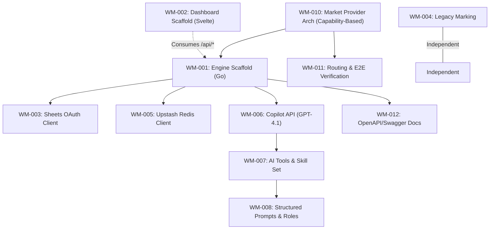

# Sprint 1: System Foundation & Monorepo Plumbing

**Slogan**: _"The Transition from Next.js Legacy to Go-Svelte High-Performance"_  
**Period**: April 1st - April 14th  
**PO/PM**: Antigravity  
**Dev Lead**: Antigravity

---

## 🏗️ Sprint 1: Dependency Visualization

**Note on WM-010/WM-011**: These tasks implement a **capability-based market provider architecture** (not action-based proxy). See [\_technical/Market_Provider_Capabilities.md](file:///Users/ez2/projects/personal/monorepo/docs/wealth-management/_technical/Market_Provider_Capabilities.md) for design rationale. This enables extensible multi-provider routing with injected configuration and unified caching.

---

## 🟢 Sprint 1: Definition of Done (DoD)

1.  **Architecture**: Successful scaffold of `apps/wealth-management-engine` and `apps/wealth-management-dashboard` in the Nx workspace.
2.  **Connectivity**: The Go backend can successfully ping the legacy `vnstock-server` (Python) and local SWR cache (Redis).
3.  **Authentication**: OAuth2 Google Sheets client successfully implemented in a shared Go library.
4.  **AI Validation**: The Go backend successfully completes the **AI Readiness Suite** (Streaming, JSON, Tools, Skills, and Multi-Role Prompts) via GitHub Copilot GPT-4.1.
5.  **External Connectivity**: All 3 external services (Google Sheets, Upstash Redis, GitHub Copilot) confirmed reachable from the Go core.
6.  **Legacy**: Current `apps/wealth-management`, `apps/portfolio-landpage`, and `apps/cloudinary-photos-app` (Next.js) are marked as `[LEGACY]`. Root `package.json` cleaned of legacy dependencies.
7.  **Quality**: Sub-200ms latency on the first Go "Hello World" API endpoint.
8.  **MCP Readiness**: The **Wealth Management Engine** is successfully detectable as an **MCP Server** via `stdio` or `eventsource`.
9.  **Architecture**: **Hexagonal** (Go Engine) and **FSD/DDD** (Svelte Dashboard) patterns confirmed in first commit; all commands via **Bun/Bunx**.

---

## 📌 DoD Scope Clarification (Current Direction)

- Legacy marking task is intentionally skipped for now.
- Benchmark requirement for sub-200ms is intentionally skipped for now.
- Stress-test requirement is intentionally skipped for now.
- MCP is now always enabled at app startup (no `--mcp` switch required).

---

## 🧩 Domain Naming Reference

- Source of truth: [\_technical/1-Data-Engine/Architecture_and_Schema.md](file:///Users/ez2/projects/personal/monorepo/docs/wealth-management/_technical/1-Data-Engine/Architecture_and_Schema.md) section **2.0 Domain Modeling & Naming Convention (Go Engine)**.
- Sprint-wide conventions: [tasks/README.md](file:///Users/ez2/projects/personal/monorepo/docs/wealth-management/tasks/README.md) section **5. Standing Conventions (Permanent)**.

---

## Task Files

- [WM-001](./WM-001.md)
- [WM-002](./WM-002.md)
- [WM-003](./WM-003.md)
- [WM-004](./WM-004.md)
- [WM-005](./WM-005.md)
- [WM-006](./WM-006.md)
- [WM-007](./WM-007.md)
- [WM-008](./WM-008.md)
- [WM-009](./WM-009.md)
- [WM-010](./WM-010.md)
- [WM-011](./WM-011.md)
- [WM-012](./WM-012.md)
