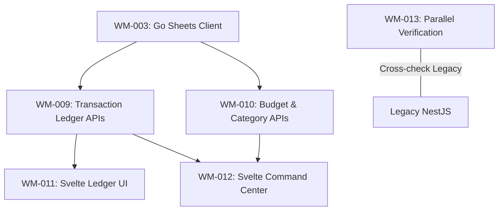

# Sprint 2: Core Data Engine & Financial Control

**Slogan**: _"Transferring the Financial Heartbeat to the New Core"_  
**Period**: April 15th - April 28th  
**PO/PM**: Antigravity  
**Dev Lead**: Antigravity

---

## 🏗️ Sprint 2: Dependency Visualization

---

## 🔵 Sprint 2: Definition of Done (DoD)

1.  **Parity**: 100% functional parity with the legacy Next.js Ledger and Budget features.
2.  **Performance**: p95 latency for Net Worth aggregation in the Go backend < 100ms (Uncached Sheets read).
3.  **Accuracy**: Zero variance in calculations between the legacy and new systems for the same sheet data.
4.  **Integration**: Svelte frontend retrieves and displays data perfectly.
5.  **MCP Tools**: Transaction Ledger and Budget logic are successfully exposed as **MCP Tools** (e.g., `list_transactions`, `get_budget_health`).

---

**Priority**: High
**Related Docs**: [\_specs/2-Ledger-and-Control/Financial_Ledger_and_Budget_Control.md](file:///Users/ez2/projects/personal/monorepo/docs/wealth-management/_specs/2-Ledger-and-Control/Financial_Ledger_and_Budget_Control.md)
**Description**:
Implement the `Transactions_YYYY` sharding and write logic in the Go backend.

- **Logic**: Dynamic tab selection based on the transaction date.
- **Logic**: `WriteToFirstEmptyRow` port from legacy mappers.
  **Acceptance Criteria**:
- API POST `/api/transactions` appends to the correct yearly tab.
- Automatically handles tab creation if it doesn't exist (optional vs manual prompt).
- **MCP**: Expose `append_transaction` and `get_transactions` as MCP tools.

---

**Task ID**: WM-010
**Title**: [Core-Logics] Budget and Category Management APIs in Go
**Status**: TODO
**Reporter**: PM
**Assignee**: Dev Lead
**Priority**: High
**Related Docs**: [\_specs/2-Ledger-and-Control/Financial_Ledger_and_Budget_Control.md](file:///Users/ez2/projects/personal/monorepo/docs/wealth-management/_specs/2-Ledger-and-Control/Financial_Ledger_and_Budget_Control.md)
**Description**:
Implement the categorical budget logic (Allocation vs. Spending) in Go.

- **Service**: Port the `budget.ts` logic into a Go `BudgetService`.
  **Acceptance Criteria**:
- Calculates "Safe Zone" and "Burn Rate" for categories.
- Integration tests with `Budget_YYYY` sheet tabs.
- **MCP**: Expose `get_category_health` as an MCP tool.

---

**Task ID**: WM-011
**Title**: [Frontend] Specialized Svelte Ledger Components
**Status**: TODO
**Reporter**: PM
**Assignee**: Dev Lead
**Priority**: High
**Related Docs**: [\_specs/1-Core-Command-Center/Portfolio_Home_and_Global_Patterns.md](file:///Users/ez2/projects/personal/monorepo/docs/wealth-management/_specs/1-Core-Command-Center/Portfolio_Home_and_Global_Patterns.md)
**Description**:
Create high-performance Svelte components for the Transaction list and Quick Entry modal.

- **UI**: Infinite scroll, month dividers, and category-vibrant badges.
- **State**: Use Svelte stores for privacy (Stealth Mode) global state.
  **Acceptance Criteria**:
- 60 FPS scrolling with lists of 1000+ items.
- "Stealth Mode" defaults to masked on every Svelte route change.

---

**Task ID**: WM-012
**Title**: [Frontend] Svelte Command Center (Net Worth View)
**Status**: TODO
**Reporter**: PM
**Assignee**: Dev Lead
**Priority**: High
**Related Docs**: [\_specs/1-Core-Command-Center/Portfolio_Home_and_Global_Patterns.md](file:///Users/ez2/projects/personal/monorepo/docs/wealth-management/_specs/1-Core-Command-Center/Portfolio_Home_and_Global_Patterns.md)
**Description**:
Implement the Portfolio Home in Svelte.

- **Metrics**: Total Balance, monthly delta, and cash flow bars.
  **Acceptance Criteria**:
- Initial load time for Net Worth < 300ms.
- Smooth glassmorphism transitions between the Home and Ledger pages.

---

**Task ID**: WM-013
**Title**: [Quality] Parallel Run & Verification (Legacy vs Go)
**Status**: TODO
**Reporter**: PM
**Assignee**: Dev Lead
**Priority**: Medium
**Related Docs**: [\_testing/TEST_STRATEGY.md](file:///Users/ez2/projects/personal/monorepo/docs/wealth-management/_testing/TEST_STRATEGY.md)
**Description**:
Run both the next-legacy and go-new apps side-by-side to verify data consistency.

- **Action**: Use a test spreadsheet to compare API outputs.
  **Acceptance Criteria**:
- 0% variance in account totals and budget actuals across both systems.

---
