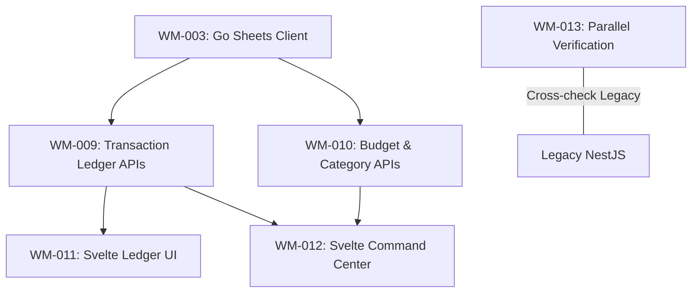

# Sprint 2: Core Data Engine & Financial Control

**Slogan**: _"Transferring the Financial Heartbeat to the New Core"_  
**Period**: April 15th - April 28th  
**PO/PM**: Antigravity  
**Dev Lead**: Antigravity

---

## 🏗️ Sprint 2: Dependency Visualization

---

## 🔵 Sprint 2: Definition of Done (DoD)

1.  **Parity**: 100% functional parity with the legacy Next.js Ledger and Budget features.
2.  **Performance**: p95 latency for Net Worth aggregation in the Go backend < 100ms (Uncached Sheets read).
3.  **Accuracy**: Zero variance in calculations between the legacy and new systems for the same sheet data.
4.  **Integration**: Svelte frontend retrieves and displays data perfectly.
5.  **MCP Tools**: Transaction Ledger and Budget logic are successfully exposed as **MCP Tools** (e.g., `list_transactions`, `get_budget_health`).

---

## 🧩 Domain Naming Reference

- Source of truth: [\_technical/1-Data-Engine/Architecture_and_Schema.md](file:///Users/ez2/projects/personal/monorepo/docs/wealth-management/_technical/1-Data-Engine/Architecture_and_Schema.md) section **2.0 Domain Modeling & Naming Convention (Go Engine)**.
- Sprint-wide conventions: [tasks/README.md](file:///Users/ez2/projects/personal/monorepo/docs/wealth-management/tasks/README.md) section **5. Standing Conventions (Permanent)**.

---

## Task Files

- [WM-009](./WM-009.md)
- [WM-010](./WM-010.md)
- [WM-011](./WM-011.md)
- [WM-012](./WM-012.md)
- [WM-013](./WM-013.md)
