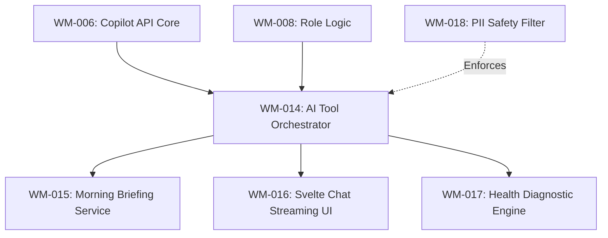

# Sprint 3: Wealth Intelligence & AI Orchestration

**Slogan**: _"Infusing the Go-Svelte Core with Advanced AI Intelligence"_  
**Period**: April 29th - May 12th  
**PO/PM**: Antigravity  
**Dev Lead**: Antigravity

---

## 🏗️ Sprint 3: Dependency Visualization

---

## 🟡 Sprint 3: Definition of Done (DoD)

1.  **AI Engine**: Successful migration of the GPT-4o tool-based orchestration logic into Go.
2.  **Streaming**: Real-time NDJSON streaming of AI responses to the Svelte UI.
3.  **Insights**: Daily Morning Briefing is generated automatically on the Go backend and displayed in Svelte.
4.  **Security**: PII filtering logic implemented.
5.  **MCP Tools**: Intelligence engine exposed as **MCP Tools** (e.g., `get_daily_briefing`, `ask_financial_advisor`).

---

**Priority**: High
**Related Docs**: [\_specs/3-Wealth-Intelligence/Knowledge_and_Intelligence_Center.md](file:///Users/ez2/projects/personal/monorepo/docs/wealth-management/_specs/3-Wealth-Intelligence/Knowledge_and_Intelligence_Center.md)
**Description**:
Implement the core LLM orchestration logic in Go.

- **Tools**: Use the OpenAI SDK for Go (or Fiber/Gin client for custom API calls).
- **Core Strategy**: Intent Detection → Tool Registry → Result Synthesis.
  **Acceptance Criteria**:
- Go backend can successfully "Discover" and execute tools like `getAccounts` or `getTransactions`.
- **MCP**: Register orchestration logic as an MCP Tool proxy.
- Implements the "Think Tank" debate phase logic.

---

**Task ID**: WM-015
**Title**: [Intelligence] Daily Briefing Generation in Go
**Status**: TODO
**Reporter**: PM
**Assignee**: Dev Lead
**Priority**: High
**Related Docs**: [\_specs/3-Wealth-Intelligence/Knowledge_and_Intelligence_Center.md](file:///Users/ez2/projects/personal/monorepo/docs/wealth-management/_specs/3-Wealth-Intelligence/Knowledge_and_Intelligence_Center.md)
**Description**:
Implement the automated morning report generation.

- **Logic**: Port the briefing prompt logic from legacy into a Go `BriefingService`.
  **Acceptance Criteria**:
- Successfully generates 3 actionable bullet points at user's first login of the day.
- **MCP**: Daily briefing accessible via `get_daily_briefing` MCP tool.

---

**Task ID**: WM-016
**Title**: [Frontend] Svelte AI Chat & Briefing Interface
**Status**: TODO
**Reporter**: PM
**Assignee**: Dev Lead
**Priority**: High
**Related Docs**: [\_specs/3-Wealth-Intelligence/Knowledge_and_Intelligence_Center.md](file:///Users/ez2/projects/personal/monorepo/docs/wealth-management/_specs/3-Wealth-Intelligence/Knowledge_and_Intelligence_Center.md)
**Description**:
Create the "Intelligence Center" in Svelte.

- **UI**: SvelteKit-powered chat bubbles with real-time text streaming.
- **UI**: Display for the daily briefing card in the Dashboard.
  **Acceptance Criteria**:
- TTFT (Time to First Token) < 1.0s.
- Automatic scrolling and Markdown rendering in Svelte chat bubbles.

---

**Task ID**: WM-017
**Title**: [Intelligence] AI-Powered Financial Health Diagnostics in Go
**Status**: TODO
**Reporter**: PM
**Assignee**: Dev Lead
**Priority**: Medium
**Related Docs**: [\_specs/3-Wealth-Intelligence/Knowledge_and_Intelligence_Center.md](file:///Users/ez2/projects/personal/monorepo/docs/wealth-management/_specs/3-Wealth-Intelligence/Knowledge_and_Intelligence_Center.md)
**Description**:
Port the health scoring (0-100) logic and diagnostic ratios from legacy into Go.

- **Calculation**: Savings Rate, Emergency Fund, and DTI.
  **Acceptance Criteria**:
- Go backend calculates health metrics accurately using the sharded transaction data.

---

**Task ID**: WM-018
**Title**: [AI-System] PII Filtering & Prompt Safety in Go
**Status**: TODO
**Reporter**: PM
**Assignee**: Dev Lead
**Priority**: High
**Related Docs**: [\_technical/2-AI-Systems/Orchestration_and_Tools.md](file:///Users/ez2/projects/personal/monorepo/docs/wealth-management/_technical/2-AI-Systems/Orchestration_and_Tools.md)
**Description**:
Implement the security layer for prompt construction in the Go-orchestrator.

- **Rule**: No private balances or real account IDs in the prompt context.
  **Acceptance Criteria**:
- Automated tests confirm zero sensitive strings are sent to the LLM model.

---
