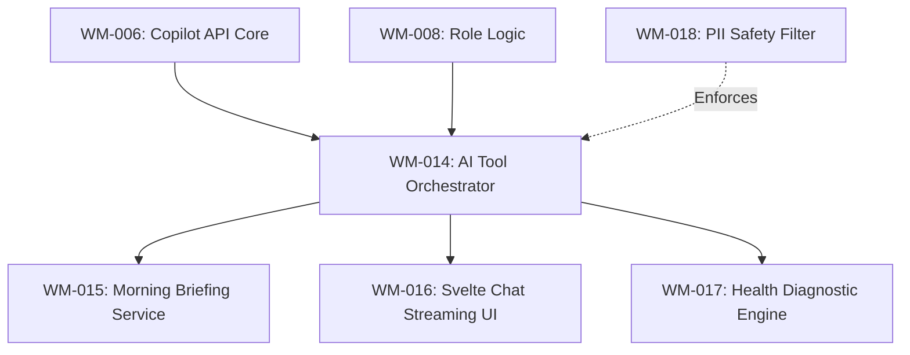

# Sprint 3: Wealth Intelligence & AI Orchestration

**Slogan**: _"Infusing the Go-Svelte Core with Advanced AI Intelligence"_  
**Period**: April 29th - May 12th  
**PO/PM**: Antigravity  
**Dev Lead**: Antigravity

---

## 🏗️ Sprint 3: Dependency Visualization

---

## 🟡 Sprint 3: Definition of Done (DoD)

1.  **AI Engine**: Successful migration of the GPT-4o tool-based orchestration logic into Go.
2.  **Streaming**: Real-time NDJSON streaming of AI responses to the Svelte UI.
3.  **Insights**: Daily Morning Briefing is generated automatically on the Go backend and displayed in Svelte.
4.  **Security**: PII filtering logic implemented.
5.  **MCP Tools**: Intelligence engine exposed as **MCP Tools** (e.g., `get_daily_briefing`, `ask_financial_advisor`).

---

## 🧩 Domain Naming Reference

- Source of truth: [\_technical/1-Data-Engine/Architecture_and_Schema.md](file:///Users/ez2/projects/personal/monorepo/docs/wealth-management/_technical/1-Data-Engine/Architecture_and_Schema.md) section **2.0 Domain Modeling & Naming Convention (Go Engine)**.
- Sprint-wide conventions: [tasks/README.md](file:///Users/ez2/projects/personal/monorepo/docs/wealth-management/tasks/README.md) section **5. Standing Conventions (Permanent)**.

---

## Task Files

- [WM-014](./WM-014.md)
- [WM-015](./WM-015.md)
- [WM-016](./WM-016.md)
- [WM-017](./WM-017.md)
- [WM-018](./WM-018.md)
