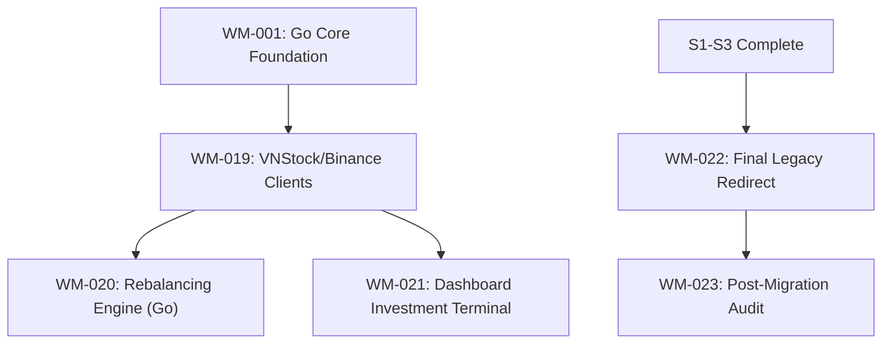

# Sprint 4: Market Alpha & Migration

**Slogan**: _"Activating High-Alpha Market Data in the New Core"_  
**Period**: May 13th - May 26th  
**PO/PM**: Antigravity  
**Dev Lead**: Antigravity

---

## 🏗️ Sprint 4: Dependency Visualization

---

## 🟠 Sprint 4: Definition of Done (DoD)

1.  **Market Engine**: Successful integration of the Go backend with the `vnstock-server` (Python) and external market APIs (Binance).
2.  **Investment Alpha**: Ticker deep-dive (M-T-F Confluence) and Rebalancing Suggestions are fully functional in Go and Svelte.
3.  **Migration Final**: All user sessions and configurations are migrated to the new Go-Svelte platform.
4.  **Legacy Deprecation**: Officially decommissioned.
5.  **MCP Tools**: Market telemetry and portfolio analysis exposed as **MCP Tools** (e.g., `get_market_spot`, `calculate_asset_drift`).

---

**Priority**: High
**Related Docs**: [\_specs/4-Market-Alpha/Investment_and_Market_Terminal.md](file:///Users/ez2/projects/personal/monorepo/docs/wealth-management/_specs/4-Market-Alpha/Investment_and_Market_Terminal.md)
**Description**:
Implement the market telemetry clients in the Go backend.

- **Client**: Connect to the `vnstock-server` (localhost:8000) for Vietnamese stocks.
- **Client**: Connect to the Binance and HOSE APIs (if needed) for asset pricing.
  **Acceptance Criteria**:
- Go backend provides unified Ticker data.
- **MCP**: Expose `get_ticker_price` and `get_market_pulse` as MCP tools.

---

**Task ID**: WM-020
**Title**: [Wealth-Alpha] Portfolio Rebalancing Suggested Engine in Go
**Status**: TODO
**Reporter**: PM
**Assignee**: Dev Lead
**Priority**: High
**Related Docs**: [\_specs/4-Market-Alpha/Investment_and_Market_Terminal.md](file:///Users/ez2/projects/personal/monorepo/docs/wealth-management/_specs/4-Market-Alpha/Investment_and_Market_Terminal.md)
**Description**:
Port the drift detection and trade suggestion logic into a Go `InvestmentService`.

- **Strategy**: Target Allocation vs. Current Spot Value.
  **Acceptance Criteria**:
- Successfully identifies drift > 5% and suggests trades.
- **MCP**: Expose `rebalance_portfolio` as a READ-ONLY tool for advice.

---

**Task ID**: WM-021
**Title**: [Frontend] Svelte Investment Terminal (Deep-Dive)
**Status**: TODO
**Reporter**: PM
**Assignee**: Dev Lead
**Priority**: High
**Related Docs**: [\_specs/4-Market-Alpha/Investment_and_Market_Terminal.md](file:///Users/ez2/projects/personal/monorepo/docs/wealth-management/_specs/4-Market-Alpha/Investment_and_Market_Terminal.md)
**Description**:
Create the high-fidelity Svelte terminal for active stock and crypto tracking.

- **UI**: 1W/1D/4H Matrix, Seasonality Heatmap, and Valuation charts.
  **Acceptance Criteria**:
- Switching between tickers reveals analytics in < 1s.
- Includes the "% Gap to Fair Value" modeling logic.

---

**Task ID**: WM-022
**Title**: [Migration] Final System Transition & Legacy Divergence
**Status**: TODO
**Reporter**: PM
**Assignee**: Dev Lead
**Priority**: High
**Related Docs**: [README.md](file:///Users/ez2/projects/personal/monorepo/docs/wealth-management/README.md)
**Description**:
Perform the final production rollout of the Go-Svelte architecture.

- **Action**: Redirect all user traffic (or personal access) to the new domain/IP.
- **Action**: Mark the legacy Next.js directories as **[DEPRECATED]**.
  **Acceptance Criteria**:
- Zero downtime during transition.
- Legacy app serves a "Moved to Go-Svelte" banner or is fully stopped in the cloud.

---

**Task ID**: WM-023
**Title**: [DevOps] Documentation Consolidation & Post-Migration Audit
**Status**: TODO
**Reporter**: PM
**Assignee**: Dev Lead
**Priority**: Medium
**Related Docs**: [\_technical/README.md](file:///Users/ez2/projects/personal/monorepo/docs/wealth-management/_technical/README.md)
**Description**:
Update all "Current System" documentation in `_technical` to reflect the Go/Svelte codebase instead of Next.js.

- **Action**: Final review of all NFRs and schemas for consistency.
  **Acceptance Criteria**:
- System specifications match the new architecture 100%.

---
